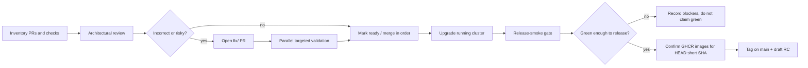

# PR And Release Train

Use this when asked to review or merge a set of obol-stack PRs, pin a frontend RC, handle GHAS/Renovate comments, or cut a release candidate. This is the orchestration layer; load the other references for the specific smoke, LLM, paid-flow, or remote-QA details.

## Inputs To Nail Down

- PR range and exclusions, for example "all PRs greater than #509 except #542".
- Target base branch and whether the work should merge existing PRs, collapse them, or open fix PRs.
- Release tag, frontend image tag, and whether the release is draft, prerelease, or ready.
- Validation target: local unit tests, running cluster upgrade, CLI smoke, live OBOL smoke, fork smoke, or full `flows/release-smoke.sh` when explicitly release-gating.
- Any required OpenAI-compatible QA LLM endpoint and model. Keep endpoint details in the shell environment or private notes, not in skill files, commit messages, PR text, or release text.

## Train Shape



## Inventory

Start with source-of-truth state, not memory:

```bash
gh pr list --state open --limit 100 --json number,title,headRefName,baseRefName,isDraft,mergeStateStatus,statusCheckRollup,updatedAt
gh pr view <number> --json number,title,body,headRefName,baseRefName,isDraft,mergeStateStatus,statusCheckRollup,reviewDecision,commits,files,comments,reviews
```

Build a table with number, topic, branch, draft status, checks, review status, dependency order, and whether it changes runtime behavior, release artifacts, CI, chart manifests, or docs only.

## Architectural Review

For each PR, review the diff in dependency order. The decision is not "does it compile"; it is whether the change preserves the stack contracts:

- No regression in public/private route boundaries. Frontend, eRPC, storefront, `/.well-known/agent-registration.json`, and `/skill.md` stay intentionally exposed; agent internals do not become public.
- No loss of x402 semantics: `PurchaseRequest Ready=True`, paid HTTP 200, exact balance deltas, on-chain transfer, and buyer route hot-add remain required evidence.
- No dev/prod image confusion. Under `OBOL_DEVELOPMENT=true`, running pods must use the local images intended by the branch.
- No release-only migration or wrapper unless the repo already has a durable helper. Prefer release notes warnings and operator directions when the product is not yet production-released.
- No narrowing of supported chain names, model endpoint forms, or URL forms unless the caller and tests prove the old form is dead.
- No broad cleanup. Delete only clusters, worktrees, containers, or ports whose ownership is recorded by the current worktree or explicitly confirmed.

Subagents are useful for sidecar trace work, but the main agent owns the final architectural judgement. Give subagents bounded questions such as "trace all callers of this field" or "verify this PR cannot expose a private route"; do not delegate the whole train.

## Fix PRs

When a PR is architecturally wrong, open a minimal fix branch:

```bash
git switch -c fix/<short-topic>
```

PR descriptions should be self-contained and should not mention Codex or local host details. Include:

- What invariant was violated.
- Why the fix is the smallest correct change.
- A Mermaid diagram when the behavior crosses controllers, charts, tunnels, buyers, or releases.
- Exact validation run and result.
- Remaining risk or follow-up, if any.

## GHAS, Renovate, And Image Pins

Treat bot comments as review input, not noise:

- Read the exact comment and affected line before changing anything.
- For GitHub Actions and third-party images, prefer current versions pinned by immutable SHA or digest when the repo pattern expects it.
- Frontend RC images and third-party digests (LiteLLM, cloudflared) still live in git; stack-owned x402 images do **not** — see `docs/release-images.md`.
- For frontend RCs, verify both the repo pin and the running pod image/digest after cluster upgrade.
- Do not mark the train done until PR checks and security comments are either fixed or explicitly documented as non-actionable with evidence.

### Stack-owned images (no repin)

```text
merge to main → docker-publish-x402 tags :shortsha → tag when green
```

```bash
.github/scripts/verify-release-images.sh HEAD
# force publish if missing:
gh workflow run docker-publish-x402.yml --ref main
```

CLI `version.GitCommit` selects `repo:<short-sha>`; apply-time `images.Resolve` binds the GHCR index digest for security. Digests are never committed.

## Merge And Collapse Order

Merge from the oldest/base dependency forward. After each merge or collapse step:

```bash
git fetch origin
git log --oneline --decorate --graph --max-count=30 origin/main
gh pr view <number> --json state,mergedAt,mergeCommit,isDraft,mergeStateStatus,statusCheckRollup
```

Before merging the next PR, confirm the previous behavior did not regress:

- Branch head contains the expected commits and did not drop earlier fixes.
- Required CI checks are complete or the reason for bypass is recorded.
- Any running-cluster upgrade still points at the expected backend and frontend images.
- Release notes and PR descriptions still match the final merged code, not an earlier draft.

After merges that touch payment-path / image-backed source, wait for **Build and Publish x402 Images** before claiming main is tag-ready.

## Release Candidate Gate

A release candidate is not ready just because the GitHub release exists. Gate it in this order:

1. **Images on GHCR** for HEAD short SHA (`verify-release-images.sh`).
2. Start the body from `.github/release-template.md`.
3. Keep generated `What's Changed`, `New Contributors`, and `Full Changelog` at the bottom.
4. Include warnings and operator directions for known upgrade issues only after validating the upgrade path or explicitly labeling the warning as unverified.
5. Run the smoke set required by the release. Prefer CLI smoke (`obol stack`, `obol model`, `obol sell`, `obol buy`, `obol kubectl`) for targeted fixes. For full RCs, use `flows/release-smoke.sh` with live and fork flags when credentials and RPC capacity are available.
6. Fill the release body with the actual smoke report: command, artifact path, pass/fail table, failed flow names, and current blockers.
7. Only make the RC non-draft when the release body and validation evidence are complete.

Tag only on main after step 1:

```bash
git fetch origin
git switch main && git pull --ff-only
.github/scripts/verify-release-images.sh HEAD
git tag vX.Y.Z
git push origin vX.Y.Z
```

If any smoke flow fails, say exactly what failed. Do not present a release as green when the report is red or partially blocked.

## Running-Cluster Upgrade Check

Before testing an upgrade against a live local cluster:

```bash
k3d cluster list
obol kubectl get pods -A
obol kubectl get deploy -A -o wide
```

Identify the active stack ID, frontend image, backend component images, ports, and any parallel obol-stack clusters. Use tmux for long-running commands or shared sudo prompts. Clean up only stale stacks that are not the target and whose ownership is clear.

After the upgrade:

```bash
obol kubectl get deploy -A -o wide
obol kubectl get pods -A
```

Then run the targeted CLI smoke or full release smoke. Archive the command, log, and artifact directory path in the PR or release description.

## Final Report

End with a short, auditable status:

- PRs reviewed, fixed, merged, skipped, or left blocked.
- Bot comments resolved or remaining.
- Release images confirmed on GHCR for the tag commit short SHA.
- Smoke command, report path, and pass/fail summary.
- Release URL and draft/prerelease status.
- Cleanup performed and any cluster/worktree intentionally left running.
