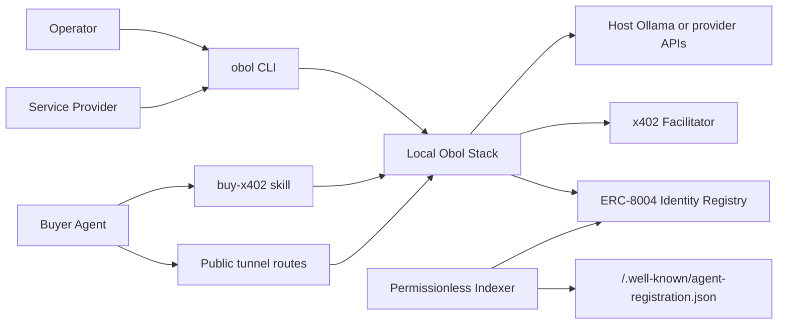
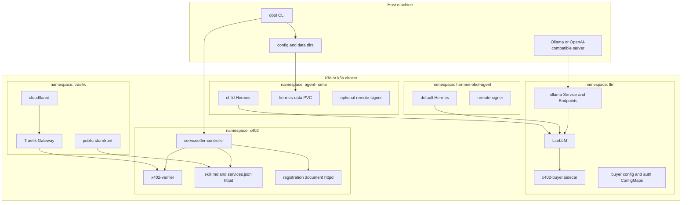
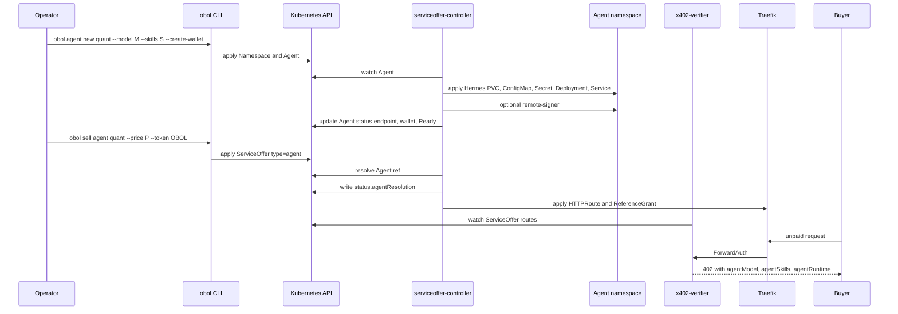
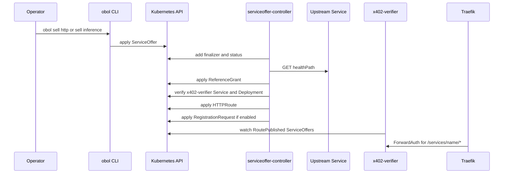
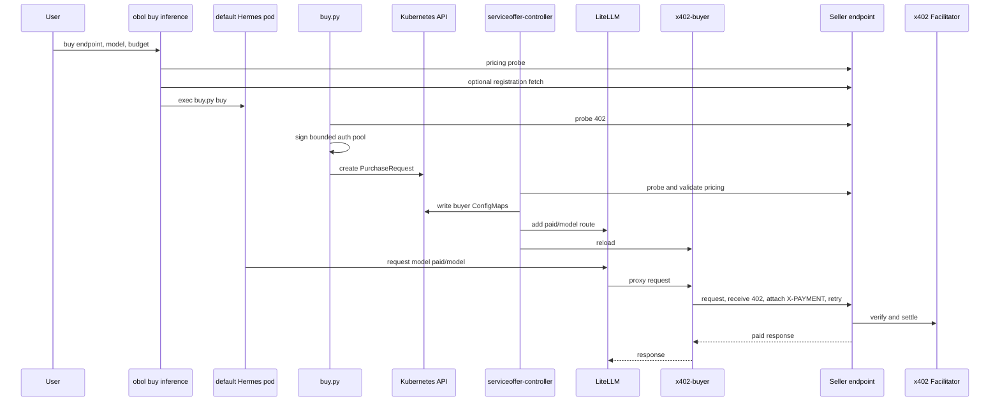
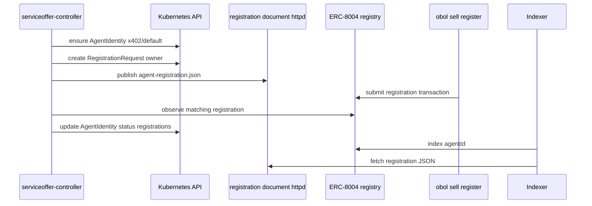
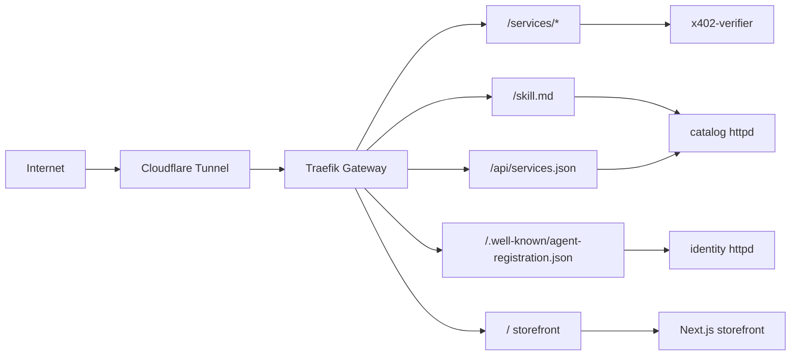

# Obol Stack Architecture

**Version**: 1.0.0-draft
**Status**: Draft
**Last Updated**: 2026-05-20

Visual companion to [SPEC.md](SPEC.md). This file is intentionally compact: use it to orient agents, then jump to the referenced SPEC sections.

## 1. Principles

| ID | Principle | Consequence |
|----|-----------|-------------|
| AP1 | Local-first control plane | k3d/k3s, local config dirs, embedded charts, CRDs as state. |
| AP2 | Standards-native commerce | x402 for payments, ERC-8004 for discovery, no central bazaar. |
| AP3 | Intent via CRDs | CLI writes intent; controllers converge resources and status. |
| AP4 | Bounded buyer risk | Pre-signed auth pools, no runtime signer in x402-buyer. |
| AP5 | Public by allowlist | Tunnel exposes only catalog, registration, and paid service routes. |

## 2. System Context

References: SPEC 1, 3.

## 3. Runtime Containers

References: SPEC 2, 4.

## 4. Module Decomposition

| Module | Runtime | State | SPEC |
|--------|---------|-------|------|
| CLI | host process | config dir, kube API | 3 |
| Stack lifecycle | host process plus Helmfile | stack ID, kubeconfig, defaults | 5.1 |
| LiteLLM | `llm` Deployment | ConfigMap, Secret | 5.2 |
| Agent CRD reconciler | serviceoffer-controller | Agent status, child resources | 5.3 |
| ServiceOffer reconciler | serviceoffer-controller | ServiceOffer status, routes | 5.4 |
| x402 verifier/proxy | `x402-verifier` | in-memory route rules | 3.3, 5.4 |
| PurchaseRequest reconciler | serviceoffer-controller | ConfigMaps, LiteLLM route | 5.6 |
| x402-buyer | LiteLLM sidecar | auth ConfigMap, pod-local consumed state | 5.6 |
| ERC-8004 renderer | serviceoffer-controller plus httpd | AgentIdentity status, registration doc | 5.7 |
| Tunnel/storefront | cloudflared plus Next.js | tunnel state, storefront resources | 5.8 |

## 5. Sell Agent Flow

References: SPEC 5.3, 5.5.

## 6. Sell HTTP/Inference Flow

References: SPEC 5.4.

## 7. Buy Paid Inference Flow

References: SPEC 5.6.

## 8. Discovery and Registration Flow

References: SPEC 5.7.

## 9. Public Network Topology

Internal-only surfaces must remain hostname-restricted to `obol.stack`: frontend, eRPC, LiteLLM, monitoring.

References: SPEC 3.2, 5.8, 6.

## 10. Storage

| Store | Entities | Notes |
|-------|----------|-------|
| Host config dir | stack ID, backend, kubeconfig, tunnel state | Local operator state. |
| Host data dir | Hermes homes, child agent seed files, PVC backing data | Local-path provisioner maps into pods. |
| Kubernetes API | CRDs, child resources, status | Main control-plane state. |
| Secrets | LiteLLM key, remote-signer keystores, API tokens | Namespaced; avoid copying into docs/logs. |
| ConfigMaps | LiteLLM config, buyer config/auths, catalogs | Controller writes per-purchase keys. |
| Pod emptyDir | x402-buyer consumed state | Reason LiteLLM replicas stay at 1. |
| Chain | ERC-8004 identity NFT/URI | Observed by controller, not minted by controller. |
