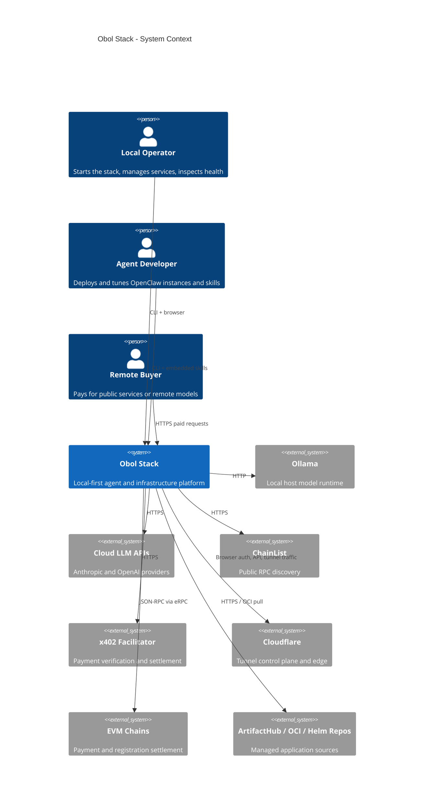
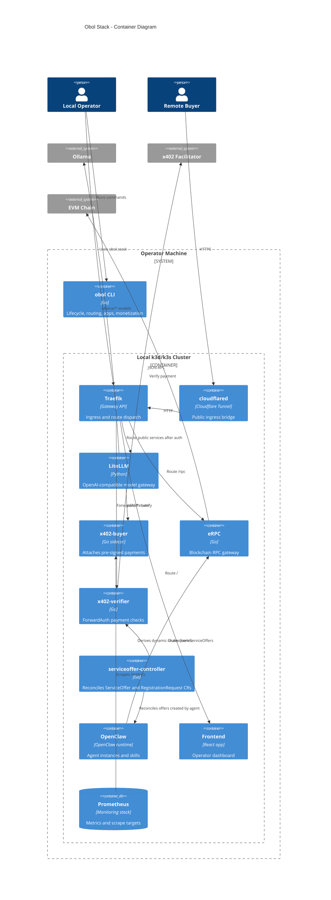
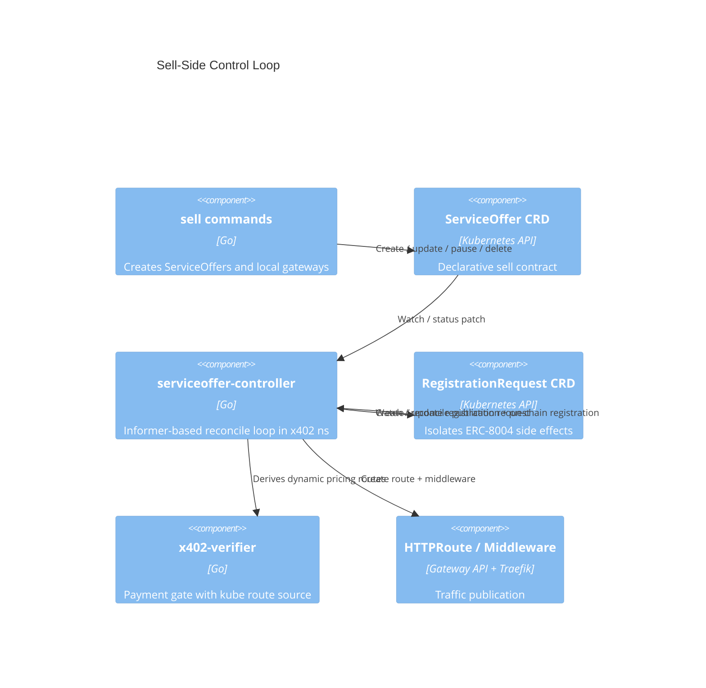
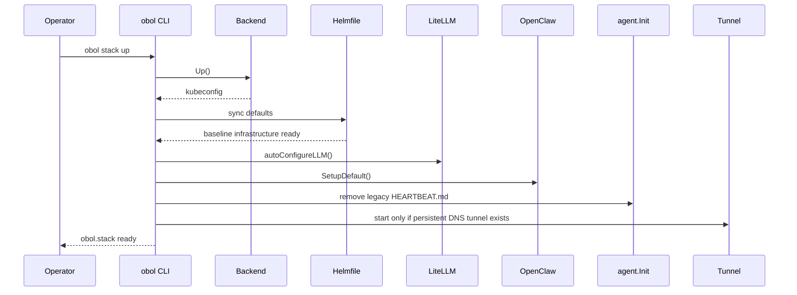
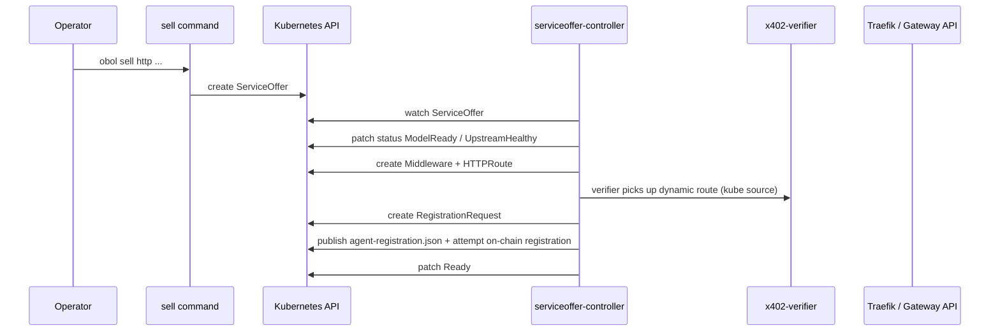
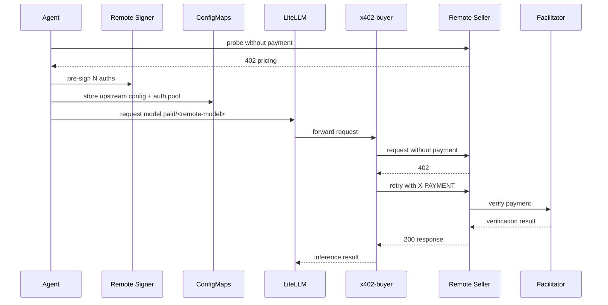
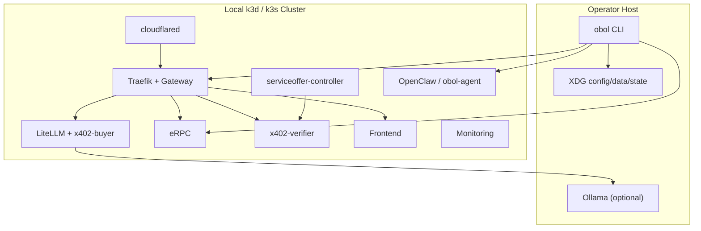
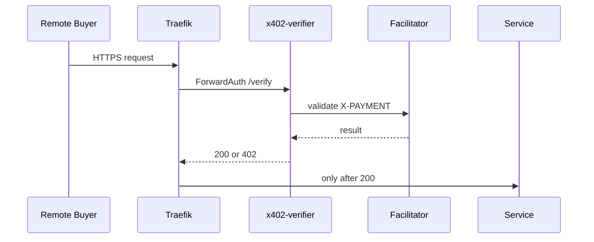

# Obol Stack Architecture

**Version**: 1.0.0-pr288
**Status**: Living document
**Last Updated**: 2026-03-29

This document is the structural companion to [SPEC.md](SPEC.md). It focuses on component boundaries, data flow, deployment topology, and trust boundaries for the PR `#288` baseline.

---

## Table of Contents

1. [Design Philosophy](#1-design-philosophy)
2. [Component Diagrams](#2-component-diagrams)
3. [Module Decomposition](#3-module-decomposition)
4. [Data Flow Diagrams](#4-data-flow-diagrams)
5. [Storage Architecture](#5-storage-architecture)
6. [Deployment Model](#6-deployment-model)
7. [Network Topology](#7-network-topology)
8. [Security Architecture](#8-security-architecture)

---

## 1. Design Philosophy

Obol Stack is built around these principles:

1. **Local-first sovereignty**: the operator machine remains the source of truth for cluster, wallet, and skill state.
2. **Single operator entry point**: the `obol` CLI is the primary control surface for lifecycle, routing, applications, and monetization.
3. **Centralized protocol translation**: LiteLLM centralizes model routing, Traefik centralizes HTTP routing, and eRPC centralizes chain access.
4. **Bounded trust**: payment execution, signing, and public routing are split into separate components with different privileges.
5. **Phased extensibility**: experimental or not-yet-fully-integrated surfaces are explicit phase follow-ups rather than hidden assumptions.

System constraints are defined in [SPEC.md](SPEC.md#15-system-constraints).

---

## 2. Component Diagrams

### 2.1 C4 Context Diagram

### 2.2 C4 Container Diagram

### 2.3 Component Diagram: Sell-Side Control Loop

---

## 3. Module Decomposition

| Module | Responsibility | SPEC Reference |
|--------|----------------|----------------|
| `internal/stack` | Backend lifecycle and default infrastructure deployment | Section 3.1 |
| `internal/model` | Central LiteLLM routing and provider patching | Section 3.2 |
| `internal/network` | eRPC, local network deployments, public RPC management | Section 3.3 |
| `internal/openclaw` | OpenClaw overlays, tokens, skills, wallets, dashboards | Section 3.4 |
| `internal/agent` | Cleans up legacy heartbeat from the default agent | Section 3.4 |
| `cmd/serviceoffer-controller` + `internal/serviceoffercontroller` | ServiceOffer and RegistrationRequest reconciliation | Section 3.5 |
| `internal/monetizeapi` | Go types for ServiceOffer, RegistrationRequest, and GVR constants | Section 3.5 |
| `cmd/obol/sell.go` + `internal/x402` | Sell-side operator CLI and verifier paths | Section 3.5 |
| `internal/x402/buyer` | Buy-side sidecar runtime | Section 3.6 |
| `internal/tunnel` | Quick and DNS tunnel lifecycle | Section 3.7 |
| `internal/app` | Managed Helm-chart workloads | Section 3.8 |

---

## 4. Data Flow Diagrams

### 4.1 Stack Startup

### 4.2 Sell-Side Publication

### 4.3 Buy-Side Request

---

## 5. Storage Architecture

### 5.1 Overview

State is intentionally split between:
- local XDG filesystem state managed by the CLI
- Kubernetes resources in the local cluster
- external chain state and facilitator state that the stack references but does not own

### 5.2 Schema Summary

| Store | Entity | Key Fields | Purpose |
|-------|--------|-----------|---------|
| Local config dir | stack metadata | `.stack-id`, `.stack-backend`, `kubeconfig.yaml` | Stack identity and runtime targeting |
| Local config dir | deployment config | `applications/<app>/<id>`, `networks/<type>/<id>` | Declarative deployment inputs |
| Kubernetes API | `ServiceOffer` | `spec.upstream`, `spec.payment`, `status.conditions` | Sell-side contract and reconcile status |
| Kubernetes API | `RegistrationRequest` | `spec.serviceOfferName`, `spec.desiredState`, `status.phase` | ERC-8004 publication and on-chain registration lifecycle |
| Kubernetes ConfigMaps | routing and pricing state | LiteLLM, eRPC, x402, buyer config | Dynamic runtime routing |
| Kubernetes Secrets | provider creds and tunnel token | API keys, tunnel token | Sensitive runtime inputs |

---

## 6. Deployment Model

### 6.1 Deployment Diagram

### 6.2 Infrastructure Requirements

| Resource | Requirement | Notes |
|----------|-------------|-------|
| Local runtime | Docker for `k3d` or direct host support for `k3s` | Backend-specific prerequisites |
| Filesystem | Writable XDG config/data/state dirs | Required for persistent stack state |
| Network | Local loopback plus outbound HTTPS | Needed for providers, ChainList, facilitator, Cloudflare |
| Optional Cloudflare account | Required only for persistent DNS tunnel | Quick tunnel path can remain local-first |

---

## 7. Network Topology

- `obol.stack` is the local operator hostname.
- Frontend and eRPC are intentionally bound behind `hostnames: ["obol.stack"]`.
- Public service routes flow through Cloudflare tunnel to Traefik, then through x402 ForwardAuth before reaching an upstream.
- Buyer-side `paid/*` traffic stays inside the cluster until the sidecar contacts a remote seller.
- Registration JSON is intentionally public and bypasses ForwardAuth.

---

## 8. Security Architecture

### 8.1 Trust Boundaries

Trust boundaries exist between:
- operator host and local cluster
- local-only routes and public tunnel routes
- remote signer and buyer sidecar
- x402 verification and upstream service execution
- local filesystem state and external chain/facilitator systems

### 8.2 Authentication Flow

### 8.3 Data Encryption

| Data | At Rest | In Transit |
|------|---------|-----------|
| Provider API keys | Kubernetes Secret | HTTPS to provider APIs |
| Wallet and backup material | Local data dir, optional encrypted backup | Local filesystem or remote signer API |
| Tunnel traffic | Cloudflare-managed | HTTPS / QUIC |
| Payment proofs | Not persisted by the sidecar beyond auth pool state | HTTPS to seller / facilitator |
