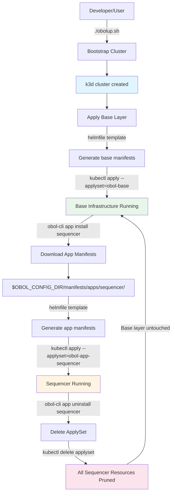

# Obol Stack Planning

## Purpose

Local-first Kubernetes stack for running Ethereum infrastructure with a layered
architecture supporting base infrastructure and multiple applications.

## Architecture Overview

The system is designed in **3 distinct layers**, each with independent lifecycle
management:

```
┌─────────────────────────────────────────┐
│  Layer 1: Cluster (k3d)                 │
│  - k3d Kubernetes cluster               │
│  - Container runtime                    │
│  - Networking, storage drivers          │
│  - Kubeconfig                           │
│  Managed by: obolup.sh (bootstrap)      │
└─────────────────────────────────────────┘
              ↓
┌─────────────────────────────────────────┐
│  Layer 2: Base Infrastructure           │
│  - Ethereum L1 nodes/infrastructure     │
│  - Monitoring (Prometheus, Grafana)     │
│  - Shared storage, networking           │
│  - Common services                      │
│  Managed by: obolup.sh                  │
│  ApplySet: obol-base                    │
│  Source: manifests/base/                │
└─────────────────────────────────────────┘
              ↓
┌─────────────────────────────────────────┐
│  Layer 3: Applications (Multiple)       │
│  - L2 sequencers                        │
│  - Validator nodes                      │
│  - Custom Ethereum workloads            │
│  Managed by: obol-stack-ui / obol-cli   │
│  ApplySet: obol-app-{name}              │
│  Source: Downloaded manifests           │
└─────────────────────────────────────────┘
```

## Tooling Architecture

The obol-stack is managed through two primary tools that work together:

1. **obolup.sh** - Bootstrap installer and updater
2. **obol** - CLI binary for cluster and application management

### obolup.sh - Bootstrap Installer

`obolup.sh` is a curl-to-bash bootstrap installer (similar to rustup) that
handles initial setup and ongoing updates of the obol toolchain.

**Purpose:**

- Downloads and installs the `obol` binary from GitHub releases
- Manages dependency versions (k3d, helm, helmfile, k9s)
- Validates prerequisites (Docker installation and status)
- Optionally bootstraps a cluster through the obol binary

**Installation:**

```bash
# Curl-to-bash installation
curl -sSL https://raw.githubusercontent.com/obol/obol-stack/main/obolup.sh | bash

# Or download and run
curl -sSL https://raw.githubusercontent.com/obol/obol-stack/main/obolup.sh -o obolup.sh
chmod +x obolup.sh
./obolup.sh
```

**Idempotency:**

The `obolup.sh` script is designed to be idempotent and can be run multiple
times safely:

- Detects existing `obol` binary installation
- Shows current version before upgrading
- Overwrites binary with new version
- Creates directories only if they don't exist
- Can be used for both initial installation and upgrades

**Core Responsibilities:**

#### 1. Binary Management

- Downloads latest `obol` binary release from GitHub
- Installs to `$OBOL_CONFIG_DIR/bin/obol`
- Detects and upgrades to new obol binary versions
- Prints shell PATH instructions for user configuration

#### 2. Dependency Version Management

Each obol release specifies compatible versions of dependencies:

- k3d
- helm
- helmfile
- k9s

When upgrading obol, obolup.sh automatically:

- Detects version changes in dependencies
- Downloads/upgrades/downgrades dependencies as needed
- Ensures version compatibility across the toolchain

#### 3. Prerequisites Validation

- Validates Docker is installed
- Validates Docker daemon is running
- Exits with instructions if Docker is missing or inactive
- Respects user's system Docker installation method

---

### obol - Cluster Management Binary

The `obol` binary is a Golang project within the obol-stack repository that
provides comprehensive cluster and application lifecycle management.

**Installation Location:** `$OBOL_CONFIG_DIR/bin/obol`

**Architecture:** Golang CLI that wraps and orchestrates:

- k3d (cluster management)
- kubectl (Kubernetes API)
- helmfile (manifest generation)
- k9s (cluster UI)

---

#### Cluster Management Commands

##### `obol cluster init`

Initializes cluster configuration from obol-stack repository.

```bash
obol cluster init
```

**Behavior:**

- Downloads default k3d configuration file to `$OBOL_CONFIG_DIR/cluster/k3d/`
- Syncs latest cluster config from obol-stack GitHub repo
- May perform optional system analysis to estimate resource tolerances
- Prepares cluster definition but does not start cluster

**Output:**

- `$OBOL_CONFIG_DIR/cluster/k3d/config.yaml`

---

##### `obol cluster up`

Spins up the k3d cluster and validates Layer 1 health.

```bash
obol cluster up
```

**Behavior:**

1. Reads k3d configuration from `$OBOL_CONFIG_DIR/cluster/k3d/`
2. Creates k3d cluster via `k3d cluster create`
3. Validates Layer 1 foundation health:
   - Cluster API reachability
   - Networking configuration (CNI, ingress)
   - Persistent storage provisioners
4. Generates kubeconfig at `$OBOL_CONFIG_DIR/cluster/kubeconfig/default.yaml`
5. Runs health check against ingress endpoints

**Exit behavior:**

- Returns success if cluster is healthy and ready
- Returns error if cluster creation or health check fails

---

##### `obol cluster down`

Gracefully tears down the cluster.

```bash
obol cluster down
```

**Behavior:**

- Stops k3d cluster via `k3d cluster stop`
- Preserves persistent storage volumes in `$OBOL_STATE_DIR`
- Retains configuration in `$OBOL_CONFIG_DIR`

**Note:** Cluster can be restarted with `obol cluster up` without data loss.

---

##### `obol cluster purge`

Completely removes cluster and all persistent data.

```bash
obol cluster purge
```

**Behavior:**

1. Stops k3d cluster
2. Deletes k3d cluster via `k3d cluster delete`
3. **Deletes all persistent storage volumes** from `$OBOL_STATE_DIR`
4. Removes kubeconfig from `$OBOL_CONFIG_DIR/cluster/kubeconfig/`

**Warning:** This is destructive and cannot be undone.

**Confirmation:** Requires user confirmation before proceeding.

---

##### `obol cluster connect`

Connects to the cluster by launching k9s with the correct kubeconfig.

```bash
obol cluster connect
```

**Behavior:**

- Wraps `k9s` with `KUBECONFIG=$OBOL_CONFIG_DIR/cluster/kubeconfig/default.yaml`
- Launches interactive k9s session
- Provides immediate cluster visibility and management

**Equivalent to:**

```bash
KUBECONFIG=$OBOL_CONFIG_DIR/cluster/kubeconfig/default.yaml k9s
```

---

##### `obol cluster backup <volume>`

Backs up persistent storage volumes to a compressed archive.

```bash
obol cluster backup <volume-name>
```

**Behavior:**

1. Persistent storage is hardcoded to `$OBOL_STATE_DIR` for all PVC volumes
2. Identifies the volume's directory in `$OBOL_STATE_DIR/<volume-name>`
3. Creates compressed archive:
   `$OBOL_STATE_DIR/backups/<volume-name>-<timestamp>.tar.gz`
4. Validates archive integrity

**Example:**

```bash
# Backup Prometheus data
obol cluster backup prometheus-data

# Creates: $OBOL_STATE_DIR/backups/prometheus-data-2025-10-13T14-30-00.tar.gz
```

**Use cases:**

- Backing up Ethereum validator keys
- Preserving historical metrics data
- Creating restore points before upgrades

---

#### Application Management Commands

##### `obol app install <APP>`

Installs an application from the obol-stack repository.

```bash
obol app install <app-name>
```

**Behavior:**

1. Checks `obol-base` applyset exists (dependency validation)
2. Validates application dependencies (base layer components, other apps)
3. Downloads application manifests from
   `github.com/obol/obol-stack/manifests/apps/<app>/`
4. Saves to `$OBOL_CONFIG_DIR/helmfile/<app>/`
5. Applies default configuration
6. Runs `helmfile template` to generate YAML manifests
7. Applies with `kubectl apply --prune --applyset=obol-app-<app>`
8. Tracks installation in `$OBOL_CONFIG_DIR/.apps.yaml`

**Example:**

```bash
obol app install sequencer
# Downloads sequencer helmfile
# Applies with applyset: obol-app-sequencer
```

---

##### `obol app edit <APP>`

Opens the application's values file in the user's editor.

```bash
obol app edit <app-name>
```

**Behavior:**

1. Locates app values file: `$OBOL_CONFIG_DIR/helmfile/<app>/values.yaml`
2. Opens in `$EDITOR` (falls back to `vim` or `nano`)
3. Waits for editor to close
4. Prompts: "Apply changes? [y/n]"
5. If yes, runs `obol app sync <app>` to apply mutations

**Example:**

```bash
export EDITOR=code
obol app edit sequencer
# Opens VS Code with sequencer/values.yaml
```

---

##### `obol app sync <APP>`

Generates manifests and applies changes to the cluster.

```bash
obol app sync <app-name>
```

**Behavior:**

1. Reads app helmfile from `$OBOL_CONFIG_DIR/helmfile/<app>/`
2. Runs `helmfile template` with current values
3. Generates Kubernetes YAML manifests
4. Applies with `kubectl apply --prune --applyset=obol-app-<app>`
5. ApplySet automatically prunes removed resources

**Example:**

```bash
# After editing values
obol app sync sequencer
# Regenerates and applies sequencer manifests
```

---

##### `obol app update <APP>`

Pulls the latest application template from obol-stack repository.

```bash
obol app update <app-name>
```

**Behavior:**

1. Fetches latest app version from GitHub
2. Downloads updated helmfile templates
3. **Preserves user customizations** in `values.yaml`
4. Merges user values with new template
5. Prompts: "Review changes and apply? [y/n]"
6. If yes, runs `obol app sync <app>` to apply updates

**Example:**

```bash
obol app update sequencer
# Fetches latest sequencer template
# Merges with existing values.yaml
# Applies updated manifests
```

---

##### `obol app delete <APP>`

Removes an application from the cluster.

```bash
obol app delete <app-name>
```

**Behavior:**

1. Checks for dependent applications
2. If dependencies exist, prevents deletion:
   ```
   ERROR: Cannot delete 'sequencer', required by: validator
   ```
3. If no dependencies, deletes applyset:
   ```bash
   kubectl delete applyset obol-app-<app>
   ```
4. All resources with `applyset.kubernetes.io/part-of=obol-app-<app>` are pruned
5. Optionally removes local manifests from `$OBOL_CONFIG_DIR/helmfile/<app>/`
6. Updates `$OBOL_CONFIG_DIR/.apps.yaml`

**Example:**

```bash
obol app delete sequencer
# Removes all sequencer resources from cluster
# Base layer and other apps remain untouched
```

---

#### Wrapped Utility Commands

##### `obol kubectl [args...]`

Wraps kubectl with the correct kubeconfig.

```bash
obol kubectl get pods
```

**Equivalent to:**

```bash
KUBECONFIG=$OBOL_CONFIG_DIR/cluster/kubeconfig/default.yaml kubectl get pods
```

---

##### `obol k9s`

Wraps k9s with the correct kubeconfig.

```bash
obol k9s
```

**Equivalent to:**

```bash
KUBECONFIG=$OBOL_CONFIG_DIR/cluster/kubeconfig/default.yaml k9s
```

---

##### `obol helm [args...]`

Wraps helm with the correct kubeconfig.

```bash
obol helm list
```

**Equivalent to:**

```bash
KUBECONFIG=$OBOL_CONFIG_DIR/cluster/kubeconfig/default.yaml helm list
```

---

#### AI-Assisted Commands

##### `obol ai <prompt>`

Provides AI-powered cluster debugging and monitoring using a local AI with
kubernetes-mcp integration.

```bash
obol ai "validate why my cluster is not working"
obol ai "why is the sequencer pod crashing?"
obol ai "check if all apps are healthy"
```

**Purpose:**

- Natural language cluster diagnostics
- Automated issue detection and root cause analysis
- Monitoring of installed applications
- Configuration validation
- Guided troubleshooting

**Architecture:**

The `obol ai` command connects to a local AI agent that has:

1. **kubernetes-mcp access** - Direct read access to cluster state via Model
   Context Protocol
2. **Cluster context** - Awareness of installed apps, base layer, and
   configuration
3. **Log analysis** - Ability to query pod logs and events
4. **Metrics access** - Integration with Prometheus for performance data

**Behavior:**

1. Connects to local AI endpoint (defaults to localhost MCP server)
2. Passes user prompt to AI with cluster context
3. AI uses kubernetes-mcp tools to:
   - Query pod status, deployments, services
   - Read logs and events
   - Check resource utilization
   - Validate configurations
4. Returns analysis and recommendations in natural language

**Example Use Cases:**

1. **Cluster Health Validation:**
   ```bash
   $ obol ai "validate why my cluster is not working"

   Analyzing cluster state...

   Found 3 issues:

   1. Prometheus pod in CrashLoopBackOff
      └─ Root cause: Insufficient memory (OOMKilled)
      └─ Current limit: 1Gi, Recommended: 2Gi

   2. Sequencer deployment has 0/1 replicas ready
      └─ Root cause: Image pull failure (ImagePullBackOff)
      └─ Image: ghcr.io/obol/sequencer:v1.2.3 not found

   3. Persistent volume claim 'validator-data' pending
      └─ Root cause: No storage class available
      └─ k3d local-path provisioner not running

   Suggested actions:
   1. Increase Prometheus memory: obol app edit monitoring
   2. Check sequencer image tag in values.yaml
   3. Verify k3d storage provisioner: kubectl get pods -n kube-system
   ```

2. **Application-Specific Debugging:**
   ```bash
   $ obol ai "why is the sequencer pod crashing?"

   Analyzing sequencer deployment...

   Sequencer pod 'sequencer-7d9f8b6c-xkj2p' crash loop detected.

   Last 20 log lines show:
   - Fatal: Connection refused to L1 RPC endpoint
   - Configured endpoint: http://eth-l1:8545

   Root cause: L1 Ethereum node not reachable

   Validation:
   ✗ Service 'eth-l1' exists but no endpoints ready
   ✗ eth-l1 pod in 'Pending' state
   ✗ PVC 'eth-l1-data' stuck in Pending (no storage)

   Resolution steps:
   1. Fix storage provisioner (see above issue)
   2. Once eth-l1 starts, sequencer will auto-recover
   ```

3. **Health Check All Apps:**
   ```bash
   $ obol ai "check if all apps are healthy"

   Scanning installed applications...

   Base Layer (obol-base):
   ✓ Prometheus: Running (1/1 replicas)
   ✓ Grafana: Running (1/1 replicas)
   ✗ eth-l1-execution: Syncing (12 hours behind)
   ✓ eth-l1-consensus: Synced

   Applications:
   ✓ sequencer: Running (1/1 replicas, 45 blocks processed)
   ✗ validator: Degraded (2/3 replicas ready)
      └─ validator-2 pod evicted (node pressure)

   Overall Status: Degraded
   Recommendation: Address validator replica issue and wait for L1 sync
   ```

4. **Configuration Validation:**
   ```bash
   $ obol ai "is my sequencer configured correctly?"

   Analyzing sequencer configuration...

   Configuration Review:
   ✓ L1 RPC endpoint: http://eth-l1:8545 (reachable)
   ✓ Sequencer private key: Set via secret
   ✓ Resource requests: 2 CPU, 4Gi RAM (appropriate)
   ⚠ Resource limits: Not set (recommended to add)
   ✗ Persistent storage: Using emptyDir (data loss on restart)
   ✓ Monitoring: Prometheus annotations present

   Recommendations:
   1. Add resource limits to prevent node exhaustion
   2. Switch to PVC for persistent storage
   3. Consider adding liveness/readiness probes
   ```

5. **Performance Analysis:**
   ```bash
   $ obol ai "why is the validator slow?"

   Analyzing validator performance...

   Metrics from last 1 hour:
   - CPU usage: 95% (near limit of 2 cores)
   - Memory usage: 6.2Gi / 8Gi (78%)
   - Attestation success rate: 94% (below target 99%)
   - P2P peer count: 12 (healthy)

   Root cause: CPU bottleneck
   - Validator is CPU-bound during attestation duties
   - Current limit: 2 cores insufficient for 100 validators

   Recommendation:
   Increase CPU allocation to 4 cores:
   $ obol app edit validator
   # Set: resources.limits.cpu: "4"
   $ obol app sync validator
   ```

**Infrastructure:**

The AI capability is part of the base infrastructure setup (Layer 2). When the
base layer is deployed, a local AI agent with kubernetes-mcp integration is
installed and configured to monitor the cluster. The `obol ai` command connects
to this local agent for diagnostics and troubleshooting.

**Interactive Mode:**

```bash
# Start interactive AI session
obol ai chat

> What's wrong with my cluster?
[AI analyzes and responds]

> How do I fix the prometheus memory issue?
[AI provides step-by-step guidance]

> Show me the logs for the sequencer
[AI fetches and displays logs]

> exit
```

**Note:** This feature integrates with the AI Assistant deployed as part of
Layer 2 (Base Infrastructure), as described in the "AI Integration and Chatbot"
experimental feature section later in this document.

---

### Directory Structure (Updated)

```
$OBOL_CONFIG_DIR/                      # User runtime directory (~/.config/obol)
├── bin/                               # Downloaded binaries
│   ├── obol                           # Main CLI binary
│   ├── k3d
│   ├── helm
│   ├── helmfile
│   └── k9s
├── cluster/                           # Cluster configuration
│   ├── k3d/
│   │   └── config.yaml                # k3d cluster definition
│   └── kubeconfig/
│       └── default.yaml               # Generated kubeconfig
├── helmfile/                          # Application manifests
│   ├── sequencer/
│   │   ├── helmfile.yaml
│   │   ├── values.yaml                # User-editable values
│   │   └── charts/
│   └── validator/
│       ├── helmfile.yaml
│       ├── values.yaml
│       └── charts/
├── .apps.yaml                         # Installed apps tracking (auto-generated)
└── manifests/                         # Synced from obol-stack repo (legacy)
    └── base/                          # Base infrastructure (future use)

$OBOL_STATE_DIR/                       # Persistent data directory (~/.local/share/obol)
├── volumes/                           # PVC persistent storage
│   ├── prometheus-data/
│   ├── grafana-data/
│   └── validator-keys/
└── backups/                           # Volume backups
    ├── prometheus-data-2025-10-13T14-30-00.tar.gz
    └── validator-keys-2025-10-13T15-00-00.tar.gz
```

**Key Changes:**

- `$OBOL_CONFIG_DIR/bin/obol` - Main CLI binary installed by obolup.sh
- `$OBOL_CONFIG_DIR/cluster/` - Cluster configuration and kubeconfig
- `$OBOL_CONFIG_DIR/helmfile/` - Application manifests (renamed from
  `manifests/apps/`)
- `$OBOL_STATE_DIR/` - Persistent storage volumes and backups

---

### Environment Variables

**OBOL_CONFIG_DIR**

- Default: `~/.config/obol`
- Purpose: Configuration, binaries, and application manifests

**OBOL_STATE_DIR**

- Default: `~/.local/share/obol`
- Purpose: Persistent storage volumes and backups

**EDITOR**

- Purpose: Editor used by `obol app edit`
- Default: Falls back to `vim` or `nano`

**KUBECONFIG**

- Automatically set by obol wrapped commands
- Points to: `$OBOL_CONFIG_DIR/cluster/kubeconfig/default.yaml`

---

## Persistent Storage Strategy

Persistent state is saved to the host machine via k3d volume mounts, enabling data to survive pod deletions and cluster teardowns.

**Approach:**

1. **Host Directory Mount**: k3d mounts a host directory into all cluster nodes
   - Source: `$OBOL_STATE_DIR` (defaults to `.workspace/state` in dev, `~/.local/share/obol` in production)
   - Target: `/data` inside k3d nodes
   - Configured via `k3d/config.yaml` volumes section

2. **Kubernetes Storage**: Applications use PersistentVolumes with hostPath pointing to subdirectories within the mounted path
   - Example: `/data/ethereum-execution`, `/data/validator-keys`, `/data/prometheus-data`
   - Data persists on host filesystem, survives cluster lifecycle

3. **Flexibility**: Default single mount configuration can be extended with additional mounts for performance/capacity needs
   - Users can add multiple volume mounts for different storage backends
   - See `k3d/config.yaml` for optional mount examples

**Lifecycle:**
- `obol cluster down`: Preserves all persistent volumes
- `obol cluster purge`: Deletes persistent volumes (requires confirmation)

---

## Layer Details

### Layer 1: Cluster Bootstrap

**Responsibility:** Create the Kubernetes cluster foundation

**Components:**

- k3d cluster creation from `k3d-config.yaml`
- kubeconfig generation
- Container runtime setup
- Network/storage provisioners

**Management:**

```bash
# Initial installation (curl to bash)
curl -sSL https://raw.githubusercontent.com/obol/obol-stack/main/obolup.sh | bash

# Or download and run
curl -sSL https://raw.githubusercontent.com/obol/obol-stack/main/obolup.sh -o obolup.sh
chmod +x obolup.sh
./obolup.sh

# Destroy cluster
./obolup.sh destroy
```

**Characteristics:**

- Ephemeral cluster, intended to be frequently destroyed and recreated
- No ApplySet (infrastructure layer)
- Prerequisite for layers 2 & 3
- Lightweight k3d enables fast iteration cycles

---

### Layer 2: Base Infrastructure

**Responsibility:** Provide shared Ethereum and monitoring infrastructure

**Components:**

- Ethereum L1 execution/consensus clients
- Prometheus metrics collection
- Grafana dashboards
- Shared storage classes
- Ingress controllers
- Certificate management

**Management:**

```bash
# Apply base layer (default behavior)
./obolup.sh
```

**Source of Truth:**

- Obol GitHub repository: `github.com/obol/obol-stack/manifests/base/`
- Synced to: `$OBOL_CONFIG_DIR/manifests/base/`
- Users do not maintain git repository
- Base configuration managed by Obol

**ApplySet:**

- Name: `obol-base`
- Scope: All base infrastructure resources
- Pruning: Automatic removal of deleted base resources

**Characteristics:**

- Single applyset for all base components
- Changes applied manually when needed
- Stable, infrequently updated
- Required by Layer 3 applications

---

### Layer 3: Applications

**Responsibility:** Run application-specific Ethereum workloads

**Components:**

- L2 sequencer nodes
- Validator instances
- Rollup infrastructure
- Custom dApps
- Application-specific services

**Management:**

```bash
# Via CLI
obol-cli app list
obol-cli app install sequencer
obol-cli app uninstall sequencer

# Via UI
obol-stack-ui
# Web interface for application management
```

**Source of Truth:**

- Obol GitHub repository: `github.com/obol/obol-stack/manifests/apps/`
- Downloaded to: `$OBOL_CONFIG_DIR/manifests/apps/{app-name}/`
- Applications are helmfile-based templates

**ApplySet:**

- Name: `obol-app-{app-name}` (one per application)
- Scope: All resources for that specific application
- Pruning: Automatic removal when app is uninstalled or updated

**Characteristics:**

- Multiple independent applysets
- Managed via obol-cli or obol-stack-ui
- Versioning strategy TBD
- Can be added/removed without affecting base layer
- May depend on base layer or other applications

## ApplySet Strategy

### What are ApplySets?

ApplySets are Kubernetes' native resource tracking mechanism for pruning (alpha
in k8s 1.27+).

**Key concepts:**

1. Creates a parent tracking object (Secret/ConfigMap)
2. Labels all applied resources: `applyset.kubernetes.io/part-of={name}`
3. Tracks resource inventory in parent object
4. On next apply, compares new manifests with tracked inventory
5. Automatically prunes resources in applyset but not in new manifests

### Why ApplySets vs ArgoCD/Flux?

| Feature         | ApplySets         | ArgoCD/Flux               |
| --------------- | ----------------- | ------------------------- |
| Complexity      | Native kubectl    | Separate controller       |
| Daemon          | None              | Runs 24/7                 |
| Pruning         | Built-in          | Built-in                  |
| Drift detection | Manual apply      | Continuous reconciliation |
| Resource usage  | Zero              | ~200-500MB RAM            |
| Setup           | Enable alpha flag | Install operator          |
| Best for        | Local dev         | Production clusters       |

**For local-first Ethereum stacks:** ApplySets provide sufficient guarantees
without controller overhead.

**Note on Helmfile:** Helmfile is used **solely for generating YAML manifests**
per applyset. Helmfile does NOT handle resource pruning - that responsibility
belongs to kubectl with ApplySets.

### ApplySet Usage

**Enable ApplySets:**

```bash
export KUBECTL_APPLYSET=true
```

**Apply with pruning:**

```bash
kubectl apply -f manifests/ --prune --applyset={name}
```

**View applysets:**

```bash
kubectl get applysets
kubectl get applyset obol-base -o yaml
```

**Delete applyset (prunes all resources):**

```bash
kubectl delete applyset obol-app-sequencer
# All sequencer resources automatically removed
```

### Layer-Specific ApplySet Design

#### Base Layer: Single ApplySet

```bash
# Apply base infrastructure
helmfile -f manifests/base/helmfile.yaml template --include-crds | \
  KUBECTL_APPLYSET=true kubectl apply -f - \
    --prune \
    --applyset=obol-base
```

**Behavior:**

- All base resources tracked under `obol-base`
- Base layer configuration is stable and rarely changes
- Managed by Obol team in obol-stack repository
- Application layer depends on base layer

**Note:** Base layer helmfile defines core infrastructure (monitoring, Ethereum
L1, networking). This configuration is maintained by Obol and synced to users'
local systems. Users should not need to modify base layer configuration.

#### Application Layer: One ApplySet per App

```bash
# Install sequencer app
helmfile -f ~/.config/obol/manifests/apps/sequencer/helmfile.yaml template | \
  KUBECTL_APPLYSET=true kubectl apply -f - \
    --prune \
    --applyset=obol-app-sequencer

# Install validator app
helmfile -f ~/.config/obol/manifests/apps/validator/helmfile.yaml template | \
  KUBECTL_APPLYSET=true kubectl apply -f - \
    --prune \
    --applyset=obol-app-validator
```

**Behavior:**

- Each app has isolated applyset
- Apps can be installed/removed independently
- Uninstalling removes only that app's resources
- Base layer unaffected
- **Important:** Applications may depend on base layer components OR have
  inter-dependencies with other applications

**Dependency Complexity Note:** Explicitly expressing and managing complex
inter-application dependencies could become problematic. Dependency resolution
logic will need to:

- Check base layer prerequisites (e.g., requires Prometheus, Ethereum L1 RPC)
- Validate inter-app dependencies (e.g., validator requires sequencer)
- Prevent uninstall of apps with dependent apps
- Handle dependency ordering during installation

This complexity may require careful design of the dependency resolution system
in obol-cli/obol-stack-ui.

**Example:**

```bash
# Install two apps
obol-cli app install sequencer
obol-cli app install validator  # May depend on sequencer

kubectl get applysets
# obol-base              (prometheus, grafana, eth-l1)
# obol-app-sequencer     (sequencer deployment, service, etc.)
# obol-app-validator     (validator statefulset, pvc, etc.)

# Remove sequencer
obol-cli app uninstall sequencer
# ERROR: Cannot uninstall 'sequencer', required by: validator
```

## Directory Structure

```
$OBOL_CONFIG_DIR/                      # User runtime directory (~/.config/obol)
├── bin/                               # Downloaded binaries
│   ├── k3d, helm, helmfile, k9s
├── kubeconfig.yaml                    # Cluster access
├── .apps.yaml                         # Track installed applications (auto-generated by obol-cli)
└── manifests/                         # Synced from obol-stack repo
    ├── base/                          # Base infrastructure (synced)
    │   ├── helmfile.yaml              # Base layer root helmfile
    │   ├── ethereum-l1/
    │   │   └── helmfile.yaml          # L1 execution/consensus
    │   └── monitoring/
    │       ├── helmfile.yaml          # Prometheus, Grafana
    │       └── dashboards/
    │           ├── Chart.yaml
    │           └── templates/
    │               └── *.yaml
    └── apps/                          # Applications (pulled when installed)
        ├── sequencer/
        │   ├── helmfile.yaml
        │   ├── values.yaml            # User-customizable values
        │   └── charts/
        └── validator/
            ├── helmfile.yaml
            ├── values.yaml            # User-customizable values
            └── charts/
```

**Key Points:**

- `$OBOL_CONFIG_DIR/manifests/base/`: Synced from obol-stack GitHub repo during
  `./obolup.sh`
- `$OBOL_CONFIG_DIR/manifests/apps/{app}/`: Pulled from obol-stack GitHub repo
  when user installs app via CLI/UI
- `$OBOL_CONFIG_DIR/.apps.yaml`: Hidden file auto-generated by obol-cli to track
  installed applications
- Each app directory contains a `helmfile.yaml` defining the application's
  Kubernetes resources
- Helmfile is used solely to generate YAML manifests, which are then applied
  with kubectl ApplySets

## Deployment Flow



## Application Management

### Application Distribution

Applications are helmfile-based templates stored in the Obol GitHub repository
(`github.com/obol/obol-stack/manifests/apps/`).

**Installation Flow:**

1. User installs app via `obol-cli` or `obol-stack-ui`
2. Application helmfile pulled from GitHub to
   `$OBOL_CONFIG_DIR/manifests/apps/{app-name}/`
3. Application comes with sane defaults and automatic integration with base
   layer
4. User can customize values via `values.yaml` or UI configuration
5. Helmfile generates YAML manifests
6. Manifests applied to cluster with kubectl ApplySet

**Versioning:** TBD - Strategy for application versioning to be determined.

**Community Contributions:** Users are encouraged to contribute improvements to
application manifests via pull requests to the obol-stack repository. This
enables the community to:

- Fix bugs and improve existing applications
- Add new application templates
- Share best practices and optimizations
- Contribute Ethereum-specific integrations

**Alternative:** A separate repository (e.g., `obol-stack-apps`) could be
created specifically for community-contributed application manifests, keeping
the core obol-stack repository focused on base infrastructure.

### Custom Applications

Users may bring their own helm charts to deploy custom infrastructure:

```bash
# Example: User's custom helm chart
$OBOL_CONFIG_DIR/manifests/apps/my-custom-app/
├── helmfile.yaml
├── values.yaml
└── charts/
    └── my-app/
        ├── Chart.yaml
        └── templates/
```

**Custom Application Template:** We could provide a template generator that
bootstraps helmfile configuration with global variables relative to base
configuration:

```bash
# Generate custom app scaffold
obol-cli app create my-custom-app

# Creates templated helmfile with base layer integration:
# - Prometheus endpoints pre-configured
# - Ethereum L1 RPC endpoints injected
# - Monitoring dashboards auto-configured
# - Network policies aligned with base
```

This template would include:

- Pre-configured connection to base layer services
- Standard labels and annotations
- Monitoring/logging integration
- Service discovery configuration

**Trade-off:** Custom applications without using the template lose the ease of
use and automatic integration provided by Obol-managed application templates.
Users will need to:

- Manually configure service discovery/endpoints
- Handle dependencies and prerequisites
- Manage upgrades and compatibility

### Management Tools

#### obol-cli (Command-line)

```bash
# List available applications
obol-cli app list

# Install application
obol-cli app install sequencer

# Configure application
obol-cli app config sequencer --set key=value

# Uninstall application
obol-cli app uninstall sequencer

# Show status
obol-cli app status
```

#### obol-stack-ui (Web Interface)

- Browse available applications
- Install/uninstall applications
- Configure application settings
- View application status and logs
- Manage dependencies

### Application Lifecycle

**Versioning Strategy:** TBD - Application versioning approach to be determined.

#### Install Application

```bash
obol-cli app install sequencer
```

**Steps:**

1. Check `obol-base` applyset exists (dependency check)
2. Check application dependencies (base layer components, other apps)
3. Pull application helmfile from GitHub to
   `$OBOL_CONFIG_DIR/manifests/apps/sequencer/`
4. Apply default configuration with automatic base layer integration
5. Run `helmfile template` to generate YAML manifests
6. Apply with `kubectl apply --prune --applyset=obol-app-sequencer`
7. Track installation in `$OBOL_CONFIG_DIR/installed-apps.yaml`

#### Upgrade Application

```bash
obol-cli app upgrade sequencer
```

**Steps:**

1. Pull updated application helmfile from GitHub
2. Merge user customizations from existing `values.yaml`
3. Run `helmfile template` with updated configuration
4. Apply with same applyset name `obol-app-sequencer`
5. ApplySet automatically prunes old resources not in new manifests
6. Update tracking in `installed-apps.yaml`

#### Uninstall Application

```bash
obol-cli app uninstall sequencer
```

**Steps:**

1. Check for dependent applications (prevent uninstall if other apps depend on
   this)
2. Delete applyset: `kubectl delete applyset obol-app-sequencer`
3. All resources with `applyset.kubernetes.io/part-of=obol-app-sequencer`
   automatically pruned
4. Optionally remove local manifests:
   `rm -rf $OBOL_CONFIG_DIR/manifests/apps/sequencer/`
5. Update tracking in `installed-apps.yaml`

#### Show Status

```bash
obol-cli app status
```

**Output:**

```
Installed Applications:
  sequencer - Running ✓
  validator - Running ✓ (depends on: sequencer)

Available Applications:
  rollup-node - Not installed
```

## Key Design Decisions

### 1. No GitOps Controllers (ArgoCD/Flux)

**Decision:** Use kubectl ApplySets instead of ArgoCD/Flux

**Rationale:**

- Local-first development stack, not production
- Manual apply is acceptable (no continuous drift detection needed)
- Eliminates controller overhead (~200-500MB RAM)
- Simpler mental model: apply when changes needed
- Still gets automatic pruning via ApplySets

**Trade-offs:**

- ✅ Zero daemon overhead
- ✅ Simple kubectl-based workflow
- ❌ No automatic drift detection/correction
- ❌ No web UI (could add simple status dashboard)
- ❌ Manual apply required

### 2. Helmfile Instead of Raw Manifests

**Decision:** Use helmfile as templating layer

**Rationale:**

- Helm charts provide Ethereum application packaging
- Helmfile simplifies multi-chart deployments
- Mature ecosystem of charts (prometheus, grafana, etc.)
- Template generation: `helmfile template` → kubectl apply

**Note:** Helmfile is used **solely for generating YAML manifests** per
applyset. Helmfile does NOT handle pruning → that's why ApplySets are needed.

### 3. One ApplySet per Application

**Decision:** Separate applysets for each Layer 3 application

**Rationale:**

- Independent lifecycle management
- Clean uninstall (delete applyset = all resources gone)
- No risk of base layer interference
- Easy to see what resources belong to each app

**Alternative considered:** Single applyset for all apps → rejected because
uninstalling one app would be complex

### 4. Base Configuration Managed by Obol

**Decision:** Base layer provides stable foundation for user experimentation

**Rationale:**

- Base configuration synced from Obol's GitHub repository during `./obolup.sh`
- Provides consistent, tested foundation for Ethereum infrastructure
- Reduces complexity for end users
- Users focus on application configuration and experimentation
- Stable base enables safe iteration on application layer

### 5. Application Templates from Obol Repository

**Decision:** Applications are helmfile templates in Obol's GitHub repository

**Rationale:**

- Applications pulled from `github.com/obol/obol-stack/manifests/apps/` when
  installed
- Comes with sane defaults and automatic base layer integration
- Users can customize via `values.yaml` or UI
- Versioning strategy TBD

## Experimental Features

### Alternative Kubernetes Distributions (Layer 1)

**Concept:** Support swapping k3d for alternative Kubernetes solutions

The current implementation uses k3d (k3s in Docker) for Layer 1, but the
architecture could support alternative Kubernetes distributions for different
performance, portability, or operational requirements.

**Potential alternatives:**

#### k3s (bare metal)

- **Pros:** Better performance than k3d, native system integration, lower
  overhead
- **Cons:** Requires root access, harder cleanup, less portable
- **Use case:** Long-running local development, CI/CD environments

#### kind (Kubernetes in Docker)

- **Pros:** Official Kubernetes SIG project, multi-node cluster support, closer
  to production k8s
- **Cons:** Heavier than k3d, slower startup, more resource intensive
- **Use case:** Testing k8s features, multi-node scenarios

#### minikube

- **Pros:** Mature ecosystem, driver flexibility (Docker, VM, bare metal),
  addons
- **Cons:** Heavier footprint, more complex setup
- **Use case:** Development environments with established minikube workflows

#### colima (macOS)

- **Pros:** Native macOS container runtime, lighter than Docker Desktop,
  Lima-based
- **Cons:** macOS only, newer project
- **Use case:** macOS developers avoiding Docker Desktop licensing

#### Bare metal Kubernetes (kubeadm/k0s)

- **Pros:** Maximum performance, production-like, full control
- **Cons:** Complex setup, manual cluster management, not ephemeral
- **Use case:** Performance testing, production-like local environments

**Implementation approach:**

```bash
# Environment variable to select distribution
export OBOL_K8S_DISTRO=k3d  # Default
export OBOL_K8S_DISTRO=kind
export OBOL_K8S_DISTRO=minikube

# obolup.sh detects and uses appropriate bootstrap
./obolup.sh
```

**Compatibility matrix:**

| Feature      | k3d | kind | minikube | k3s | colima |
| ------------ | --- | ---- | -------- | --- | ------ |
| Ephemeral    | ✓   | ✓    | ✓        | ~   | ✓      |
| Fast startup | ✓   | ~    | ✗        | ✓   | ✓      |
| Multi-node   | ~   | ✓    | ✓        | ✓   | ✗      |
| macOS native | ✗   | ✗    | ✗        | ✗   | ✓      |
| OCI registry | ✓   | ~    | ~        | ✓   | ~      |

**Key consideration:** Layer 2 (base) and Layer 3 (apps) remain
distribution-agnostic since they operate at the Kubernetes API level. Only Layer
1 bootstrap logic needs adaptation.

---

### AI Integration and Chatbot (Layer 2)

**Concept:** AI-powered cluster management as part of base infrastructure

An AI chatbot integrated into Layer 2 (base infrastructure) that provides
context-aware Kubernetes mutation, configuration management, and operational
intelligence.

**Architecture:**

```
┌─────────────────────────────────────┐
│  Layer 2: Base Infrastructure       │
│  - Monitoring (Prometheus, Grafana) │
│  - Ethereum L1 infrastructure       │
│  - AI Assistant (NEW)               │
│    ├─ kubernetes-mcp integration    │
│    ├─ Cluster state awareness       │
│    └─ Configuration mutations       │
└─────────────────────────────────────┘
```

**Capabilities:**

#### 1. Context-Aware Configuration

```
User: "Increase sequencer replicas to handle more load"
AI: Analyzing sequencer deployment... Currently 1 replica.
    Suggesting: 3 replicas with HPA (min: 2, max: 5)
    Would you like me to apply this change? [y/n]
```

#### 2. Value Mutations

```
User: "Set Prometheus retention to 30 days"
AI: Updating $OBOL_CONFIG_DIR/manifests/base/monitoring/values.yaml
    prometheus.server.retention: "30d"
    Requires additional storage: ~50GB
    Apply changes? [y/n]
```

#### 3. Failure Detection and Remediation

```
AI: ⚠️ Detected: grafana pod CrashLoopBackOff
    Root cause: PVC storage full
    Suggested actions:
    1. Increase PVC size: 10Gi → 20Gi
    2. Enable log rotation
    3. Clear old dashboards
    Choose action or describe custom solution:
```

#### 4. Dependency Guidance

```
User: "Install validator app"
AI: Checking dependencies...
    ✓ obol-base present
    ✗ sequencer required but not installed
    Suggested workflow:
    1. Install sequencer first
    2. Configure L1 endpoints
    3. Install validator
    Proceed with guided installation? [y/n]
```

#### 5. Monitoring and Alerts

```
AI: 📊 Cluster health summary:
    - Base layer: Healthy ✓
    - Sequencer: High memory usage (85%)
    - Validator: Sync lagging 12 blocks
    
    Recommendation: Increase sequencer memory limit
    Current: 2Gi, Suggested: 4Gi
```

**Technical Implementation:**

**Component:** `obol-ai-assistant` (Helm chart in base layer)

```yaml
# manifests/base/helmfile.yaml
releases:
  - name: obol-ai-assistant
    namespace: obol-system
    chart: ./ai-assistant
    values:
      - mcp:
          enabled: true
          kubernetesAccess: true
      - llm:
          provider: anthropic  # or openai, local
          model: claude-3-5-sonnet
          apiKeySecret: obol-ai-api-key
      - monitoring:
          prometheus: http://prometheus-server
          grafana: http://grafana
      - permissions:
          readOnly: false  # Can mutate cluster
          approvalRequired: true  # Require user confirmation
```

**kubernetes-mcp Integration:**

The AI uses Model Context Protocol (MCP) to interact with Kubernetes:

- Read cluster state (pods, deployments, services)
- Query logs and metrics
- Propose configuration changes
- Apply changes after user approval

**Interface Options:**

1. **CLI chat mode:**

```bash
obol-cli chat
> Help me debug why validator isn't syncing
```

2. **Web UI (obol-stack-ui):**

```
[Chat widget in sidebar]
💬 Ask AI about your cluster...
```

3. **Slack/Discord bot:**

```
@obol-bot cluster status
@obol-bot why is sequencer using so much memory?
```

**Safety guardrails:**

- Read-only mode by default (can be enabled in values)
- All mutations require explicit user approval
- Audit log of all AI actions
- Rollback capabilities for AI-suggested changes
- Scope limited to user's namespace/cluster

**Privacy considerations:**

- Optional: Run local LLM (ollama) instead of API
- No cluster data sent to external APIs without consent
- Configurable data retention policies

**Benefits:**

- Lower barrier to entry for Kubernetes newcomers
- Faster troubleshooting and remediation
- Natural language cluster management
- Learning tool (AI explains what it's doing)
- Reduced cognitive load for complex operations

**Challenges:**

- API costs (mitigated by local LLM option)
- Trust in AI suggestions (addressed by approval flow)
- Context window limits (addressed by kubernetes-mcp filtering)
- Keeping AI knowledge up-to-date with cluster state
