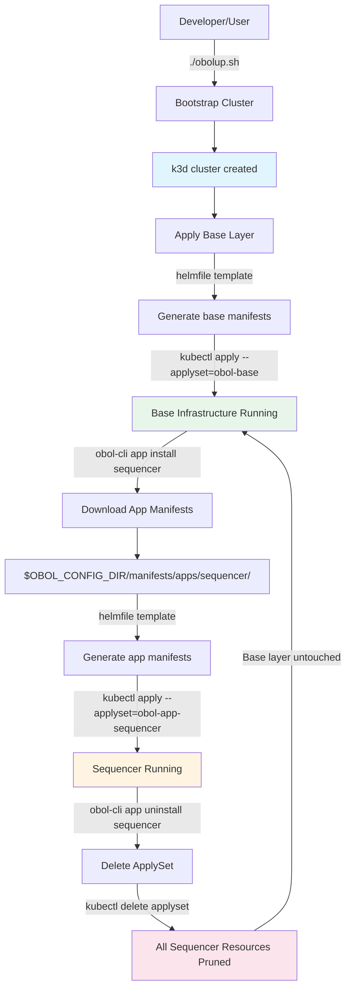

# Obol Stack Planning

## Purpose

Local-first Kubernetes stack for running Ethereum infrastructure with a layered architecture supporting base infrastructure and multiple applications.

## Architecture Overview

The system is designed in **3 distinct layers**, each with independent lifecycle management:

```
┌─────────────────────────────────────────┐
│  Layer 1: Cluster (k3d)                 │
│  - k3d Kubernetes cluster               │
│  - Container runtime                    │
│  - Networking, storage drivers          │
│  - Kubeconfig                           │
│  Managed by: obolup.sh (bootstrap)      │
└─────────────────────────────────────────┘
              ↓
┌─────────────────────────────────────────┐
│  Layer 2: Base Infrastructure           │
│  - Ethereum L1 nodes/infrastructure     │
│  - Monitoring (Prometheus, Grafana)     │
│  - Shared storage, networking           │
│  - Common services                      │
│  Managed by: obolup.sh                  │
│  ApplySet: obol-base                    │
│  Source: manifests/base/                │
└─────────────────────────────────────────┘
              ↓
┌─────────────────────────────────────────┐
│  Layer 3: Applications (Multiple)       │
│  - L2 sequencers                        │
│  - Validator nodes                      │
│  - Custom Ethereum workloads            │
│  Managed by: obol-stack-ui / obol-cli   │
│  ApplySet: obol-app-{name}              │
│  Source: Downloaded manifests           │
└─────────────────────────────────────────┘
```

## Layer Details

### Layer 1: Cluster Bootstrap

**Responsibility:** Create the Kubernetes cluster foundation

**Components:**
- k3d cluster creation from `k3d-config.yaml`
- kubeconfig generation
- Container runtime setup
- Network/storage provisioners

**Management:**
```bash
# Initial installation (curl to bash)
curl -sSL https://raw.githubusercontent.com/obol/obol-stack/main/obolup.sh | bash

# Or download and run
curl -sSL https://raw.githubusercontent.com/obol/obol-stack/main/obolup.sh -o obolup.sh
chmod +x obolup.sh
./obolup.sh

# Destroy cluster
./obolup.sh destroy
```

**Characteristics:**
- Ephemeral cluster, intended to be frequently destroyed and recreated
- No ApplySet (infrastructure layer)
- Prerequisite for layers 2 & 3
- Lightweight k3d enables fast iteration cycles

---

### Layer 2: Base Infrastructure

**Responsibility:** Provide shared Ethereum and monitoring infrastructure

**Components:**
- Ethereum L1 execution/consensus clients
- Prometheus metrics collection
- Grafana dashboards
- Shared storage classes
- Ingress controllers
- Certificate management

**Management:**
```bash
# Apply base layer (default behavior)
./obolup.sh
```

**Source of Truth:**
- Obol GitHub repository: `github.com/obol/obol-stack/manifests/base/`
- Synced to: `$OBOL_CONFIG_DIR/manifests/base/`
- Users do not maintain git repository
- Base configuration managed by Obol

**ApplySet:**
- Name: `obol-base`
- Scope: All base infrastructure resources
- Pruning: Automatic removal of deleted base resources

**Characteristics:**
- Single applyset for all base components
- Changes applied manually when needed
- Stable, infrequently updated
- Required by Layer 3 applications

---

### Layer 3: Applications

**Responsibility:** Run application-specific Ethereum workloads

**Components:**
- L2 sequencer nodes
- Validator instances
- Rollup infrastructure
- Custom dApps
- Application-specific services

**Management:**
```bash
# Via CLI
obol-cli app list
obol-cli app install sequencer
obol-cli app uninstall sequencer

# Via UI
obol-stack-ui
# Web interface for application management
```

**Source of Truth:**
- Obol GitHub repository: `github.com/obol/obol-stack/manifests/apps/`
- Downloaded to: `$OBOL_CONFIG_DIR/manifests/apps/{app-name}/`
- Applications are helmfile-based templates

**ApplySet:**
- Name: `obol-app-{app-name}` (one per application)
- Scope: All resources for that specific application
- Pruning: Automatic removal when app is uninstalled or updated

**Characteristics:**
- Multiple independent applysets
- Managed via obol-cli or obol-stack-ui
- Versioning strategy TBD
- Can be added/removed without affecting base layer
- May depend on base layer or other applications

## ApplySet Strategy

### What are ApplySets?

ApplySets are Kubernetes' native resource tracking mechanism for pruning (alpha in k8s 1.27+).

**Key concepts:**
1. Creates a parent tracking object (Secret/ConfigMap)
2. Labels all applied resources: `applyset.kubernetes.io/part-of={name}`
3. Tracks resource inventory in parent object
4. On next apply, compares new manifests with tracked inventory
5. Automatically prunes resources in applyset but not in new manifests

### Why ApplySets vs ArgoCD/Flux?

| Feature | ApplySets | ArgoCD/Flux |
|---------|-----------|-------------|
| Complexity | Native kubectl | Separate controller |
| Daemon | None | Runs 24/7 |
| Pruning | Built-in | Built-in |
| Drift detection | Manual apply | Continuous reconciliation |
| Resource usage | Zero | ~200-500MB RAM |
| Setup | Enable alpha flag | Install operator |
| Best for | Local dev | Production clusters |

**For local-first Ethereum stacks:** ApplySets provide sufficient guarantees without controller overhead.

**Note on Helmfile:** Helmfile is used **solely for generating YAML manifests** per applyset. Helmfile does NOT handle resource pruning - that responsibility belongs to kubectl with ApplySets.

### ApplySet Usage

**Enable ApplySets:**
```bash
export KUBECTL_APPLYSET=true
```

**Apply with pruning:**
```bash
kubectl apply -f manifests/ --prune --applyset={name}
```

**View applysets:**
```bash
kubectl get applysets
kubectl get applyset obol-base -o yaml
```

**Delete applyset (prunes all resources):**
```bash
kubectl delete applyset obol-app-sequencer
# All sequencer resources automatically removed
```

### Layer-Specific ApplySet Design

#### Base Layer: Single ApplySet

```bash
# Apply base infrastructure
helmfile -f manifests/base/helmfile.yaml template --include-crds | \
  KUBECTL_APPLYSET=true kubectl apply -f - \
    --prune \
    --applyset=obol-base
```

**Behavior:**
- All base resources tracked under `obol-base`
- Base layer configuration is stable and rarely changes
- Managed by Obol team in obol-stack repository
- Application layer depends on base layer

**Note:** Base layer helmfile defines core infrastructure (monitoring, Ethereum L1, networking). This configuration is maintained by Obol and synced to users' local systems. Users should not need to modify base layer configuration.

#### Application Layer: One ApplySet per App

```bash
# Install sequencer app
helmfile -f ~/.config/obol/manifests/apps/sequencer/helmfile.yaml template | \
  KUBECTL_APPLYSET=true kubectl apply -f - \
    --prune \
    --applyset=obol-app-sequencer

# Install validator app
helmfile -f ~/.config/obol/manifests/apps/validator/helmfile.yaml template | \
  KUBECTL_APPLYSET=true kubectl apply -f - \
    --prune \
    --applyset=obol-app-validator
```

**Behavior:**
- Each app has isolated applyset
- Apps can be installed/removed independently
- Uninstalling removes only that app's resources
- Base layer unaffected
- **Important:** Applications may depend on base layer components OR have inter-dependencies with other applications

**Dependency Complexity Note:**
Explicitly expressing and managing complex inter-application dependencies could become problematic. Dependency resolution logic will need to:
- Check base layer prerequisites (e.g., requires Prometheus, Ethereum L1 RPC)
- Validate inter-app dependencies (e.g., validator requires sequencer)
- Prevent uninstall of apps with dependent apps
- Handle dependency ordering during installation

This complexity may require careful design of the dependency resolution system in obol-cli/obol-stack-ui.

**Example:**
```bash
# Install two apps
obol-cli app install sequencer
obol-cli app install validator  # May depend on sequencer

kubectl get applysets
# obol-base              (prometheus, grafana, eth-l1)
# obol-app-sequencer     (sequencer deployment, service, etc.)
# obol-app-validator     (validator statefulset, pvc, etc.)

# Remove sequencer
obol-cli app uninstall sequencer
# ERROR: Cannot uninstall 'sequencer', required by: validator
```

## Directory Structure

```
$OBOL_CONFIG_DIR/                      # User runtime directory (~/.config/obol)
├── bin/                               # Downloaded binaries
│   ├── k3d, helm, helmfile, k9s
├── kubeconfig.yaml                    # Cluster access
├── .apps.yaml                         # Track installed applications (auto-generated by obol-cli)
└── manifests/                         # Synced from obol-stack repo
    ├── base/                          # Base infrastructure (synced)
    │   ├── helmfile.yaml              # Base layer root helmfile
    │   ├── ethereum-l1/
    │   │   └── helmfile.yaml          # L1 execution/consensus
    │   └── monitoring/
    │       ├── helmfile.yaml          # Prometheus, Grafana
    │       └── dashboards/
    │           ├── Chart.yaml
    │           └── templates/
    │               └── *.yaml
    └── apps/                          # Applications (pulled when installed)
        ├── sequencer/
        │   ├── helmfile.yaml
        │   ├── values.yaml            # User-customizable values
        │   └── charts/
        └── validator/
            ├── helmfile.yaml
            ├── values.yaml            # User-customizable values
            └── charts/
```

**Key Points:**
- `$OBOL_CONFIG_DIR/manifests/base/`: Synced from obol-stack GitHub repo during `./obolup.sh`
- `$OBOL_CONFIG_DIR/manifests/apps/{app}/`: Pulled from obol-stack GitHub repo when user installs app via CLI/UI
- `$OBOL_CONFIG_DIR/.apps.yaml`: Hidden file auto-generated by obol-cli to track installed applications
- Each app directory contains a `helmfile.yaml` defining the application's Kubernetes resources
- Helmfile is used solely to generate YAML manifests, which are then applied with kubectl ApplySets

## Deployment Flow



## Application Management

### Application Distribution

Applications are helmfile-based templates stored in the Obol GitHub repository (`github.com/obol/obol-stack/manifests/apps/`).

**Installation Flow:**
1. User installs app via `obol-cli` or `obol-stack-ui`
2. Application helmfile pulled from GitHub to `$OBOL_CONFIG_DIR/manifests/apps/{app-name}/`
3. Application comes with sane defaults and automatic integration with base layer
4. User can customize values via `values.yaml` or UI configuration
5. Helmfile generates YAML manifests
6. Manifests applied to cluster with kubectl ApplySet

**Versioning:** TBD - Strategy for application versioning to be determined.

**Community Contributions:**
Users are encouraged to contribute improvements to application manifests via pull requests to the obol-stack repository. This enables the community to:
- Fix bugs and improve existing applications
- Add new application templates
- Share best practices and optimizations
- Contribute Ethereum-specific integrations

**Alternative:** A separate repository (e.g., `obol-stack-apps`) could be created specifically for community-contributed application manifests, keeping the core obol-stack repository focused on base infrastructure.

### Custom Applications

Users may bring their own helm charts to deploy custom infrastructure:

```bash
# Example: User's custom helm chart
$OBOL_CONFIG_DIR/manifests/apps/my-custom-app/
├── helmfile.yaml
├── values.yaml
└── charts/
    └── my-app/
        ├── Chart.yaml
        └── templates/
```

**Custom Application Template:**
We could provide a template generator that bootstraps helmfile configuration with global variables relative to base configuration:

```bash
# Generate custom app scaffold
obol-cli app create my-custom-app

# Creates templated helmfile with base layer integration:
# - Prometheus endpoints pre-configured
# - Ethereum L1 RPC endpoints injected
# - Monitoring dashboards auto-configured
# - Network policies aligned with base
```

This template would include:
- Pre-configured connection to base layer services
- Standard labels and annotations
- Monitoring/logging integration
- Service discovery configuration

**Trade-off:** Custom applications without using the template lose the ease of use and automatic integration provided by Obol-managed application templates. Users will need to:
- Manually configure service discovery/endpoints
- Handle dependencies and prerequisites
- Manage upgrades and compatibility

### Management Tools

#### obol-cli (Command-line)
```bash
# List available applications
obol-cli app list

# Install application
obol-cli app install sequencer

# Configure application
obol-cli app config sequencer --set key=value

# Uninstall application
obol-cli app uninstall sequencer

# Show status
obol-cli app status
```

#### obol-stack-ui (Web Interface)
- Browse available applications
- Install/uninstall applications
- Configure application settings
- View application status and logs
- Manage dependencies

### Application Lifecycle

**Versioning Strategy:** TBD - Application versioning approach to be determined.

#### Install Application
```bash
obol-cli app install sequencer
```

**Steps:**
1. Check `obol-base` applyset exists (dependency check)
2. Check application dependencies (base layer components, other apps)
3. Pull application helmfile from GitHub to `$OBOL_CONFIG_DIR/manifests/apps/sequencer/`
4. Apply default configuration with automatic base layer integration
5. Run `helmfile template` to generate YAML manifests
6. Apply with `kubectl apply --prune --applyset=obol-app-sequencer`
7. Track installation in `$OBOL_CONFIG_DIR/installed-apps.yaml`

#### Upgrade Application
```bash
obol-cli app upgrade sequencer
```

**Steps:**
1. Pull updated application helmfile from GitHub
2. Merge user customizations from existing `values.yaml`
3. Run `helmfile template` with updated configuration
4. Apply with same applyset name `obol-app-sequencer`
5. ApplySet automatically prunes old resources not in new manifests
6. Update tracking in `installed-apps.yaml`

#### Uninstall Application
```bash
obol-cli app uninstall sequencer
```

**Steps:**
1. Check for dependent applications (prevent uninstall if other apps depend on this)
2. Delete applyset: `kubectl delete applyset obol-app-sequencer`
3. All resources with `applyset.kubernetes.io/part-of=obol-app-sequencer` automatically pruned
4. Optionally remove local manifests: `rm -rf $OBOL_CONFIG_DIR/manifests/apps/sequencer/`
5. Update tracking in `installed-apps.yaml`

#### Show Status
```bash
obol-cli app status
```

**Output:**
```
Installed Applications:
  sequencer - Running ✓
  validator - Running ✓ (depends on: sequencer)

Available Applications:
  rollup-node - Not installed
```

## Key Design Decisions


### 1. No GitOps Controllers (ArgoCD/Flux)

**Decision:** Use kubectl ApplySets instead of ArgoCD/Flux

**Rationale:**
- Local-first development stack, not production
- Manual apply is acceptable (no continuous drift detection needed)
- Eliminates controller overhead (~200-500MB RAM)
- Simpler mental model: apply when changes needed
- Still gets automatic pruning via ApplySets

**Trade-offs:**
- ✅ Zero daemon overhead
- ✅ Simple kubectl-based workflow
- ❌ No automatic drift detection/correction
- ❌ No web UI (could add simple status dashboard)
- ❌ Manual apply required

### 2. Helmfile Instead of Raw Manifests

**Decision:** Use helmfile as templating layer

**Rationale:**
- Helm charts provide Ethereum application packaging
- Helmfile simplifies multi-chart deployments
- Mature ecosystem of charts (prometheus, grafana, etc.)
- Template generation: `helmfile template` → kubectl apply

**Note:** Helmfile is used **solely for generating YAML manifests** per applyset. Helmfile does NOT handle pruning → that's why ApplySets are needed.

### 3. One ApplySet per Application

**Decision:** Separate applysets for each Layer 3 application

**Rationale:**
- Independent lifecycle management
- Clean uninstall (delete applyset = all resources gone)
- No risk of base layer interference
- Easy to see what resources belong to each app

**Alternative considered:** Single applyset for all apps → rejected because uninstalling one app would be complex

### 4. Base Configuration Managed by Obol

**Decision:** Base layer provides stable foundation for user experimentation

**Rationale:**
- Base configuration synced from Obol's GitHub repository during `./obolup.sh`
- Provides consistent, tested foundation for Ethereum infrastructure
- Reduces complexity for end users
- Users focus on application configuration and experimentation
- Stable base enables safe iteration on application layer

### 5. Application Templates from Obol Repository

**Decision:** Applications are helmfile templates in Obol's GitHub repository

**Rationale:**
- Applications pulled from `github.com/obol/obol-stack/manifests/apps/` when installed
- Comes with sane defaults and automatic base layer integration
- Users can customize via `values.yaml` or UI
- Versioning strategy TBD

## Experimental Features

### Alternative Kubernetes Distributions (Layer 1)

**Concept:** Support swapping k3d for alternative Kubernetes solutions

The current implementation uses k3d (k3s in Docker) for Layer 1, but the architecture could support alternative Kubernetes distributions for different performance, portability, or operational requirements.

**Potential alternatives:**

#### k3s (bare metal)
- **Pros:** Better performance than k3d, native system integration, lower overhead
- **Cons:** Requires root access, harder cleanup, less portable
- **Use case:** Long-running local development, CI/CD environments

#### kind (Kubernetes in Docker)
- **Pros:** Official Kubernetes SIG project, multi-node cluster support, closer to production k8s
- **Cons:** Heavier than k3d, slower startup, more resource intensive
- **Use case:** Testing k8s features, multi-node scenarios

#### minikube
- **Pros:** Mature ecosystem, driver flexibility (Docker, VM, bare metal), addons
- **Cons:** Heavier footprint, more complex setup
- **Use case:** Development environments with established minikube workflows

#### colima (macOS)
- **Pros:** Native macOS container runtime, lighter than Docker Desktop, Lima-based
- **Cons:** macOS only, newer project
- **Use case:** macOS developers avoiding Docker Desktop licensing

#### Bare metal Kubernetes (kubeadm/k0s)
- **Pros:** Maximum performance, production-like, full control
- **Cons:** Complex setup, manual cluster management, not ephemeral
- **Use case:** Performance testing, production-like local environments

**Implementation approach:**

```bash
# Environment variable to select distribution
export OBOL_K8S_DISTRO=k3d  # Default
export OBOL_K8S_DISTRO=kind
export OBOL_K8S_DISTRO=minikube

# obolup.sh detects and uses appropriate bootstrap
./obolup.sh
```

**Compatibility matrix:**

| Feature | k3d | kind | minikube | k3s | colima |
|---------|-----|------|----------|-----|--------|
| Ephemeral | ✓ | ✓ | ✓ | ~ | ✓ |
| Fast startup | ✓ | ~ | ✗ | ✓ | ✓ |
| Multi-node | ~ | ✓ | ✓ | ✓ | ✗ |
| macOS native | ✗ | ✗ | ✗ | ✗ | ✓ |
| OCI registry | ✓ | ~ | ~ | ✓ | ~ |

**Key consideration:** Layer 2 (base) and Layer 3 (apps) remain distribution-agnostic since they operate at the Kubernetes API level. Only Layer 1 bootstrap logic needs adaptation.

---

### AI Integration and Chatbot (Layer 2)

**Concept:** AI-powered cluster management as part of base infrastructure

An AI chatbot integrated into Layer 2 (base infrastructure) that provides context-aware Kubernetes mutation, configuration management, and operational intelligence.

**Architecture:**

```
┌─────────────────────────────────────┐
│  Layer 2: Base Infrastructure       │
│  - Monitoring (Prometheus, Grafana) │
│  - Ethereum L1 infrastructure       │
│  - AI Assistant (NEW)               │
│    ├─ kubernetes-mcp integration    │
│    ├─ Cluster state awareness       │
│    └─ Configuration mutations       │
└─────────────────────────────────────┘
```

**Capabilities:**

#### 1. Context-Aware Configuration
```
User: "Increase sequencer replicas to handle more load"
AI: Analyzing sequencer deployment... Currently 1 replica.
    Suggesting: 3 replicas with HPA (min: 2, max: 5)
    Would you like me to apply this change? [y/n]
```

#### 2. Value Mutations
```
User: "Set Prometheus retention to 30 days"
AI: Updating $OBOL_CONFIG_DIR/manifests/base/monitoring/values.yaml
    prometheus.server.retention: "30d"
    Requires additional storage: ~50GB
    Apply changes? [y/n]
```

#### 3. Failure Detection and Remediation
```
AI: ⚠️ Detected: grafana pod CrashLoopBackOff
    Root cause: PVC storage full
    Suggested actions:
    1. Increase PVC size: 10Gi → 20Gi
    2. Enable log rotation
    3. Clear old dashboards
    Choose action or describe custom solution:
```

#### 4. Dependency Guidance
```
User: "Install validator app"
AI: Checking dependencies...
    ✓ obol-base present
    ✗ sequencer required but not installed
    Suggested workflow:
    1. Install sequencer first
    2. Configure L1 endpoints
    3. Install validator
    Proceed with guided installation? [y/n]
```

#### 5. Monitoring and Alerts
```
AI: 📊 Cluster health summary:
    - Base layer: Healthy ✓
    - Sequencer: High memory usage (85%)
    - Validator: Sync lagging 12 blocks
    
    Recommendation: Increase sequencer memory limit
    Current: 2Gi, Suggested: 4Gi
```

**Technical Implementation:**

**Component:** `obol-ai-assistant` (Helm chart in base layer)

```yaml
# manifests/base/helmfile.yaml
releases:
  - name: obol-ai-assistant
    namespace: obol-system
    chart: ./ai-assistant
    values:
      - mcp:
          enabled: true
          kubernetesAccess: true
      - llm:
          provider: anthropic  # or openai, local
          model: claude-3-5-sonnet
          apiKeySecret: obol-ai-api-key
      - monitoring:
          prometheus: http://prometheus-server
          grafana: http://grafana
      - permissions:
          readOnly: false  # Can mutate cluster
          approvalRequired: true  # Require user confirmation
```

**kubernetes-mcp Integration:**

The AI uses Model Context Protocol (MCP) to interact with Kubernetes:
- Read cluster state (pods, deployments, services)
- Query logs and metrics
- Propose configuration changes
- Apply changes after user approval

**Interface Options:**

1. **CLI chat mode:**
```bash
obol-cli chat
> Help me debug why validator isn't syncing
```

2. **Web UI (obol-stack-ui):**
```
[Chat widget in sidebar]
💬 Ask AI about your cluster...
```

3. **Slack/Discord bot:**
```
@obol-bot cluster status
@obol-bot why is sequencer using so much memory?
```

**Safety guardrails:**
- Read-only mode by default (can be enabled in values)
- All mutations require explicit user approval
- Audit log of all AI actions
- Rollback capabilities for AI-suggested changes
- Scope limited to user's namespace/cluster

**Privacy considerations:**
- Optional: Run local LLM (ollama) instead of API
- No cluster data sent to external APIs without consent
- Configurable data retention policies

**Benefits:**
- Lower barrier to entry for Kubernetes newcomers
- Faster troubleshooting and remediation
- Natural language cluster management
- Learning tool (AI explains what it's doing)
- Reduced cognitive load for complex operations

**Challenges:**
- API costs (mitigated by local LLM option)
- Trust in AI suggestions (addressed by approval flow)
- Context window limits (addressed by kubernetes-mcp filtering)
- Keeping AI knowledge up-to-date with cluster state
