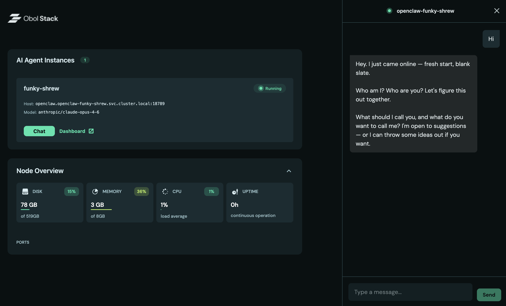

<div align="center">
  

&nbsp;

<h1>The Obol Stack: Where agents deploy their infrastructure</h1>

</div>

## Overview

The [Obol Stack](https://obol.org/stack) is a framework for AI agents to run decentralised infrastructure locally. It provides an agent with the ability to sync blockchain networks (Ethereum, Aztec, etc.), interact with them via skills, and expose services to the public internet through Cloudflare [tunnels](https://developers.cloudflare.com/cloudflare-one/networks/connectors/cloudflare-tunnel/) and [x402](https://www.x402.org/) payment gateways.

Built on [Kubernetes](https://kubernetes.io) with [Helm](https://helm.sh/) for package management. Read more in the [docs](https://docs.obol.org/next/obol-stack/obol-stack).



> [!IMPORTANT]
> The Obol Stack is alpha software. If you encounter an issue, please open a
> [GitHub issue](https://github.com/obolNetwork/obol-stack/issues).

## Getting Started

### Prerequisites

[Docker](https://www.docker.com/) must be installed and running:

- **Linux**: [Docker Engine installation guide](https://docs.docker.com/engine/install/)
- **macOS/Windows**: [Docker Desktop](https://docs.docker.com/desktop/)

### Install

```bash
bash <(curl -s https://stack.obol.org)
```

The installer will set up the `obol` CLI and all dependencies (`kubectl`, `helm`, `k3d`, `helmfile`, `k9s`) into `~/.local/bin/`, configure your PATH, and offer to start the cluster.

Verify:

```bash
obol version
```

### Quick Start

```bash
# Start the stack
obol stack init
obol stack up

# Apply agent capabilities to the default stack-managed agent
obol agent init

# Inspect the default Hermes agent
obol agent list
obol agent auth obol-agent
```

`obol stack up` provisions the default [Hermes Agent](https://github.com/NousResearch/hermes-agent) runtime behind LiteLLM. `obol agent init` applies the controller-based agent capabilities used for monetization and reconciliation.

## Blockchain Networks

Install and run blockchain networks as isolated deployments. Each installation gets a unique namespace so you can run multiple instances side-by-side.

```bash
# List available networks
obol network list

# Install a network (defaults to network name as ID)
obol network install ethereum
# → ethereum/mainnet

# Deploy to the cluster (auto-selects if only one deployment exists)
obol network sync

# Or specify by type (auto-selects if only one ethereum deployment)
obol network sync ethereum

# Or by full identifier
obol network sync ethereum/mainnet

# Sync all deployments at once
obol network sync --all
```

**Available networks:** ethereum, aztec

**Ethereum options:** `--network` (mainnet, sepolia, hoodi), `--execution-client` (reth, geth, nethermind, besu, erigon, ethereumjs), `--consensus-client` (lighthouse, prysm, teku, nimbus, lodestar, grandine)

```bash
# View installed deployments
obol kubectl get namespaces | grep -E "ethereum|aztec"

# Delete a deployment (auto-selects if only one exists)
obol network delete
obol network delete ethereum/mainnet --force
```

> [!TIP]
> Use `obol network install <network> --help` to see all options.

## Applications

Install arbitrary Helm charts as managed applications:

```bash
# Install from ArtifactHub
obol app install bitnami/redis

# With specific version
obol app install bitnami/postgresql@15.0.0

# Deploy to cluster (auto-selects if only one app is installed)
obol app sync

# Or specify by type (auto-selects if only one postgresql deployment)
obol app sync postgresql

# Or by full identifier
obol app sync postgresql/eager-fox

# List and manage
obol app list
obol app delete postgresql/eager-fox --force
```

Find charts at [Artifact Hub](https://artifacthub.io).

## Model Providers

The stack runs [LiteLLM](https://github.com/BerriAI/litellm) as an in-cluster OpenAI-compatible gateway that proxies all LLM traffic. By default, Ollama on the host machine is used. To switch to a cloud provider:

```bash
# Interactive — prompts for provider and API key
obol model setup

# Or pass flags directly
obol model setup --provider anthropic --api-key sk-ant-...
obol model setup --provider openai --api-key sk-proj-...

# Check which providers are enabled
obol model status
```

`model setup` patches the LiteLLM config and Secret with your API key, adds the model to the gateway, restarts LiteLLM, and syncs the stack-managed Hermes default agent.

## AI Agent Runtimes

Hermes is the default AI agent runtime deployed by the stack as `obol-agent`. OpenClaw remains available as an optional manual runtime. Multiple Hermes and OpenClaw instances can run side-by-side.

```bash
# Default stack-managed Hermes agent
obol agent list
obol agent auth obol-agent
obol hermes skills list

# Create and deploy an additional Hermes instance
obol agent new --id research

# Create and deploy an optional OpenClaw instance
obol agent new --runtime openclaw

# List optional OpenClaw instances
obol agent list --runtime openclaw

# Open the OpenClaw web dashboard
obol openclaw dashboard
```

Use `obol agent` for Obol-managed lifecycle and auth flows. Use `obol hermes` for native Hermes CLI commands against the default instance, or pass `--agent <id>` for a non-default Hermes instance.

### Skills

The stack ships with embedded Obol skills that are installed automatically for the default Hermes agent and for OpenClaw instances. Skills give the agent domain-specific capabilities — from querying blockchains to understanding Ethereum development patterns.

#### Infrastructure

| Skill | Purpose |
|-------|---------|
| `ethereum-networks` | Read-only Ethereum queries via cast — blocks, balances, contract reads, ERC-20, ENS |
| `ethereum-local-wallet` | Sign and send Ethereum transactions via the per-agent remote-signer |
| `obol-stack` | Kubernetes cluster diagnostics — pods, logs, events, deployments |
| `distributed-validators` | Obol DVT cluster monitoring, operator audit, exit coordination |

#### Ethereum Development

| Skill | Purpose |
|-------|---------|
| `addresses` | Verified contract addresses — DeFi, tokens, bridges, ERC-8004 registries across chains |
| `building-blocks` | OpenZeppelin patterns, DEX integration, oracle usage, access control |
| `concepts` | Mental model — state machines, incentive design, gas mechanics, EOAs vs contracts |
| `gas` | Gas optimization patterns, L2 fee structures, estimation |
| `indexing` | The Graph, Dune, event indexing for onchain data |
| `l2s` | L2 comparison — Base, Arbitrum, Optimism, zkSync with gas costs and use cases |
| `orchestration` | End-to-end dApp build (Scaffold-ETH 2) + AI agent commerce cycle |
| `security` | Smart contract vulnerability patterns, reentrancy, flash loans, MEV protection |
| `standards` | ERC-8004, x402, EIP-3009, EIP-7702, ERC-4337 — spec details and integration patterns |
| `ship` | Architecture planning — onchain vs offchain, chain selection, agent service patterns |
| `testing` | Foundry testing — unit, fuzz, fork, invariant tests |
| `tools` | Development tooling — Foundry, Hardhat, Scaffold-ETH 2, verification |
| `wallets` | Wallet management — EOAs, Safe multisig, EIP-7702, key safety for AI agents |

#### Frontend & QA

| Skill | Purpose |
|-------|---------|
| `frontend-playbook` | Deployment — IPFS, Vercel, ENS subdomains |
| `frontend-ux` | Web3 UX patterns — wallet connection, transaction flows, error handling |
| `qa` | Quality assurance — testing strategy, coverage, CI/CD patterns |
| `why` | Why Ethereum — the AI agent angle with ERC-8004 and x402 |

Manage skills at runtime:

```bash
obol openclaw skills list                   # list installed skills
obol openclaw skills sync                   # re-inject embedded defaults
obol openclaw skills sync --from ./my-skills  # push custom skills from local dir
obol openclaw skills add <package>          # add via openclaw CLI in pod
obol openclaw skills remove <name>          # remove via openclaw CLI in pod
```

Skills are delivered via host-path PVC injection — no ConfigMap size limits, works before pod readiness, and survives pod restarts.

## Public Access (Cloudflare Tunnel)

Expose your stack to the internet via Cloudflare Tunnel:

```bash
# Check tunnel status (quick tunnel mode is the default)
obol tunnel status

# Use a persistent hostname
obol tunnel login --hostname stack.example.com

# Or provision via API
obol tunnel provision --hostname stack.example.com \
  --account-id ... --zone-id ... --api-token ...
```

## Managing the Stack

```bash
obol stack up        # Start the cluster
obol stack down      # Stop the cluster (preserves data)
obol stack purge -f  # Remove everything (including data)
obol k9s             # Interactive cluster UI
```

The `obol` CLI wraps `kubectl`, `helm`, `helmfile`, and `k9s` with the correct KUBECONFIG:

```bash
obol kubectl get pods --all-namespaces
obol helm list --all-namespaces
```

## Troubleshooting

#### Port 80 Already in Use

Edit `~/.config/obol/k3d.yaml`, remove the `80:80` and `443:443` port entries (keep `8080:80` and `8443:443`), then restart:

```bash
obol stack down && obol stack up
```

Access at http://obol.stack:8080 instead.

#### Direct `X-PAYMENT` Buyers

Raw direct `X-PAYMENT` requests through the Traefik `ForwardAuth` route are not a supported production payment path. The verifier is intentionally `verifyOnly: true`, so Traefik can gate requests but is not the final settlement point.

Use:

- `x402-buyer` for cluster-routed paid traffic
- `obol sell inference` for direct buyers that need to send raw `X-PAYMENT`

If you call `x402-verifier /verify` directly for debugging, you must send `X-Forwarded-Uri` (and usually `X-Forwarded-Host`) like Traefik does, or verifier correctly returns `403 forbidden: missing forwarded URI`.

#### Monetize Flow Preflight (Recommended)

Before running sell/buy tests on a machine, verify:

```bash
# 1) Kubeconfig matches the currently running k3d cluster (ports can drift).
k3d kubeconfig write <cluster-name> -o ~/.config/obol/kubeconfig.yaml --overwrite

# 2) Stack components are healthy.
obol kubectl get pods -A

# 3) Seller route exists and is Ready.
obol sell list
obol sell status <offer-name> -n <namespace>

# 4) Buyer wallet and balances are available.
obol kubectl exec -n hermes-obol-agent deploy/hermes -c hermes -- \
  python3 /data/.hermes/obol-skills/buy-inference/scripts/buy.py balance
```

Run the paid tests only after all four checks pass.

#### Known Limitations

- `PurchaseRequest.status` (`remaining`/`spent` and `conditions[].message`) is a reconciled snapshot, not a live per-request counter.
- For real-time auth pool state, use `x402-buyer` `GET /status` from the litellm pod.
- Agent-managed refill is driven by `buy.py process --all`; use live sidecar status as the source of truth for refill decisions.
- Raw direct `X-PAYMENT` through Traefik is not a supported production path; use `obol sell inference` if you need a direct buyer flow.

## File Locations

Follows the [XDG Base Directory](https://specifications.freedesktop.org/basedir-spec/basedir-spec-latest.html) specification:

| Directory | Purpose |
|-----------|---------|
| `~/.config/obol/` | Cluster config, kubeconfig, network and app deployments |
| `~/.local/share/obol/` | Persistent volumes (blockchain data) |
| `~/.local/bin/` | CLI binary and dependencies |

## Updating

```bash
bash <(curl -s https://stack.obol.org)
```

The installer detects your existing installation and upgrades safely.

## Uninstalling

```bash
obol stack purge -f
rm -f ~/.local/bin/{obol,kubectl,helm,k3d,helmfile,k9s,obolup.sh}
rm -rf ~/.config/obol ~/.local/share/obol
```

## Development

```bash
git clone https://github.com/ObolNetwork/obol-stack.git
cd obol-stack
OBOL_DEVELOPMENT=true ./obolup.sh
```

Development mode uses `.workspace/` instead of XDG directories and runs `go run` on every `obol` invocation — no build step needed.

Networks are embedded at `internal/embed/networks/`. Each uses annotated Go templates that auto-generate CLI flags:

```yaml
# @enum mainnet,hoodi
# @default mainnet
# @description Blockchain network to deploy
network: {{.Network}}
```

See [CONTRIBUTING.md](CONTRIBUTING.md) for details.

## License

[Apache License 2.0](LICENSE)
