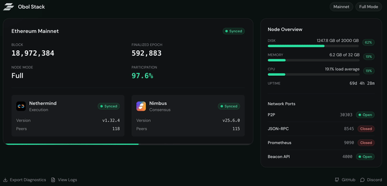

<div align="center">
  

&nbsp;

<h1>The Obol Stack: Run Blockchain Networks Locally</h1>

</div>

## Overview

The Obol Stack is a framework to make it easier to distribute and run blockchain networks and decentralised applications (dApps) locally. The stack is built on [Kubernetes](https://kubernetes.io), with [Helm](https://helm.sh/) as a package management system.

The Obol Stack provides a deployment-centric approach where you can easily install and manage multiple blockchain network instances (Ethereum, Aztec, etc.) with configurable clients and settings. Each network installation creates a unique deployment instance with its own namespace, resources, and configuration - allowing you to run mainnet and testnet side-by-side, or test different client combinations independently.



## Getting Started

> [!IMPORTANT]
> The Obol Stack is alpha software. It is not complete, and it may not be
> working smoothly. If you encounter an issue that does not appear to be
> documented, please open a
> [GitHub issue](http://github.com/obolNetwork/obol-stack/issues) if an
> appropriate one is not already present.

### Prerequisites

The Obol Stack requires [Docker](https://www.docker.com/) to run a local Kubernetes cluster. Install Docker:

- **Linux**: Follow the [Docker Engine installation guide](https://docs.docker.com/engine/install/)
- **macOS/Windows**: Install [Docker Desktop](https://docs.docker.com/desktop/)

### Installation

The easiest way to install the Obol Stack is using the `obolup` bootstrap installer.

Run the installer with:

```bash
bash <(curl -s https://stack.obol.org)
```

**What the installer does:**

1. Verifies Docker is running
2. Installs the `obol` CLI binary to `~/.local/bin/obol`
3. Installs required dependencies (kubectl, helm, k3d, helmfile, k9s) to `~/.local/bin/`
4. Adds `obol.stack` to your `/etc/hosts` file (requires sudo) to enable local domain access
5. Prompts you to add `~/.local/bin` to your PATH by updating your shell profile
6. Prompts you to start the cluster and open the Obol application in your browser

**PATH Configuration:**

The installer will detect your shell (bash/zsh) and ask if you want to automatically add `~/.local/bin` to your PATH. If you choose automatic configuration, it will add this line to your shell profile (`~/.bashrc` or `~/.zshrc`):

```bash
export PATH="$HOME/.local/bin:$PATH"
```

After installation, reload your shell configuration:

```bash
# For bash
source ~/.bashrc

# For zsh
source ~/.zshrc
```

**Manual PATH Configuration:**

If you prefer to configure PATH manually, add this line to your shell profile:

```bash
# Add to ~/.bashrc (bash) or ~/.zshrc (zsh)
export PATH="$HOME/.local/bin:$PATH"
```

Then reload your shell or start a new terminal session.

**Using obol without PATH:**

If you haven't added `~/.local/bin` to your PATH, you can always run commands directly:

```bash
~/.local/bin/obol version
~/.local/bin/obol stack init
```

**Verify the installation:**

```bash
obol version
```

### Quick Start

Once installed, you can start your local Ethereum stack with a few commands:

```bash
# Initialize the stack configuration
obol stack init

# Start the Kubernetes cluster
obol stack up

# Install a blockchain network (creates a unique deployment)
obol network install ethereum
# This creates a deployment like: ethereum-nervous-otter

# Deploy the network to the cluster
obol network sync ethereum/nervous-otter

# Install another network configuration
obol network install ethereum --network=hoodi
# This creates a separate deployment like: ethereum-happy-panda

# Deploy the second network
obol network sync ethereum/happy-panda

# View cluster resources (opens interactive terminal UI)
obol k9s
```

The stack will create a local Kubernetes cluster. Each network installation creates a uniquely-namespaced deployment instance, allowing you to run multiple configurations simultaneously.

## Public Access (Cloudflare Tunnel)

By default, the stack deploys a Cloudflare Tunnel connector in “quick tunnel” mode, which provides a random public URL. Check it with:

```bash
obol tunnel status
```

To use a persistent hostname instead:

- Browser login flow (requires `cloudflared` installed locally, e.g. `brew install cloudflared` on macOS):
  - `obol tunnel login --hostname stack.example.com`
- API-driven provisioning:
  - `obol tunnel provision --hostname stack.example.com --account-id ... --zone-id ... --api-token ...`
  - Or set `CLOUDFLARE_ACCOUNT_ID`, `CLOUDFLARE_ZONE_ID`, `CLOUDFLARE_API_TOKEN`.

Note: the stack ID (used in tunnel naming) is preserved across `obol stack init --force`. Use `obol stack purge` to reset it.

> [!TIP]
> Use `obol network list` to see all available networks. Customize installations with flags (e.g., `obol network install ethereum --network=holesky --execution-client=geth`) to create different deployment configurations. After installation, deploy to the cluster with `obol network sync <network>/<id>`.

> [!TIP]
> You can also install arbitrary Helm charts as applications using `obol app install <chart>`. Find charts at [Artifact Hub](https://artifacthub.io).

## Managing Networks

The Obol Stack uses a deployment-centric architecture where each network installation creates an isolated deployment instance that can be installed, configured, and removed independently. You can run multiple deployments of the same network type with different configurations.

### List Available Networks

View all network types that can be installed:

```bash
obol network list
```

**Available networks:**
- **ethereum** - Full Ethereum node (execution + consensus clients)
- **helios** - Lightweight Ethereum client
- **aztec** - Aztec rollup network

**View installed deployments:**

```bash
# List all network deployment namespaces
obol kubectl get namespaces | grep -E "ethereum|helios|aztec"

# View resources in a specific deployment
obol kubectl get all -n ethereum-nervous-otter
```

### Install a Network

Install a network with default configuration:

```bash
obol network install ethereum
```

Each network installation creates a **unique deployment instance** with:
1. Network configuration templated and saved to `~/.config/obol/networks/ethereum/<namespace>/`
2. Configuration files ready to be deployed to the cluster
3. Isolated persistent storage for blockchain data

### Sync a Network

After installing a network configuration, deploy it to the cluster:

```bash
# Deploy the network to the cluster
obol network sync ethereum/<namespace>

# Or use the namespace format
obol network sync ethereum-nervous-otter
```

The sync command:
- Reads the configuration from `~/.config/obol/networks/<network>/<namespace>/`
- Executes helmfile to deploy resources to a unique Kubernetes namespace
- Creates isolated persistent storage for blockchain data

**Multiple deployments:**

You can install the same network type multiple times with different configurations. Each deployment is isolated in its own namespace:

```bash
# Install mainnet with Geth + Prysm
obol network install ethereum --network=mainnet --execution-client=geth --consensus-client=prysm
# Creates configuration: ethereum-nervous-otter

# Deploy to cluster
obol network sync ethereum/nervous-otter

# Install Hoodi testnet with Reth + Lighthouse
obol network install ethereum --network=hoodi --execution-client=reth --consensus-client=lighthouse
# Creates: ethereum-laughing-elephant namespace

# Install another Hoodi instance for testing
obol network install ethereum --network=hoodi
# Creates: ethereum-happy-panda namespace
```

**Ethereum configuration options:**
- `--network`: Choose network (mainnet, sepolia, hoodi)
- `--execution-client`: Choose execution client (reth, geth, nethermind, besu, erigon, ethereumjs)
- `--consensus-client`: Choose consensus client (lighthouse, prysm, teku, nimbus, lodestar, grandine)

> [!TIP]
> Use `obol network install <network> --help` to see all available options for a specific network

### Network Architecture

**Unique deployment instances:**

Each network installation creates an isolated deployment with a unique namespace (e.g., `ethereum-nervous-otter`). This allows you to:
- Run multiple instances of the same network type (e.g., mainnet and testnet)
- Test different client combinations without conflicts
- Independently manage, update, and delete deployments

**Per-deployment resources:**
- **Unique namespace**: All Kubernetes resources isolated (e.g., `ethereum-nervous-otter`, `ethereum-happy-panda`)
- **Configuration files**: Templated helmfile saved to `~/.config/obol/networks/ethereum/<namespace>/`
- **Persistent volumes**: Blockchain data stored in `~/.local/share/obol/<cluster-id>/networks/<network>_<namespace>/`
- **Service endpoints**: Internal cluster DNS per deployment (e.g., `ethereum-rpc.ethereum-nervous-otter.svc.cluster.local`)

**Install and Sync workflow:**
1. **Install**: `obol network install` generates configuration files locally from CLI flags
2. **Customize**: Edit values and templates in `~/.config/obol/networks/<network>/<id>/` (optional)
3. **Sync**: `obol network sync` deploys the configuration to the cluster using helmfile
4. **Update**: Modify configuration and re-sync to update the deployment

### Delete a Network Deployment

Remove a specific network deployment instance and clean up all associated resources:

```bash
# List all deployments to find the namespace
obol kubectl get namespaces | grep ethereum

# Delete a specific deployment
obol network delete ethereum-nervous-otter

# Skip confirmation prompt
obol network delete ethereum-nervous-otter --force
```

This command will:
- Remove the deployment configuration from `~/.config/obol/networks/ethereum/<namespace>/`
- Delete the Kubernetes namespace and all deployed resources
- Clean up associated persistent volumes and blockchain data

> [!WARNING]
> Deleting a deployment removes all associated data and resources. Use with caution.

> [!NOTE]
> You can have multiple deployments of the same network type. Deleting one deployment (e.g., `ethereum-nervous-otter`) does not affect other deployments (e.g., `ethereum-happy-panda`).

## Managing Applications

The Obol Stack supports installing arbitrary Helm charts as managed applications. Each application installation creates an isolated deployment with its own namespace, similar to network deployments.

### Install an Application

Install any Helm chart using one of the supported reference formats:

```bash
# Install using repo/chart format (resolved via ArtifactHub)
obol app install bitnami/redis
obol app install bitnami/postgresql@15.0.0

# Install using direct URL
obol app install https://charts.bitnami.com/bitnami/redis-19.0.0.tgz

# Install with custom name and ID
obol app install bitnami/postgresql --name mydb --id production
```

Find charts at [Artifact Hub](https://artifacthub.io).

**Supported chart reference formats:**
- `repo/chart` - Resolved via ArtifactHub (e.g., `bitnami/redis`)
- `repo/chart@version` - Specific version (e.g., `bitnami/redis@19.0.0`)
- `https://.../*.tgz` - Direct URL to chart archive

**What happens during installation:**
1. Resolves the chart reference (via ArtifactHub for repo/chart format)
2. Fetches default values from the chart
3. Generates helmfile.yaml that references the chart remotely
4. Saves configuration to `~/.config/obol/applications/<app>/<id>/`

**Installation options:**
- `--name`: Application name (defaults to chart name)
- `--version`: Chart version (defaults to latest)
- `--id`: Deployment ID (defaults to generated petname)
- `--force` or `-f`: Overwrite existing deployment

### Sync an Application

After installing an application, deploy it to the cluster:

```bash
# Deploy the application
obol app sync postgresql/eager-fox

# Check status
obol kubectl get all -n postgresql-eager-fox
```

The sync command:
- Reads configuration from `~/.config/obol/applications/<app>/<id>/`
- Executes helmfile to deploy resources
- Creates unique namespace: `<app>-<id>`

### List Applications

View all installed applications:

```bash
# Simple list
obol app list

# Detailed information
obol app list --verbose
```

### Delete an Application

Remove an application deployment and its cluster resources:

```bash
# Delete with confirmation prompt
obol app delete postgresql/eager-fox

# Skip confirmation
obol app delete postgresql/eager-fox --force
```

This command will:
- Remove the Kubernetes namespace and all deployed resources
- Delete the configuration directory and chart files

### Customize Applications

After installation, you can modify the values file to customize your deployment:

```bash
# Edit application values
$EDITOR ~/.config/obol/applications/postgresql/eager-fox/values.yaml

# Re-deploy with changes
obol app sync postgresql/eager-fox
```

**Local files:**
- `helmfile.yaml`: Deployment configuration (references chart remotely)
- `values.yaml`: Configuration values (edit to customize)

### Managing the Stack

**Start the stack:**
```bash
obol stack up
```

**Stop the stack:**
```bash
obol stack down
```

**View cluster (interactive UI):**
```bash
obol k9s
```

**View cluster logs:**
```bash
obol kubectl logs -n <namespace> <pod-name>
```

**Remove everything (including data):**
```bash
obol stack purge -f
```

> [!WARNING]
> The `purge` command permanently deletes all cluster data and configuration. The `-f` flag is required to remove persistent volume claims (PVCs) owned by root. Use with caution.

### Working with Kubernetes

The `obol` CLI includes convenient wrappers for common Kubernetes tools. These automatically use the correct cluster configuration:

```bash
# Kubectl (Kubernetes CLI)
obol kubectl get pods --all-namespaces

# Helm (Kubernetes package manager)
obol helm list --all-namespaces

# K9s (interactive cluster manager)
obol k9s

# Helmfile (declarative Helm releases)
obol helmfile list
```

### Troubleshooting

#### Port 80 Already in Use

The Obol Stack is configured to run on ports 80 and 443 by default. If you have another service using these ports, the cluster may fail to start.

**To fix this:**

1. Edit the k3d configuration file:
   ```bash
   $EDITOR ~/.config/obol/k3d.yaml
   ```

2. Find the ports section that looks like this:
   ```yaml
   ports:
     - port: 80:80
       nodeFilters:
         - loadbalancer
     - port: 8080:80
       nodeFilters:
         - loadbalancer
     - port: 443:443
       nodeFilters:
         - loadbalancer
     - port: 8443:443
       nodeFilters:
         - loadbalancer
   ```

3. Remove the `80:80` and `443:443` entries (keep the 8080 and 8443 entries):
   ```yaml
   ports:
     - port: 8080:80
       nodeFilters:
         - loadbalancer
     - port: 8443:443
       nodeFilters:
         - loadbalancer
   ```

4. Restart the cluster:
   ```bash
   obol stack down
   obol stack up
   ```

After this change, access the Obol Stack frontend using port 8080:
- **Obol Stack**: http://obol.stack:8080 (or http://localhost:8080)

> [!TIP]
> If ports 8080 or 8443 are also in use, you can change them to any available port. For example, change `8080:80` to `9090:80` and `8443:443` to `9443:443`. Then access the application at http://obol.stack:9090 or http://localhost:9090

### Where Files Are Stored

The Obol Stack follows the [XDG Base Directory](https://specifications.freedesktop.org/basedir-spec/basedir-spec-latest.html) specification:

- **Configuration**: `~/.config/obol/` - Cluster config, kubeconfig, default resources, network deployments
- **Data**: `~/.local/share/obol/` - Persistent volumes for network blockchain data
- **Binaries**: `~/.local/bin/` - The `obol` CLI and dependencies

**Configuration directory structure:**

```
~/.config/obol/
├── k3d.yaml                       # Cluster configuration
├── .cluster-id                    # Unique cluster identifier
├── kubeconfig.yaml                # Kubernetes access configuration
├── defaults/                      # Default stack resources
│   ├── helmfile.yaml              # Base stack configuration
│   ├── base/                      # Base Kubernetes resources
│   └── values/                    # Configuration templates (ERPC, frontend)
├── networks/                      # Installed network deployments
│   ├── ethereum/                  # Ethereum network deployments
│   │   ├── <namespace-1>/         # First deployment instance
│   │   └── <namespace-2>/         # Second deployment instance
│   ├── helios/                    # Helios network deployments
│   └── aztec/                     # Aztec network deployments
└── applications/                  # Installed application deployments
    ├── redis/                     # Redis deployments
    │   └── <id>/                  # Deployment instance
    │       ├── helmfile.yaml      # Deployment configuration
    │       └── values.yaml        # Configuration values
    └── postgresql/                # PostgreSQL deployments
        └── <id>/                  # Deployment instance
```

**Data directory structure:**

```
~/.local/share/obol/
└── <cluster-id>/                  # Per-cluster data
    └── networks/                  # Network blockchain data
        ├── ethereum_<namespace>/  # Ethereum deployment instance data
        ├── helios_<namespace>/    # Helios deployment instance data
        └── aztec_<namespace>/     # Aztec deployment instance data
```

#### Uninstalling Obol Stack

To completely remove the Obol Stack from your system:

**1. Stop and remove the cluster:**
```bash
~/.local/bin/obol stack purge -f
```

> [!NOTE]
> The `-f` flag is required to remove persistent volume claims (PVCs) that are owned by root. Without this flag, data volumes will remain on your system.

**2. Remove Obol binaries:**
```bash
rm -f ~/.local/bin/obol \
      ~/.local/bin/kubectl \
      ~/.local/bin/helm \
      ~/.local/bin/k3d \
      ~/.local/bin/helmfile \
      ~/.local/bin/k9s \
      ~/.local/bin/obolup.sh
```

**3. Remove Obol directories:**
```bash
rm -rf ~/.config/obol \
       ~/.local/share/obol \
       ~/.local/state/obol
```

> [!NOTE]
> This process removes Obol binaries from `~/.local/bin/`. If you installed kubectl, helm, k3d, helmfile, or k9s separately before installing Obol, make sure not to delete those binaries. The PATH configuration in your shell profile is left unchanged.

### Updating the Stack

To update to the latest version, simply run the installer again:

```bash
curl -fsSL https://raw.githubusercontent.com/ObolNetwork/obol-stack/main/obolup.sh | bash
```

The installer will detect your existing installation and upgrade it safely.

### Development Mode

If you're contributing to the Obol Stack or want to run it from source, you can use development mode.

**Setting up development mode:**

1. Clone the repository:
   ```bash
   git clone https://github.com/ObolNetwork/obol-stack.git
   cd obol-stack
   ```

2. Run the installer in development mode:
   ```bash
   OBOL_DEVELOPMENT=true ./obolup.sh
   ```

**What development mode does:**

- Uses a local `.workspace/` directory instead of XDG directories (`~/.config/obol`, etc.)
- Installs a wrapper script that runs the `obol` CLI using `go run` (no compilation needed)
- Code changes are immediately reflected when you run `obol` commands
- All cluster data and configuration are stored in `.workspace/`

**Development workspace structure:**

```
.workspace/
├── bin/                         # obol wrapper script and dependencies
├── config/                      # Cluster configuration
│   ├── k3d.yaml
│   ├── .cluster-id
│   ├── kubeconfig.yaml
│   ├── defaults/                # Default stack resources
│   │   ├── helmfile.yaml
│   │   ├── base/
│   │   └── values/
│   ├── networks/                # Installed network deployments
│   │   ├── ethereum/            # Ethereum network deployments
│   │   │   ├── <namespace-1>/  # First deployment instance
│   │   │   └── <namespace-2>/  # Second deployment instance
│   │   ├── helios/
│   │   └── aztec/
│   └── applications/            # Installed application deployments
│       ├── redis/
│       └── postgresql/
└── data/                        # Persistent volumes (network data)
```

**Making code changes:**

Simply edit the Go source files and run `obol` commands as normal. The wrapper script automatically compiles and runs your changes:

```bash
# Edit source files
$EDITOR cmd/obol/main.go

# Run immediately - no build step needed
obol stack up
```

**Network development:**

Networks are embedded in the binary at `internal/embed/networks/`. Each network uses a **two-stage templating** approach:

**Stage 1: CLI flag templating (Go templates)**
```yaml
# internal/embed/networks/ethereum/helmfile.yaml.gotmpl
values:
  # @enum mainnet,sepolia,holesky,hoodi
  # @default mainnet
  # @description Blockchain network to deploy
  - network: {{.Network}}
    # @enum reth,geth,nethermind,besu,erigon,ethereumjs
    # @default reth
    # @description Execution layer client
    executionClient: {{.ExecutionClient}}
    namespace: {{.Namespace}}
```

**Stage 2: Helmfile templating (Helm values)**
- CLI flags populate the values section with user choices
- Templated helmfile is saved to `.workspace/config/networks/<network>/<namespace>/`
- Helmfile processes the template and deploys resources to the cluster

**Adding a new network:**
1. Create `internal/embed/networks/<network-name>/helmfile.yaml.gotmpl`
2. Add annotations in values section: `@enum`, `@default`, `@description`
3. Use Go template syntax for values: `{{.FlagName}}`
4. CLI automatically generates `obol network install <network-name>` with flags
5. Test with `obol network list` and `obol network install <network-name>`

**Benefits of two-stage templating:**
- Local source of truth: Configuration saved in config directory
- User can edit and re-sync deployments
- Clear separation: CLI flags → values, helmfile → Kubernetes resources

**Switching back to production mode:**

First, purge the development cluster to remove root-owned PVCs, then remove the `.workspace/` directory and reinstall:

```bash
obol stack purge -f
rm -rf .workspace
./obolup.sh
```

> [!NOTE]
> The `obol stack purge -f` command is necessary to remove persistent volume claims (PVCs) owned by root. Without the `-f` flag, these files will remain and may cause issues.

## Stack Architecture

The Obol Stack follows a deployment-centric architecture where each network installation creates an isolated, uniquely-namespaced deployment instance.

### Deployment Isolation

Each network installation creates a unique deployment instance with:
- **Unique namespace**: Each deployment gets a generated namespace (e.g., `ethereum-nervous-otter`)
- **Dedicated resources**: CPU, memory, and storage allocated per deployment
- **Configuration files**: Templated helmfile stored in `~/.config/obol/networks/<network>/<namespace>/`
- **Persistent volumes**: Blockchain data stored in `~/.local/share/obol/<cluster-id>/networks/<network>_<namespace>/`
- **Service endpoints**: Internal cluster DNS unique to each deployment
- **Independent lifecycle**: Deploy, update, and delete each instance independently

**Benefits of unique namespaces:**
- Run multiple instances of the same network type (mainnet + testnet)
- Test different client combinations without conflicts
- Isolate resources and prevent deployment collisions
- Simple deletion: remove namespace to clean up all resources

### Default Stack Resources

The stack includes default resources deployed in the `defaults` namespace:
- **ERPC** (planned): Unified RPC load balancer and proxy
- **Obol Frontend** (planned): Web interface for stack management
- **Base resources**: Local path storage provisioner and core services

Default resources are configured via `~/.config/obol/defaults/helmfile.yaml` and deployed automatically during `obol stack up`.

### ERPC Integration (Planned)

The stack will include [eRPC](https://erpc.cloud/), a specialized Ethereum load balancer that:
- Provides unified RPC endpoints for all network deployments
- Automatically discovers and routes requests to deployment endpoints
- Supports failover and load balancing across multiple clients
- Can be configured with 3rd party RPC fallbacks

Network deployments will register their endpoints with ERPC, enabling seamless access to blockchain data across all deployed instances. For example:
- `http://erpc.defaults.svc.cluster.local/ethereum/mainnet` → routes to mainnet deployment
- `http://erpc.defaults.svc.cluster.local/ethereum/hoodi` → routes to hoodi deployment

### Advanced Tooling

The `obol` CLI wraps standard Kubernetes tools for convenience. For advanced use cases, you can use the underlying tools directly:

```bash
# Kubernetes CLI - manage pods, services, deployments
obol kubectl get pods --all-namespaces

# Helm - manage Helm charts
obol helm list --all-namespaces

# K9s - interactive cluster manager
obol k9s

# Helmfile - declarative Helm releases
obol helmfile list
```

All commands automatically use the correct cluster configuration (KUBECONFIG).

## Project Status

This project is currently in alpha, and should not be used in production.

The stack aims to support all popular Kubernetes backends and all Ethereum
client types, with a developer experience designed to be useful for local app
development, through to production deployment and management.

## Contributing

Please see [CONTRIBUTING.md](CONTRIBUTING.md) for details.

## License

This project is licensed under the [Apache License 2.0](LICENSE).
