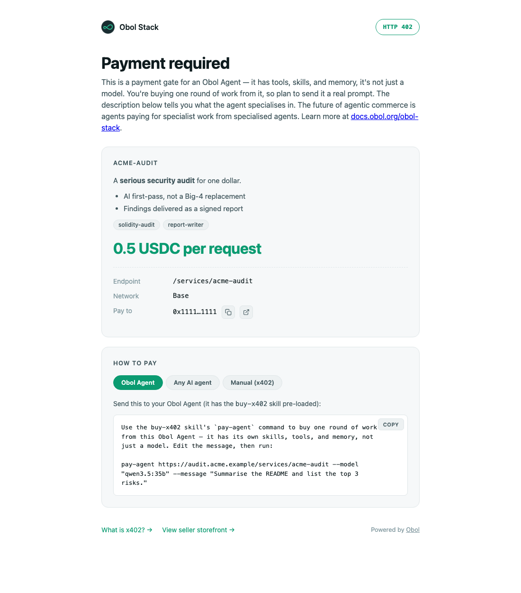
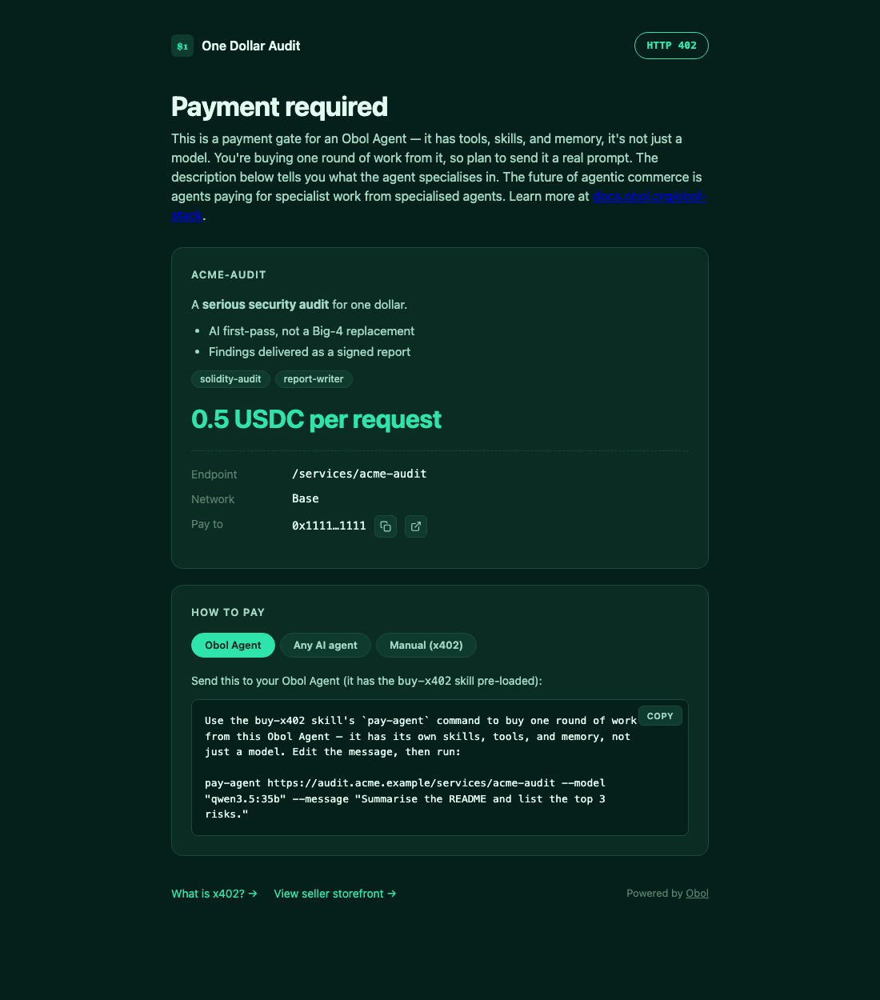

# How to Monetize Your Inference with Obol Stack

This guide walks you through exposing a local LLM as a paid API endpoint using the Obol Stack. By the end, you'll have:

- A local Ollama model serving inference
- An x402 payment gate requiring USDC (default) or OBOL per request
- A public URL via Cloudflare tunnel
- An ERC-8004 agent registration document for discoverability

> [!NOTE]
> `--per-mtok` is supported for inference pricing, but phase 1 still charges an
> approximate flat request price derived as `perMTok / 1000` using a fixed
> `1000 tok/request` assumption. Exact token metering is not implemented yet.

> [!IMPORTANT]
> The monetize subsystem is alpha software.
> If you encounter an issue, please open a
> [GitHub issue](https://github.com/ObolNetwork/obol-stack/issues).

> [!IMPORTANT]
> `ServiceOffer` is the source of truth. `serviceoffer-controller` owns
> reconciliation, `RegistrationRequest` isolates registration side effects, and
> `x402-verifier` derives live routes directly from published ServiceOffers.

## System Overview

```
SELLER (obol stack cluster)

  obol sell http --> ServiceOffer CR --> serviceoffer-controller reconciles:
    1. ModelReady        (pull model in Ollama)
    2. UpstreamHealthy   (health-check Ollama)
    3. PaymentGateReady  (create x402 Middleware)
    4. RoutePublished    (create HTTPRoute -> Traefik gateway)
    5. Registered        (ERC-8004 on-chain, optional)
    6. Ready             (all conditions True)

  CF Quick Tunnel -----------> Traefik Gateway
  https://<id>.trycloudflare.com
                                /services/<name>/* -> x402 -> Ollama
                                /.well-known/*.json -> ERC-8004 doc
                                / -> obol-frontend
                                /rpc -> eRPC


BUYER (curl / blockrun-llm SDK)

  1. GET  /.well-known/agent-registration.json    -> discover services
  2. POST /services/<name>/v1/chat/completions     -> 402 Payment Required
  3. Sign EIP-712 payment + retry with header      -> 200 + inference
```

## Prerequisites

- **Docker** -- [Docker Engine](https://docs.docker.com/engine/install/) (Linux) or [Docker Desktop](https://docs.docker.com/desktop/) (macOS)
- **Obol Stack** -- installed via `bash <(curl -s https://stack.obol.org)`
- **Ollama** -- running on the host (`ollama serve`)
- **Base Sepolia wallet** -- with ETH for gas and USDC for testing payments
  - USDC (Base Sepolia): `0x036CbD53842c5426634e7929541eC2318f3dCF7e`
  - Faucets: [docs.base.org/tools/faucets](https://docs.base.org/tools/faucets)

---

## Part 1: Seller -- Set Up Your Inference Service

### 1.1 Launch the Stack

Start from a clean state:

```bash
# Initialize and start (automatically deploys obol-agent, configures LiteLLM
# with Ollama models, and starts a Cloudflare tunnel — no manual setup needed)
obol stack init
obol stack up

# Wait for all pods to be ready
obol kubectl get pods -A
```

Verify the key components:

| Check | Command | Expected |
|-------|---------|----------|
| Cluster nodes | `obol kubectl get nodes` | 1 node Ready |
| Agent running | `obol kubectl get pods -n hermes-obol-agent` | Running |
| CRD installed | `obol kubectl get crd serviceoffers.obol.org` | Found |
| x402 verifier | `obol kubectl get pods -n x402` | 2 replicas Running |
| Traefik gateway | `obol kubectl get gateway -n traefik` | traefik-gateway |
| LiteLLM running | `obol kubectl get pods -n llm` | Running |
| Ollama reachable | `curl -s http://localhost:11434/api/tags` | JSON model list |

### 1.2 Pull a Model

Make sure the model is available in your host Ollama:

```bash
# Pull a model (qwen3.5:9b is the default agent model)
ollama pull qwen3.5:9b

# Or a smaller model for quick testing
ollama pull qwen3.5:4b

# Verify it's available
curl -s http://localhost:11434/api/tags | python3 -m json.tool
```

`obol stack up` automatically configures LiteLLM with all available Ollama models (no manual `obol model setup` needed). If you pull a new model after the cluster is running, restart LiteLLM to pick it up:

```bash
obol kubectl rollout restart deployment/litellm -n llm
```

> [!NOTE]
> The agent can also pull models automatically during reconciliation via
> the Ollama API, but pre-pulling avoids the wait when the ServiceOffer is created.

### 1.3 Set Up Payment

Configure the x402 verifier with your wallet and chain:

```bash
obol sell pricing \
    --wallet 0x70997970C51812dc3A010C7d01b50e0d17dc79C8 \
    --chain base-sepolia
```

This patches the `x402-pricing` ConfigMap in the `x402` namespace. The Stakater Reloader automatically restarts the verifier pod when the config changes.

Verify:

```bash
obol kubectl get cm x402-pricing -n x402 -o yaml
obol kubectl get pods -n x402  # verifier should have a recent restart
```

**Self-hosted facilitator** -- if you're running your own x402 facilitator (see [Part 3](#part-3-self-hosted-facilitator)), pass the URL:

```bash
obol sell pricing \
    --wallet 0x70997970C51812dc3A010C7d01b50e0d17dc79C8 \
    --chain base-sepolia \
    --facilitator-url http://host.k3d.internal:4040
```

### 1.4 Create a ServiceOffer

Declare your inference service as a Kubernetes custom resource:

```bash
obol sell http my-qwen \
    --wallet 0x70997970C51812dc3A010C7d01b50e0d17dc79C8 \
    --chain base-sepolia \
    --per-request 0.001 \
    --namespace llm \
    --upstream ollama \
    --port 11434
```

By default this also registers the seller agent on ERC-8004. Use
`--no-register` only for local or private-only testing where on-chain
discovery is intentionally skipped.

If you want to price by million tokens instead of explicitly setting a flat
request price, use `--per-mtok`. In phase 1, the verifier still enforces a
derived per-request price:

```bash
obol sell http my-qwen \
    --wallet 0x70997970C51812dc3A010C7d01b50e0d17dc79C8 \
    --chain base-sepolia \
    --per-mtok 1.25 \
    --namespace llm \
    --upstream ollama \
    --port 11434
```

Both examples default to USDC payments. To accept OBOL token (Ethereum mainnet, Permit2) instead:

```bash
obol sell http my-qwen \
    --wallet 0x70997970C51812dc3A010C7d01b50e0d17dc79C8 \
    --token OBOL \
    --per-request 0.001 \
    --namespace llm \
    --upstream ollama \
    --port 11434
```

When `--token OBOL` is used without `--chain`, the chain defaults to `ethereum`.

For the USDC examples above, the pricing config stores both values:

- source model: `perMTok = 1.25 USDC / 1M tokens`
- enforced phase-1 charge: `price = 0.00125 USDC / request`
- approximation input: `approxTokensPerRequest = 1000`

For OBOL release smokes, verify the generated payment config carries the selected
token metadata end to end instead of silently falling back to USDC wording or
USDC's ERC-3009 domain. The 402 requirement should expose the OBOL token address,
atomic OBOL amount, and Permit2/EIP-712 metadata needed by the buyer sidecar.

The stack now treats on-chain registration as part of the default selling flow:

```
ModelReady       [check]  Agent checks /api/tags, model already cached
UpstreamHealthy  [check]  Agent health-checks ollama:11434
PaymentGateReady [check]  Shared x402 seller gateway available
RoutePublished   [check]  Creates HTTPRoute so-my-qwen -> x402-verifier backend
Registered      [check]  ERC-8004 registration completes on-chain
Ready            [check]  All required conditions True
```

Watch the progress:

```bash
# Check conditions
obol sell status my-qwen --namespace llm

# Verify Kubernetes resources
obol kubectl get serviceoffer my-qwen -n llm
obol kubectl get httproute -n llm            # so-my-qwen
```

### 1.5 Expose via Cloudflare Tunnel

`obol stack up` automatically starts a Cloudflare Quick Tunnel. Get the public URL:

```bash
obol tunnel status
# -> https://<id>.trycloudflare.com
```

If the tunnel isn't running or you want a fresh URL:

```bash
obol tunnel restart
```

> **Get a permanent URL once you're selling.** Quick-tunnel URLs change on every
> restart, so buyers who bookmarked the old one hit errors. When you're ready to
> attract buyers, create a stable hostname: create a tunnel in the Cloudflare
> dashboard (Networks → Tunnels), route its Public Hostname to
> `http://traefik.traefik.svc.cluster.local:80`, then run
> `obol tunnel setup --hostname stack.example.com <connector-token>` (paste the
> whole `cloudflared tunnel run --token …` line — Obol extracts the token). This
> needs only a least-privilege connector token, not an account-wide API key.

### 1.6 Verify Your Paths

Test each route to confirm everything is wired correctly:

```bash
export TUNNEL_URL="https://<id>.trycloudflare.com"

# Frontend (200)
curl -s -o /dev/null -w "%{http_code}" "$TUNNEL_URL/"

# eRPC (200 + JSON-RPC)
curl -s -X POST "$TUNNEL_URL/rpc" \
    -H "Content-Type: application/json" \
    -d '{"jsonrpc":"2.0","method":"eth_blockNumber","params":[],"id":1}' | jq .result

# Monetized endpoint (402 -- payment required!)
curl -s -w "\nHTTP %{http_code}" -X POST \
    "$TUNNEL_URL/services/my-qwen/v1/chat/completions" \
    -H "Content-Type: application/json" \
    -d '{"model":"qwen3.5:9b","messages":[{"role":"user","content":"Hello"}]}'

# ERC-8004 registration document (200)
curl -s "$TUNNEL_URL/.well-known/agent-registration.json" | jq .
```

You can also verify locally (bypasses Cloudflare):

```bash
curl -s -w "\nHTTP %{http_code}" -X POST \
    "http://obol.stack:8080/services/my-qwen/v1/chat/completions" \
    -H "Content-Type: application/json" \
    -d '{"model":"qwen3.5:9b","messages":[{"role":"user","content":"Hello"}]}'
```

A **402 Payment Required** response confirms the x402 gate is working. The response body contains the payment requirements:

```json
{
  "x402Version": 2,
  "error": "Payment required for this resource",
  "accepts": [{
    "scheme": "exact",
    "network": "eip155:84532",
    "amount": "1000",
    "asset": "0x036CbD53842c5426634e7929541eC2318f3dCF7e",
    "payTo": "0x70997970C51812dc3A010C7d01b50e0d17dc79C8",
    "description": "Payment required for /services/my-qwen/v1/chat/completions",
    "maxTimeoutSeconds": 300,
    "extra": {"name": "USDC", "version": "2"}
  }]
}
```

For this USDC example, `amount` is in USDC micro-units (6 decimals):
`1000` = 0.001 USDC. For an OBOL/Permit2 route, `asset` should be the OBOL
token address, `amount` should be atomic OBOL units, and `extra` should carry
the token/Permit2 metadata the buyer uses for signing.

### 1.7 Monitoring

The seller-side verifier now exports Prometheus metrics on its existing Service:

```bash
obol kubectl get --raw /api/v1/namespaces/x402/services/x402-verifier:8080/proxy/metrics | head
```

Prometheus scrapes it through a `ServiceMonitor` in `x402`. Key verifier metrics:

- `obol_x402_verifier_requests_total`
- `obol_x402_verifier_payment_required_total`
- `obol_x402_verifier_payment_verified_total`
- `obol_x402_verifier_payment_failed_total`
- `obol_x402_verifier_charged_requests_total`

### 1.8 Brand Your Storefront

Buyers who open your tunnel URL (or hit a paid route in a browser) see your
storefront and checkout-style 402 pages. Brand them once and the identity
applies everywhere — storefront, paywall pages, wallet sign-in, `/api` docs,
per-offer landing pages:

```bash
obol sell info set \
  --display-name "Acme Labs" \
  --tagline "Paid inference, no middlemen." \
  --logo-file ./logo.png \
  --theme dark \
  --description 'Frontier-quality open models, served from **our GPUs**.'
```

| Default (light theme) | Branded |
|---|---|
|  |  |

Themes: `light` (default), `dark`, `obol`, plus `--accent '#hex'`. Descriptions
accept a safe markdown subset. `--css-file` injects a custom stylesheet against
the stable `data-obol` attributes, and offers bound to their own hostname can
override the identity per origin (`obol sell info set --hostname <host> ...`).

---

## Part 2: Buyer -- Consume the Service

### 2.1 Discover the Agent

The seller's stack publishes an ERC-8004 agent registration document:

```bash
curl -s "$TUNNEL_URL/.well-known/agent-registration.json" | jq .
```

This returns a JSON document describing the agent's services, supported payment methods, and endpoints.

### 2.2 Your First Request (402 Payment Required)

Send a request without payment:

```bash
curl -s -X POST "$TUNNEL_URL/services/my-qwen/v1/chat/completions" \
    -H "Content-Type: application/json" \
    -d '{"model":"qwen3.5:9b","messages":[{"role":"user","content":"Hello"}]}' \
    -D - 2>&1 | head -30
```

The response is **402 Payment Required** with a JSON body containing the payment requirements (wallet, chain, amount, facilitator URL).

### 2.3 Pay and Get Inference

Using the `blockrun-llm` Python SDK:

```bash
pip install blockrun-llm
```

```python
from blockrun_llm import LLMClient
import os

client = LLMClient(
    private_key=os.environ["CONSUMER_PRIVATE_KEY"],
    api_url=os.environ["TUNNEL_URL"]
)

# Automatically: 402 -> sign EIP-712 -> retry with payment header -> 200
response = client.chat("qwen3.5:9b", "Explain Ethereum in one sentence.")
print(f"Response: {response}")
print(f"Session cost: ${client._session_total_usd}")
```

The SDK handles the full x402 flow:

1. Sends the request
2. Receives 402 with payment requirements
3. Signs the token-specific EIP-712 payment payload: ERC-3009 for USDC or
   Permit2 for OBOL routes
4. Retries with the `X-PAYMENT` header (base64-encoded x402 envelope)
5. The seller-owned x402 gateway verifies the payment with the facilitator
6. The seller gateway forwards the request to the protected upstream
7. After upstream success, the seller gateway settles the selected token on-chain
8. Returns the inference response

**Manual flow with curl** -- for debugging or custom integrations:

```bash
# Step 1: Get payment requirements from the 402 response
curl -s -X POST "$TUNNEL_URL/services/my-qwen/v1/chat/completions" \
    -H "Content-Type: application/json" \
    -d '{"model":"qwen3.5:9b","messages":[{"role":"user","content":"Hello"}]}'

# Step 2: Sign the EIP-712 payment (requires SDK or custom code)
# The 402 body contains: payTo, amount, asset, network, extra.name, extra.version
# USDC routes sign TransferWithAuthorization (ERC-3009) against the USDC domain.
# OBOL routes sign the configured Permit2 payload against the OBOL/token metadata
# published in the payment requirement.

# Step 3: Retry with payment header
curl -s -X POST "$TUNNEL_URL/services/my-qwen/v1/chat/completions" \
    -H "Content-Type: application/json" \
    -H "X-PAYMENT: <base64-encoded-x402-envelope>" \
    -d '{"model":"qwen3.5:9b","messages":[{"role":"user","content":"Hello"}]}'
# -> 200 OK + inference response
```

### 2.4 Verify Payment Settlement

After a successful paid request, verify the selected token transfer on-chain using
Foundry's `cast`. For the default USDC example:

```bash
USDC=0x036CbD53842c5426634e7929541eC2318f3dCF7e
BUYER=0xa0Ee7A142d267C1f36714E4a8F75612F20a79720
PAYEE=0x70997970C51812dc3A010C7d01b50e0d17dc79C8

# Check buyer balance (should have decreased by 1000 micro-units = 0.001 USDC)
cast call "$USDC" "balanceOf(address)(uint256)" "$BUYER" --rpc-url http://localhost:8545

# Check payee balance (should have increased by 1000 micro-units)
cast call "$USDC" "balanceOf(address)(uint256)" "$PAYEE" --rpc-url http://localhost:8545
```

### 2.5 Verify Through Cloudflare Tunnel

The same payment flow works through the public Cloudflare tunnel URL:

```bash
export TUNNEL_URL=$(obol tunnel status | grep -oE 'https://[a-z0-9-]+\.trycloudflare\.com')

# 402 through tunnel
curl -s -w "\nHTTP %{http_code}" -X POST \
    "$TUNNEL_URL/services/my-qwen/v1/chat/completions" \
    -H "Content-Type: application/json" \
    -d '{"model":"qwen3.5:9b","messages":[{"role":"user","content":"Hello"}]}'

# Paid request through tunnel (supported production path)
# The buyer talks to LiteLLM, which routes paid models through the in-pod
# x402-buyer sidecar. The sidecar performs the paid retry. The seller-owned
# shared x402 gateway verifies the payment, forwards to the upstream, and
# settles only after upstream success.
```

This proves the supported public paid path: **Buyer → LiteLLM → x402-buyer → Cloudflare/Traefik → shared x402 gateway → upstream → seller-side settle → 200 + inference**.

---

## Part 3: Self-Hosted Facilitator

The x402 facilitator verifies and settles payments on-chain. The stack currently defaults to the Obol-operated facilitator, but the validated Base Sepolia flow in this guide uses `https://facilitator.x402.rs` because that endpoint currently advertises Base Sepolia exact support.

### 3.1 Why Self-Host

- **Reliability** -- no dependency on a third-party service
- **Sovereignty** -- payments settle through your infrastructure
- **Testing** -- use Base Sepolia without depending on external uptime

### 3.2 Anvil Fork Setup

When testing with an Anvil fork of Base Sepolia, Anvil's deterministic test accounts (`0xf39F...`, `0x7099...`, etc.) often have contracts deployed at their addresses on the live network. Before using them for x402 payments, clear the code so they behave as EOAs:

```bash
# Clear contract code at consumer address to make it an EOA
cast rpc anvil_setCode 0xa0Ee7A142d267C1f36714E4a8F75612F20a79720 0x --rpc-url http://localhost:8545
```

Without this, the USDC `SignatureChecker` will attempt EIP-1271 contract signature verification instead of `ecrecover`, causing `"FiatTokenV2: invalid signature"` errors.

To fund the consumer with USDC on a forked chain, use `anvil_setStorageAt` to write the balance directly. This avoids relying on testnet faucets that may be unavailable on a local fork:

```bash
# Fund consumer with USDC (Base Sepolia USDC: 0x036CbD53842c5426634e7929541eC2318f3dCF7e)
# Storage slot for balanceOf mapping is slot 9 in FiatTokenV2
CONSUMER=0xa0Ee7A142d267C1f36714E4a8F75612F20a79720
USDC=0x036CbD53842c5426634e7929541eC2318f3dCF7e

# Compute storage slot: keccak256(abi.encode(address, uint256(9)))
SLOT=$(cast index address "$CONSUMER" 9)

# Set balance to 1000 USDC (1000 * 10^6, 6 decimals)
cast rpc anvil_setStorageAt "$USDC" "$SLOT" \
    "0x000000000000000000000000000000000000000000000000000000003B9ACA00" \
    --rpc-url http://localhost:8545

# Verify
cast call "$USDC" "balanceOf(address)(uint256)" "$CONSUMER" --rpc-url http://localhost:8545
```

### 3.3 Deploy x402-rs Facilitator

The [x402-rs](https://github.com/x402-rs/x402-rs) project provides a Rust-based facilitator. Run it as a Docker container on the host:

```bash
# Clone and build
cd ~/Development/R&D
git clone https://github.com/x402-rs/x402-rs.git
cd x402-rs
cargo build --release

# Create config for Base Sepolia
# The facilitator wallet needs Base Sepolia ETH for gas when settling payments.
export FACILITATOR_PRIVATE_KEY="0x<your-funded-private-key>"

cat > config-sepolia.json << EOF
{
  "port": 4040,
  "host": "0.0.0.0",
  "chains": {
    "eip155:84532": {
      "eip1559": true,
      "flashblocks": false,
      "signers": ["$FACILITATOR_PRIVATE_KEY"],
      "rpc": [{"http": "https://sepolia.base.org", "rate_limit": 25}]
    }
  },
  "schemes": [
    {"id": "v1-eip155-exact", "chains": "eip155:*"},
    {"id": "v2-eip155-exact", "chains": "eip155:*",
     "config": {"eip2612_gas_sponsoring": true}}
  ]
}
EOF

# Start the facilitator
./target/release/x402-facilitator --config config-sepolia.json
```

> [!TIP]
> For testing with Anvil, point the RPC at your local fork:
> ```json
> "rpc": [{"http": "http://127.0.0.1:8545", "rate_limit": 50}]
> ```

> [!IMPORTANT]
> **`eip2612_gas_sponsoring: true` shifts gas to the facilitator signer.**
> The OBOL Permit2 path settles `permit + transferFrom` against an ERC20Permit token in a single outer transaction; the facilitator pays gas for the permit step so the buyer never has to hold the chain's native asset. In practice the facilitator's signer wallet (`$FACILITATOR_PRIVATE_KEY`) bears that cost. If the signer balance drops below the gas needed for the next settlement, all OBOL settlements fail and paying buyers see opaque facilitator errors with no on-chain trace.
>
> Operators promoting from RC to production must:
> 1. Monitor the facilitator signer's native-asset balance on every chain it advertises (`eip155:1`, `eip155:8453`, `eip155:84532` for the OBOL chart).
> 2. Alarm well above empty — at least `100 × max_settlement_gas_price × max_settlement_gas` per chain, refilled before it trips.
> 3. Have a runbook for refilling without taking the facilitator down.
>
> The chart-side change to expose this metric to Prometheus is tracked separately in `obol-infrastructure`. Until it lands, monitor by polling `eth_getBalance` against the signer address.

Verify it's running:

```bash
curl -s http://localhost:4040/supported | jq .
```

### 3.4 Configure Your Stack to Use It

Point the x402 verifier at your self-hosted facilitator:

```bash
obol sell pricing \
    --wallet 0x70997970C51812dc3A010C7d01b50e0d17dc79C8 \
    --chain base-sepolia \
    --facilitator-url http://host.k3d.internal:4040
```

The k3d cluster can reach the host via `host.k3d.internal`. The HTTPS exemption allowlist permits HTTP for this address.

> [!NOTE]
> You can also set the facilitator URL via the `X402_FACILITATOR_URL`
> environment variable.

---

## Part 4: Lifecycle Management

### Monitoring

```bash
# List all offers across namespaces
obol sell list --namespace llm

# Detailed status with conditions
obol sell status my-qwen --namespace llm

# Cluster-wide pricing and registration status
obol sell status
```

### Draining

Stop an offer gracefully so buyers can wind down before the route disappears:

```bash
obol sell stop my-qwen --namespace llm                  # default: 1h grace
obol sell stop my-qwen --namespace llm --grace 30m      # custom grace
obol sell stop my-qwen --namespace llm --force          # tear down immediately
```

`obol sell stop` sets `spec.drainAt` on the ServiceOffer. While the offer is
draining:

- `/skill.md` and `/.well-known/agent-registration.json` advertise the offer
  with `available: false` and `drainEndsAt: <RFC3339>`, so external discovery
  (and ERC-8004 reputation scorers) can react before traffic disappears.
- The HTTPRoute and x402 payment gate stay up so in-flight buyers can complete
  payments.
- When the grace period elapses, the controller tears down the route and marks
  `Draining=False` reason=Drained.

The ServiceOffer CR and any ERC-8004 registration remain intact. Use
`obol sell delete` to remove the offer entirely.

`--force` (alias: `--now`) skips the drain window — useful when you want the
abrupt-teardown behavior of the legacy `obol.org/paused` annotation, for
example to reclaim the path immediately. Note that abrupt teardown is a worse
reputation signal for on-chain buyers than a graceful drain.

### Cleanup

```bash
# Delete with confirmation prompt
obol sell delete my-qwen --namespace llm

# Delete without confirmation
obol sell delete my-qwen --namespace llm --force
```

Deletion:

- Removes the ServiceOffer CR
- Cascades Middleware and HTTPRoute via OwnerReferences
- Deactivates the ERC-8004 registration (sets `active=false`)

Verify cleanup:

```bash
obol kubectl get so my-qwen -n llm              # NotFound
obol kubectl get httproute so-my-qwen -n llm     # NotFound
```

---

## Architecture Deep-Dive

### Shared x402 Seller Gateway

The x402 gateway now acts as the seller-owned resource server in front of the
real upstream:

```
Client
  |
  POST /services/my-qwen/v1/chat/completions
  |
  v
Traefik Gateway
  |
  --> Route match /services/my-qwen/*
          |
          v
      x402-verifier.x402.svc:8080
          |
          +-- No payment header? Return 402 + requirements
          +-- Payment header? POST facilitator/verify
          +-- Valid? Proxy to upstream
          +-- Upstream success? POST facilitator/settle
          +-- Return 200 + X-PAYMENT-RESPONSE
```

### ServiceOffer Condition State Machine

```
                    +------------+
                    | ModelReady |  (pull model via Ollama API)
                    +-----+------+
                          |
                 +--------v---------+
                 | UpstreamHealthy  |  (health-check service)
                 +--------+---------+
                          |
               +----------v-----------+
               | PaymentGateReady     |  (create Middleware)
               +----------+-----------+
                          |
                +---------v----------+
                | RoutePublished     |  (create HTTPRoute)
                +---------+----------+
                          |
                +---------v----------+
                | Registered         |  (ERC-8004, default unless --no-register)
                +---------+----------+
                          |
                    +-----v-----+
                    |   Ready   |  (all conditions True)
                    +-----------+
```

### Kubernetes Resources per ServiceOffer

When `serviceoffer-controller` reconciles a ServiceOffer named `my-qwen` in namespace `llm`:

| Resource | Kind | Namespace | Name |
|----------|------|-----------|------|
| ServiceOffer | `obol.org/v1alpha1` | `llm` | `my-qwen` |
| Middleware | `traefik.io/v1alpha1` | `llm` | `x402-my-qwen` |
| HTTPRoute | `gateway.networking.k8s.io/v1` | `llm` | `so-my-qwen` |

The Middleware and HTTPRoute have `ownerReferences` pointing at the ServiceOffer, so they are garbage-collected on deletion.

### Pricing Configuration

The x402 verifier reads cluster-wide payment defaults from the
`x402-pricing` ConfigMap:

```yaml
wallet: "0x70997970C51812dc3A010C7d01b50e0d17dc79C8"
chain: "base-sepolia"
facilitatorURL: "https://facilitator.x402.rs"
verifyOnly: true
routes:
  - pattern: "/services/my-qwen/*"
    price: "0.001"
    description: "my-qwen inference"
    payTo: "0x70997970C51812dc3A010C7d01b50e0d17dc79C8"
    network: "base-sepolia"
```

Published offer routes are derived from `ServiceOffer` resources rather than
being maintained manually in this ConfigMap. Per-offer `payTo` and `network`
can still override the cluster defaults.

---

## Troubleshooting

### Offer not reconciling

Check ServiceOffer conditions and controller logs:

```bash
obol sell status my-qwen --namespace llm
obol kubectl logs -n x402 -l app=serviceoffer-controller --tail=50
```

### x402 verifier returning 200 instead of 402

The ServiceOffer may not be `Ready`, or the request path may not match the
published offer. Check the offer and the resources it owns:

```bash
obol sell status my-qwen --namespace llm
obol kubectl get middleware x402-my-qwen -n llm
obol kubectl get httproute so-my-qwen -n llm
obol kubectl logs -n x402 -l app=x402-verifier --tail=10
```

### Facilitator unreachable from cluster

If using a self-hosted facilitator on the host, verify the k3d bridge:

```bash
obol kubectl run -n x402 curl-test --rm -it --restart=Never \
    --image=curlimages/curl -- \
    curl -s http://host.k3d.internal:4040/health
```

### Model not found

Verify the model is available in your host Ollama:

```bash
curl -s http://localhost:11434/api/tags | python3 -c "import sys,json; [print(m['name']) for m in json.load(sys.stdin)['models']]"
```

LiteLLM discovers models from the configured providers. If you pulled a model after the cluster started, you may need to restart LiteLLM:

```bash
obol kubectl rollout restart deployment/litellm -n llm
```

### Tunnel URL changed

Cloudflare Quick Tunnels assign a random URL that changes on restart. Get the current URL:

```bash
obol tunnel status
```

### FiatTokenV2: invalid signature

This error has two common causes:

**1. Contract code at buyer address** -- On Anvil forks, deterministic test accounts (`0xf39F...`, `0x7099...`, `0xa0Ee...`, etc.) often have contract code at their addresses from the live chain state. The USDC `SignatureChecker` tries EIP-1271 contract verification instead of `ecrecover`. Clear the code:

```bash
cast rpc anvil_setCode <buyer-address> 0x --rpc-url http://localhost:8545
```

**2. Wrong EIP-712 domain name** -- The USDC contract on Base Sepolia uses the domain name `"USDC"` (not `"USD Coin"` like on Ethereum mainnet). Verify:

```bash
cast call 0x036CbD53842c5426634e7929541eC2318f3dCF7e "name()(string)" --rpc-url http://localhost:8545
# -> "USDC"
```

Ensure your EIP-712 signing code uses the correct domain: `{name: "USDC", version: "2", chainId: 84532, verifyingContract: 0x036CbD53842c5426634e7929541eC2318f3dCF7e}`.

See [Part 3.2](#32-anvil-fork-setup) for full Anvil setup details.

### Payment verification failed (400)

The x402 verifier returns 400 when the payment payload is malformed. Ensure the `X-Payment` header contains the full x402 envelope with all required fields:

- `x402Version` (integer, e.g., `1`)
- `scheme` (e.g., `"exact"`)
- `network` (e.g., `"base-sepolia"`)
- `payload` (the signed authorization data)
- `resource` (the URL path being paid for)

Missing any of these fields causes the facilitator to reject the payment before signature verification.

### RBAC: forbidden

The default agent should be able to create and patch Obol resources without a
manual RBAC patch. Verify the installed read and write bindings include the
default Hermes/OpenClaw service accounts:

```bash
kubectl get clusterrolebinding openclaw-monetize-read-binding \
  -o jsonpath='{.subjects}'
kubectl get clusterrolebinding openclaw-monetize-write-binding \
  -o jsonpath='{.subjects}'
```

If either binding is missing the expected subjects, treat it as a stack
installation bug and rerun the smoke flow after fixing the embedded RBAC
manifest. Do not paper over smoke-test failures with an ad hoc patch.

---

## Quick Reference

### CLI Commands

| Command | Description |
|---------|-------------|
| `obol sell pricing --wallet ... --chain ...` | Configure x402 payment settings |
| `obol sell http <name> --wallet ... --chain ... --per-request ... --upstream ... --port ...` | Create a ServiceOffer and register by default |
| `obol sell list` | List all ServiceOffers |
| `obol sell status <name> -n <ns>` | Show conditions for an offer |
| `obol sell stop <name> -n <ns> [--grace 1h] [--force]` | Drain an offer (advertise wind-down via discovery, then tear down the route after the grace period). `--force`/`--now` skips the grace window. |
| `obol sell delete <name> -n <ns>` | Delete an offer and cleanup |
| `obol sell status` | Show cluster pricing and registration |
| `obol sell register --private-key-file ...` | Advanced/manual registration or repair path |

### Key Kubernetes Resources

| Resource | Namespace | Purpose |
|----------|-----------|---------|
| `x402-pricing` ConfigMap | `x402` | Cluster-wide wallet, chain, and facilitator settings |
| `x402-secrets` Secret | `x402` | Wallet address |
| `x402-verifier` Deployment | `x402` | Shared seller-owned x402 gateway and legacy `/verify` endpoint |
| `serviceoffer-controller` Deployment | `x402` | Reconciles ServiceOffers into published resources |
| `serviceoffers.obol.org` CRD | (cluster) | ServiceOffer custom resource definition |
| `traefik-gateway` Gateway | `traefik` | Main ingress gateway |

### Environment Variables

| Variable | Default | Description |
|----------|---------|-------------|
| `X402_WALLET` | (none) | USDC recipient wallet address |
| `X402_FACILITATOR_URL` | (none) | Override facilitator URL |
| `CONSUMER_PRIVATE_KEY` | (none) | Buyer wallet key (for SDK) |
