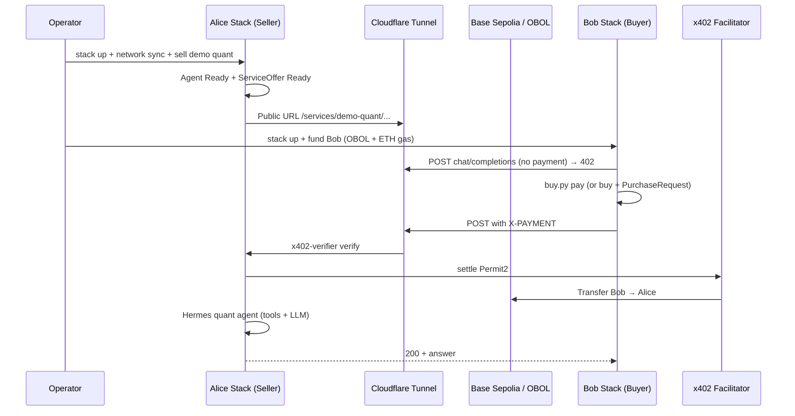

# End-to-end guide: Sell demo quant + buy agent + OBOL

This guide walks through the full **seller agent (quant demo) → buyer agent → OBOL payment → real answer** flow (for example: Vitalik’s ETH balance). It maps to the team goal of proving two agents can complete a paid agent-service transaction on the Obol Stack.

**Related automation today**

| Flow | What it proves |
|------|----------------|
| `flows/flow-16-sell-agent.sh` | Agent CR + `obol sell agent` + **402 metadata** (paid path deferred) |
| `flows/flow-14-live-obol-base-sepolia.sh` | Live OBOL **inference** Alice ↔ Bob (not quant) |
| `flows/flow-15-live-obol-faucet-alice-bob.sh` | Faucet funds Bob, then runs flow-14 |

There is **no CI flow yet** that combines `obol sell demo quant` with a paying buyer agent. This document is the manual E2E runbook until that exists.

---

## What you are proving

| Role | What it is | How in the stack |
|------|------------|------------------|
| **Seller** | One-shot agent with RPC tools (chain analyst) | `obol sell demo quant` → Agent CR + `type=agent` ServiceOffer |
| **Buyer** | Stack-managed agent that pays x402 and calls the seller | Bob’s `hermes-obol-agent` + `buy-x402` skill |
| **Payment** | OBOL via Permit2 on the priced network | Default quant: **10 OBOL** per request (override for testnet) |
| **Success** | Paid call returns real content + on-chain settlement | Same bar as flow-14 |

---

## Architecture overview



---

## Step 0 — Checkout and dev environment

```bash
cd /path/to/obol-stack
git checkout main
git pull origin main

export OBOL_DEVELOPMENT=true
export $(grep -v '^#' .env | xargs)   # REMOTE_SIGNER_PRIVATE_KEY, optional RPC keys

go build -o .workspace/bin/obol ./cmd/obol
```

Use `.workspace/bin/obol` for all commands. Do **not** use a `go run` wrapper when running flows (background port-forwards can false-fail).

**Foundry (nightly)** for payment verification:

```bash
curl -L https://foundry.paradigm.xyz | bash
foundryup --branch nightly
```

**Optional:** run baseline flows to validate the machine:

```bash
./flows/flow-01-prerequisites.sh
./flows/flow-02-stack-init-up.sh
```

---

## Step 1 — Choose network strategy

Pick **one** path before spending OBOL.

### Option A — Live Base Sepolia OBOL (production-like)

| Item | Value |
|------|--------|
| OBOL token | `0x0a09371a8b011d5110656ceBCc70603e53FD2c78` |
| Faucet | `0x0c8Ec594d067d1D850deba7BAa05d4052Ab97076` |
| Facilitator | `https://x402.gcp.obol.tech` |
| Partial automation | `./flows/flow-15-live-obol-faucet-alice-bob.sh` (faucet + flow-14 **inference**, not quant) |

**Default quant pricing mismatch:** `obol sell demo quant` defaults to **10 OBOL on `ethereum`**. The Base Sepolia faucet typically funds **~5 OBOL per claim** — not enough for one 10 OBOL call unless you override price/chain or receive more OBOL manually.

**Recommended for first E2E on testnet:**

```bash
obol sell demo quant \
  --chain base-sepolia \
  --token OBOL \
  --price 0.001
```

### Option B — Anvil fork (no live OBOL)

| Script | Purpose |
|--------|---------|
| `flows/flow-10-anvil-facilitator.sh` | Local facilitator + fork |
| `flows/flow-13-dual-stack-obol.sh` | Alice/Bob OBOL Permit2 on fork (mint OBOL to Bob) |

Use this to debug 401/503 without waiting on faucet or mainnet ETH.

### Option C — Single stack (fastest smoke)

One cluster: seller quant + buyer uses `buy.py` from the same stack’s `obol-agent`. Proves payment plumbing; does **not** prove cross-stack tunnel discovery.

---

## Step 2 — Seller stack (Alice): prerequisites

### 2.1 Run prerequisite flows (or equivalent)

| Step | Script / command |
|------|------------------|
| Environment | `flows/flow-01-prerequisites.sh` |
| Cluster | `flows/flow-02-stack-init-up.sh` |
| LLM | `flows/flow-03-inference.sh` + `obol model setup` / `prefer` / `sync` |
| Master agent (optional) | `flows/flow-04-agent.sh` |
| eRPC (quant needs RPC) | `obol network install` + `obol network sync` for target chain |
| Local facilitator (Option B) | `flows/flow-10-anvil-facilitator.sh` |

Quant demo skills (from `cmd/obol/sell.go`): `ethereum-networks`, `ethereum-local-wallet`, `addresses`, `gas`.

### 2.2 Live RPC (Option A)

Set a reliable Base Sepolia RPC in `.env` for **payment settlement** and balance checks (free tiers often 408 under load):

```bash
BASE_SEPOLIA_RPC=https://lb.drpc.live/base-sepolia/<token>
# or
ALCHEMY_BASE_SEPOLIA_API_KEY=<key>
```

Quant uses the `ethereum-networks` skill (default network: **mainnet**). If your paid prompt asks about mainnet state (e.g. Vitalik’s ETH balance), Alice also needs mainnet in eRPC — not only Base Sepolia:

```bash
obol network install mainnet
obol network sync mainnet
```

Payment chain (`--chain base-sepolia`) and **data chain** (mainnet RPC for tools) are independent.

---

## Step 3 — Seller stack (Alice): deploy quant

```bash
obol stack up

obol sell demo quant \
  --chain base-sepolia \
  --token OBOL \
  --price 0.001 \
  --name demo-quant
```

Optional on-chain discovery (needs Alice Base Sepolia **ETH** for gas):

```bash
obol sell demo quant --chain base-sepolia --token OBOL --price 0.001 --register
# or later:
obol sell register --chain base-sepolia ...
```

**What this does** (`runAgentBackedDemo` in `cmd/obol/sell_agent.go`):

1. Seeds `soul.md` + skills under `agent-demo-quant/`
2. Creates Agent CR with wallet + pinned model
3. Creates `ServiceOffer` with `spec.type: agent` at `/services/demo-quant`

### 3.1 Seller verification checkpoints

```bash
obol sell status demo-quant -n agent-demo-quant
# Expect: Ready=True

obol tunnel status
# Note the public HTTPS URL (e.g. https://....trycloudflare.com)
```

**Unpaid probe (must return 402 + agent metadata):**

```bash
TUNNEL="<your-tunnel-url>"
curl -s -X POST "$TUNNEL/services/demo-quant/v1/chat/completions" \
  -H "Content-Type: application/json" \
  -d '{"model":"agent/demo-quant","messages":[{"role":"user","content":"ping"}]}' | jq .
```

Expect `accepts[]` with `extra.agentModel` and `extra.agentSkills`.

**Partial automation (alternative to Step 3 above):** `./flows/flow-16-sell-agent.sh` uses `obol agent new` + `obol sell agent` (not `obol sell demo quant`). Defaults to USDC on base-sepolia. Use it **instead of** Step 3 for a 402 smoke, or **skip it** if you already deployed quant here — re-running on the same name/workspace will duplicate or confuse state.

```bash
FLOW_AGENT_NAME=demo-quant \
FLOW_AGENT_SKILLS=ethereum-networks,ethereum-local-wallet,addresses,gas \
./flows/flow-16-sell-agent.sh
```

---

## Step 4 — Buyer stack (Bob): wallets and funding

### 4.1 Dual-stack layout (full demo)

| Directory | Role |
|-----------|------|
| `.workspace-alice/` | Seller (Alice) |
| `.workspace-bob/` | Buyer (Bob) |

For a single-stack smoke, skip separate workspaces and use one `.workspace/`.

### 4.2 Derive Bob’s wallet (deterministic)

Bob is the **second key** derived from `REMOTE_SIGNER_PRIVATE_KEY`. Flows 11/13/14 require this — do not fund a random address.

```bash
SIGNER_KEY=$(grep -E '^[[:space:]]*REMOTE_SIGNER_PRIVATE_KEY=' .env | head -1 | cut -d= -f2-)
BOB_PRIVATE_KEY=$(env -u CHAIN cast keccak \
  "$(env -u CHAIN cast abi-encode 'f(bytes32,uint256)' "$SIGNER_KEY" 2)")
BOB_WALLET=$(env -u CHAIN cast wallet address --private-key "$BOB_PRIVATE_KEY")
ALICE_WALLET=$(env -u CHAIN cast wallet address --private-key "$SIGNER_KEY")

echo "Alice (seller): $ALICE_WALLET"
echo "Bob (buyer):    $BOB_WALLET"
```

Use `env -u CHAIN` so a set `CHAIN` env var does not skew derivation (same as flow-14/15).

### 4.3 What Bob needs

| Asset | Why |
|-------|-----|
| **OBOL** | Pays the seller (≥ price × number of calls; ≥ **10 OBOL** only if you keep default quant price on mainnet) |
| **Base Sepolia ETH** | One-time Permit2 `approve` on OBOL (buyer-side gas) |

**Check balance:**

```bash
OBOL_TOKEN=0x0a09371a8b011d5110656ceBCc70603e53FD2c78
cast call "$OBOL_TOKEN" "balanceOf(address)(uint256)" "$BOB_WALLET" \
  --rpc-url "$BASE_SEPOLIA_RPC"
```

### 4.4 Obtain OBOL if you do not have enough

1. **Faucet flow (live):**

   ```bash
   ./flows/flow-15-live-obol-faucet-alice-bob.sh
   ```

   Claims official faucet OBOL for Bob (~5 OBOL per `claimAmount()` on-chain), then runs flow-14 (**inference**, not quant) at **0.001 OBOL** per request. Good to validate faucet funding and inference commerce separately before quant.

2. **Manual transfer** of OBOL to `BOB_WALLET` on Base Sepolia.

3. **Anvil fork:** use flow-13 to mint fork OBOL to Bob.

### 4.5 QA LLM for buyer agent prompts

Full dual-stack buyer steps need a real OpenAI-compatible endpoint (not Ollama-only):

```bash
export OBOL_LLM_ENDPOINT=https://your-qa-host/v1
export OBOL_LLM_MODEL=qwen36-deep
```

Flow-14 fails fast without `OBOL_LLM_ENDPOINT`. Long `buy.py` prompts flake on small local models.

### 4.6 Bob stack up (dual-stack pattern)

Before Bob’s `stack up`, pre-seed Bob’s remote-signer with `BOB_PRIVATE_KEY` (see `flows/flow-14-live-obol-base-sepolia.sh` and `flows/lib-dual-stack.sh`).

High-level sequence:

1. Init Bob workspace / k3d cluster on separate ports
2. Pre-seed wallet in Bob’s config
3. `obol stack up` on Bob
4. `obol agent init` + model setup on Bob
5. Assert `bobSigner == BOB_WALLET` after stack up

For the full scripted path, study and adapt:

- `flows/flow-14-live-obol-base-sepolia.sh`
- `flows/lib-dual-stack.sh` (`agent_buy_with_retry`, `bob`, `alice` helpers)

---

## Step 5 — Commerce: buyer pays seller agent

### 5.1 Discovery (optional)

| Method | When |
|--------|------|
| ERC-8004 registry | Alice used `--register`; Bob runs `discovery.py` (flow-11/14) |
| Direct URL | Skip discovery; use tunnel URL + `--no-verify-identity` |

### 5.2 Choose `pay` vs `buy`

| Seller type | Buyer tool | Notes |
|-------------|------------|-------|
| `type:http` (demo-hello) | `buy.py pay <url>` | One-shot |
| `type:inference` | `buy.py buy <name>` + LiteLLM `paid/<model>` | flow-14 path |
| **`type=agent` (quant)** | **`buy.py pay <chat-completions-url>`** with `--type inference` | One-shot per request; model `agent/demo-quant` |

From `internal/embed/skills/buy-x402/SKILL.md`:

- **`pay`** — single-shot: probe, sign one auth, attach `X-PAYMENT`, send request.
- **`buy`** — inference-shaped: PurchaseRequest + `paid/<model>` sidecar. Do **not** use `buy` for `type:http`; for agent one-shot prefer **`pay`**.

### 5.3 Example paid call (Vitalik question)

Requires Alice to have **mainnet** eRPC synced (Step 2.2). Settlement stays on Base Sepolia; the agent tools query mainnet.

Inside Bob’s agent pod (or via `obol kubectl exec`):

```bash
python3 /data/.hermes/obol-skills/buy-x402/scripts/buy.py pay \
  "https://<alice-tunnel>/services/demo-quant/v1/chat/completions" \
  --type inference \
  --method POST \
  --data '{"model":"agent/demo-quant","messages":[{"role":"user","content":"What is Vitalik Buterin ETH balance on mainnet? Be concise."}]}'
```

Or prompt Bob’s Hermes agent to run `buy.py` (flow-14 style). If the agent times out, diagnose LLM routing — do not relax payment assertions.

**CLI alternative (not recommended for quant):** `obol buy inference` runs the **`buy`** subcommand (PurchaseRequest + `paid/<model>` sidecar), which is inference-shaped. It is not the documented one-shot path for `type=agent`. Prefer `buy.py pay` below.

```bash
# Experimental only — may not settle or route like pay for agent offers
obol buy inference my-buy \
  --seller "https://<alice-tunnel>/services/demo-quant/v1/chat/completions" \
  --model agent/demo-quant \
  --budget 1 \
  --token OBOL \
  --no-verify-identity
```

### 5.4 Host CLI buy (flow-11 mode)

```bash
FLOW11_BUY_MODE=host-cli ./flows/flow-11-dual-stack.sh
```

Requires Hermes runtime on Bob. For OBOL live path use flow-14/15 instead of flow-11 (USDC baseline).

---

## Step 6 — Success criteria (must all pass)

**All paths (`pay` or `buy`):**

1. **HTTP 200** on the paid request with a **final answer** (not tool-catalog text or reasoning metadata only).
2. **On-chain `Transfer`** from Bob’s signer to the seller’s **pay-to** address for **exact** priced wei.
3. **Balance deltas:** Bob OBOL decreases and the pay-to address increases by exactly the payment amount.

Default quant uses the stack remote-signer as pay-to (`ALICE_WALLET` above). If you passed `--pay-to`, verify transfers to that address instead.

**Additional criteria only for the `buy` / `obol buy inference` path** (not for `buy.py pay`, which is stateless):

4. `PurchaseRequest` reaches `Ready=True` before the paid call.

**Verify transfer** (replace `SELLER_PAY_TO` with `ALICE_WALLET` or your `--pay-to`):

```bash
SELLER_PAY_TO="$ALICE_WALLET"   # or explicit --pay-to from obol sell status

# After the paid call, scan logs from a known start block
cast logs --from-block <start_block> \
  --address "$OBOL_TOKEN" \
  'Transfer(address indexed from, address indexed to, uint256 value)' \
  "$BOB_WALLET" "$SELLER_PAY_TO" \
  --rpc-url "$BASE_SEPOLIA_RPC"
```

Archive artifacts under `.tmp/flow-quant-e2e-<timestamp>/` (receipts, curl bodies, `kubectl` logs).

---

## Step 7 — Troubleshooting 401 and related errors

401 usually means **x402 verification passed but upstream auth failed**. Check in order:

| # | Symptom | Likely cause | What to do |
|---|---------|--------------|------------|
| 1 | 401 from **LiteLLM** after payment | HTTPRoute missing `Authorization: Bearer <LITELLM_MASTER_KEY>` | Known gap (`internal/openclaw/monetize_integration_test.go`). Patch route or confirm controller adds auth. |
| 2 | 401 on **Hermes / agent** | Wrong Bearer token | Use `obol agent auth --runtime hermes obol-agent`. **Never** `obol hermes token obol-agent` (can print CLI help as token). |
| 3 | 403 / Cloudflare 1010 instead of 402 | WAF blocks `Python-urllib` | `buy.py` uses `obol-buy-x402/1.0` UA; rebuild `obol` after skill changes. |
| 4 | 503 Payment verification failed | Verifier image pin, CA bundle, chain ID mismatch | See `.agents/skills/obol-stack-dev/SKILL.md` “Hard-Won Lessons”. |
| 5 | 404 on paid route | CAIP-2 vs legacy `base-sepolia` | `internal/x402/chains.go` |
| 6 | Empty body right after deploy | Route not loaded yet | Retry 402 probe in a loop (flow-07/08 pattern). |

**Quant-specific:** upstream is **Hermes** in the seller agent namespace, not LiteLLM. Focus on Agent `Ready`, `status.endpoint`, and Hermes logs.

```bash
kubectl get agent demo-quant -n agent-demo-quant -o yaml
kubectl get serviceoffer demo-quant -n agent-demo-quant -o yaml
kubectl logs -n agent-demo-quant deploy/hermes --tail=100
kubectl get deploy -n x402 x402-verifier \
  -o jsonpath='{.spec.template.spec.containers[*].image}{"\n"}'
```

**CA bundle (distroless verifier):**

```bash
kubectl create configmap ca-certificates -n x402 \
  --from-file=ca-certificates.crt=/etc/ssl/cert.pem \
  --dry-run=client -o yaml | kubectl replace -f -
```

---

## Step 8 — Known gaps and honest assessment

| Area | Status | Impact |
|------|--------|--------|
| `flow-16` | Sell + 402 only | Does not prove paid quant settlement |
| `flow-14` / `flow-15` | Full OBOL **inference** E2E | Does not use `sell demo quant` |
| Agent-to-agent OBOL quant in CI | **Missing** | This guide is the manual path |
| Default `10 OBOL` on `ethereum` | Faucet / testnet mismatch | Override `--chain base-sepolia --price 0.001` until funded for 10 OBOL |
| Faucet UI | May be broken separately | Run flow-15 to isolate faucet vs commerce |
| `buy` vs `pay` for agents | `pay` is the documented one-shot path | Using `buy` + `paid/agent/...` may not be wired |
| External seller PurchaseRequest | Controller may not reconcile off-cluster sellers | Only if Alice is outside your cluster |

**Can it complete?** Yes, with Base Sepolia OBOL, tuned price, tunnel, both stacks, and auth fixed. **Not guaranteed** with default 10 OBOL on Ethereum mainnet without funding.

---

## Step 9 — Suggested execution schedule

### Phase A — Without OBOL (while waiting for tokens)

| # | Task | Pass criterion |
|---|------|----------------|
| 1 | Steps 0–2, flow-01/02/03 | Stack + LLM up |
| 2 | Step 3 **or** flow-16 (not both) | 402 with `agentModel` / `agentSkills` |
| 3 | Step 7 pre-checks | No 401 on unpaid probe; Hermes Running |

### Phase B — With OBOL

| # | Task | Pass criterion |
|---|------|----------------|
| 4 | Step 4 (flow-15 or manual fund) | Bob OBOL + ETH sufficient |
| 5 | Step 5 single-stack `buy.py pay` | 200 + substantive answer |
| 6 | Step 6 on-chain proof | Transfer + balance deltas |
| 7 | Steps 4–6 dual-stack | Bob stack calls Alice tunnel |

### Phase C — Report

| # | Task |
|---|------|
| 8 | File GitHub issues for any blocker with repro + logs |
| 9 | Note whether faucet, 401, or agent Ready was the limiting factor |

---

## Quick reference

```bash
# Official live OBOL (Base Sepolia)
export OBOL_TOKEN_BASE_SEPOLIA=0x0a09371a8b011d5110656ceBCc70603e53FD2c78
export OBOL_FAUCET_BASE_SEPOLIA=0x0c8Ec594d067d1D850deba7BAa05d4052Ab97076

# Seller
obol sell demo quant --chain base-sepolia --token OBOL --price 0.001
obol sell status demo-quant -n agent-demo-quant
obol tunnel status

# Closest automated OBOL commerce (inference, not quant)
./flows/flow-15-live-obol-faucet-alice-bob.sh
./flows/flow-14-live-obol-base-sepolia.sh

# Agent sell smoke (no paid path)
./flows/flow-16-sell-agent.sh
```

---

## Team topic mapping

| Meeting topic | Guide section |
|---------------|---------------|
| Two agents sell/buy | Steps 3–5 |
| 10 OBOL / OAL per transaction | Step 1 (default); override in Step 3 |
| Vitalik-style answer | Step 5.3 example prompt |
| Faucet without external API key | Step 4.4, flow-15 |
| Resolve 401 errors | Step 7 |
| Modular agent services | `obol agent new` + `obol sell agent` vs `obol sell demo quant` shortcut |

---

## Further reading

- `.agents/skills/obol-stack-dev/SKILL.md` — router + hard-won lessons
- `.agents/skills/obol-stack-dev/references/paid-flows.md` — flow-14/15, Bob wallet, success criteria
- `.agents/skills/obol-stack-dev/references/dev.md` — build, env, CLI surface
- `flows/README.md` — all flow scripts
- `contracts/fork-obol/README.md` — token + faucet deploy addresses
- `internal/embed/skills/buy-x402/SKILL.md` — `pay` vs `buy`
