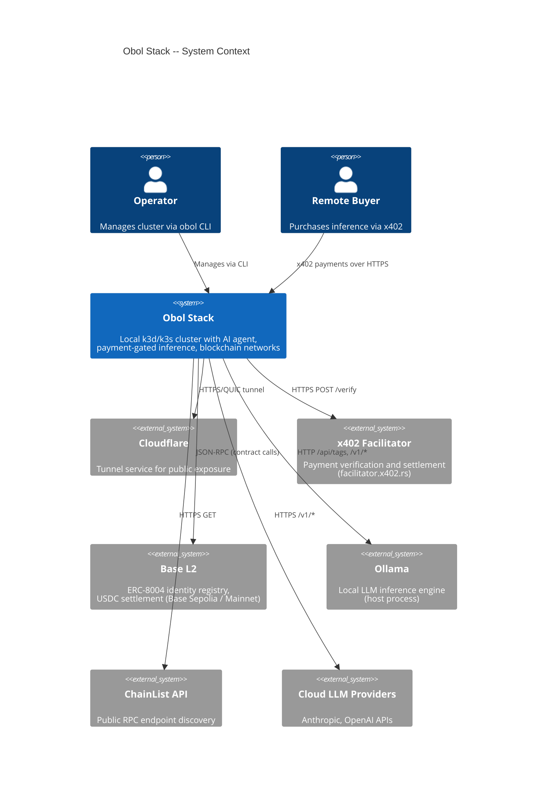
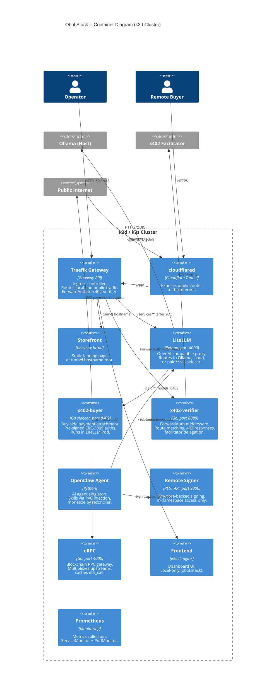
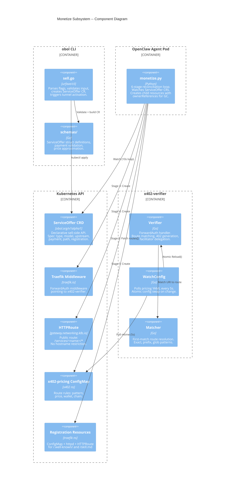
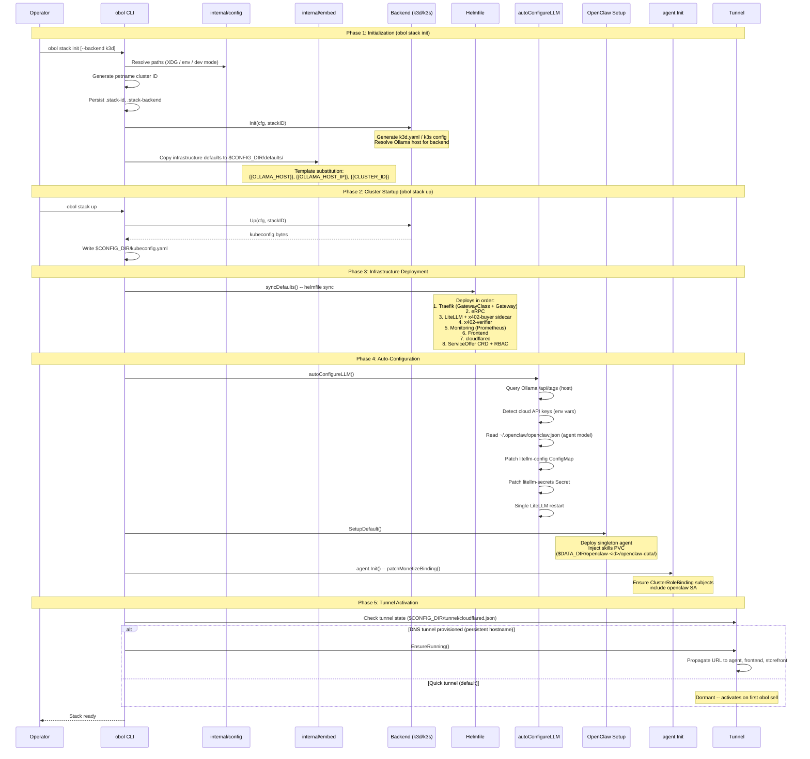
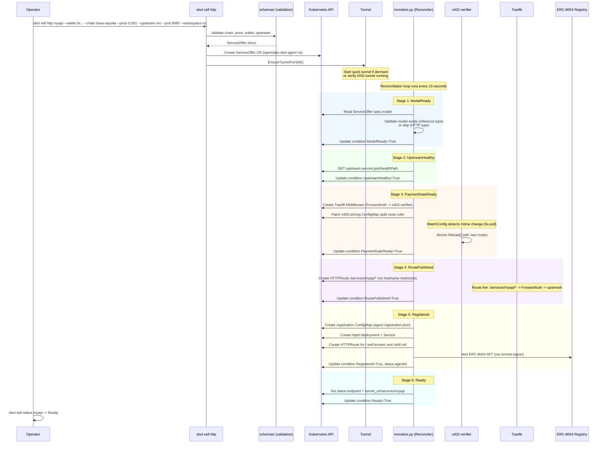
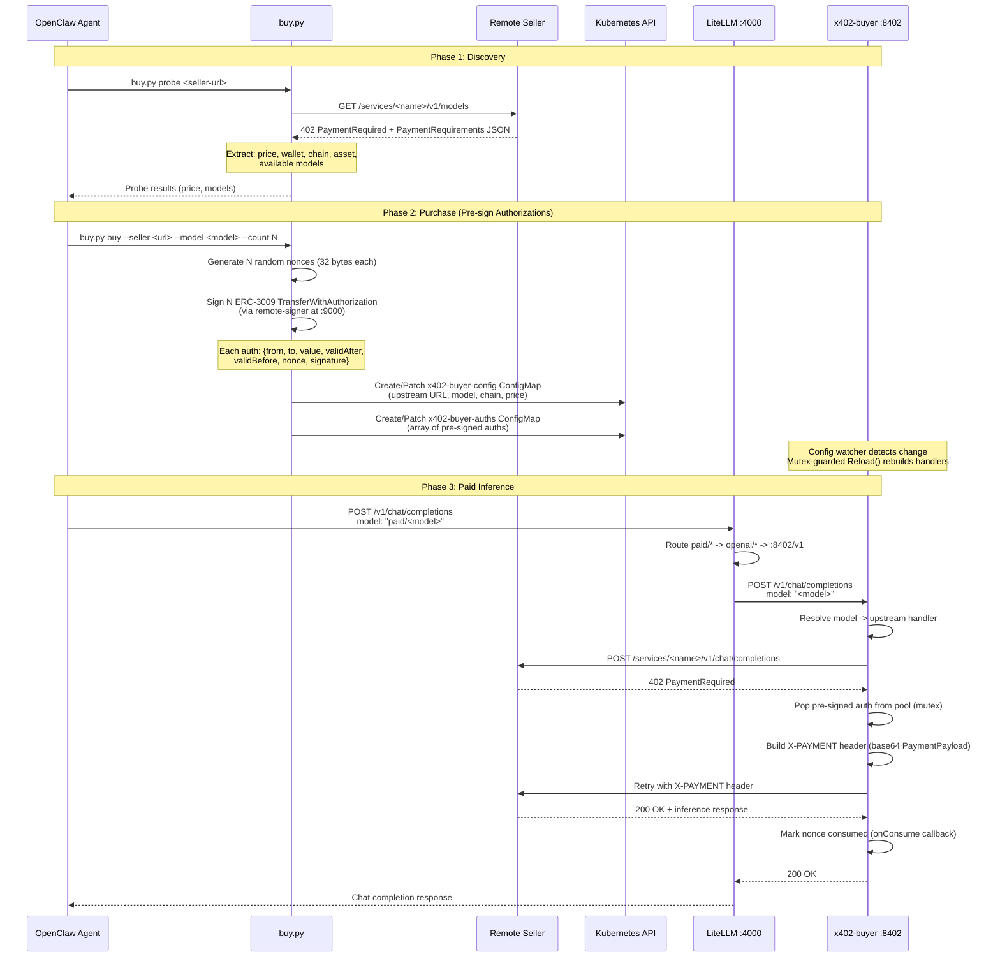
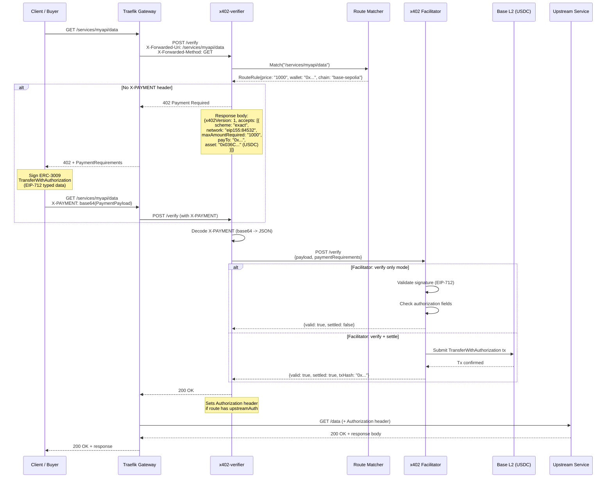
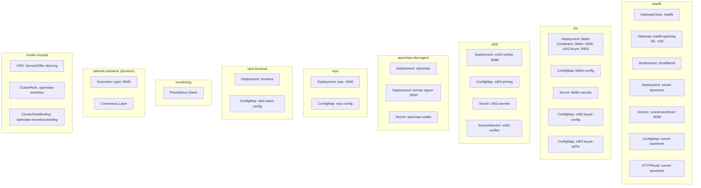
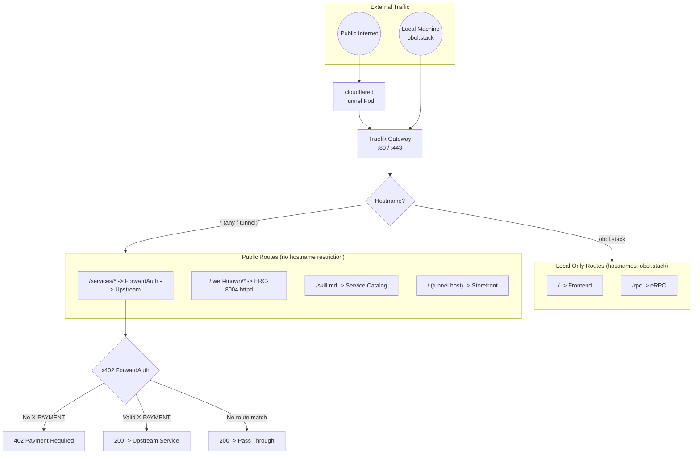
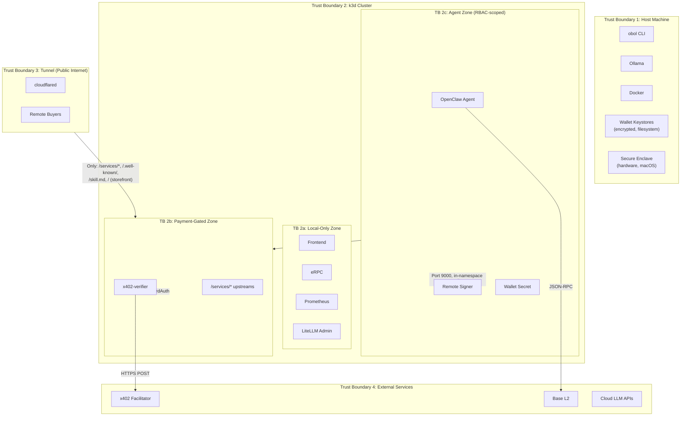

# Obol Stack -- Architecture Document

> **Version:** 1.0.0
> **Date:** 2026-03-27
> **Companion to:** [SPEC.md](./SPEC.md)
> **Audience:** Seasoned developers, agentic workflows, and system integrators.

---

## Table of Contents

1. [Design Philosophy](#1-design-philosophy)
2. [C4 Diagrams](#2-c4-diagrams)
3. [Module Decomposition](#3-module-decomposition)
4. [Data Flow Diagrams](#4-data-flow-diagrams)
5. [Storage Architecture](#5-storage-architecture)
6. [Deployment Model](#6-deployment-model)
7. [Network Topology](#7-network-topology)
8. [Security Architecture](#8-security-architecture)

---

## 1. Design Philosophy

Five guiding principles govern every architectural decision in Obol Stack. They are listed in order of precedence -- when principles conflict, the higher-numbered principle yields to the lower.

### 1.1 Local-First Sovereignty

The operator's machine is the source of truth. All infrastructure runs inside a local k3d/k3s cluster, all state lives on the local filesystem under XDG-compliant paths, and no cloud account is required to start. Public exposure (Cloudflare tunnels) is opt-in and layered on top, never a prerequisite. This ensures the operator retains full custody of keys, models, and data at all times.

*SPEC cross-ref: Section 1.3 (System Constraints), Section 2.3 (Configuration Hierarchy).*

### 1.2 Configuration-Driven Infrastructure

Infrastructure is declared, not scripted. Two-stage templating (CLI flags to Go templates to Helmfile to Kubernetes manifests) ensures that every deployed resource traces back to a versioned configuration file. Embedded assets (`internal/embed/`) ship default configurations; operators override via flags or values files. Helmfile is the single deployment orchestrator -- there are no imperative `kubectl apply` calls in the steady-state path.

*SPEC cross-ref: Section 3.3.3 (Two-Stage Templating), Section 2.1 (High-Level Overview).*

### 1.3 Payment-Gated by Default

Every publicly exposed service is protected by x402 micropayments unless explicitly exempted. The ForwardAuth pattern means Traefik itself enforces payment before traffic ever reaches the upstream. This is not an afterthought bolt-on -- the payment gate is a first-class infrastructure primitive deployed alongside the service via the ServiceOffer reconciliation loop.

*SPEC cross-ref: Section 3.4 (Monetize -- Sell Side), Section 4.1 (x402 Payment Protocol).*

### 1.4 Bounded Trust, Bounded Spending

The system minimizes trust surfaces at every layer. The buy-side sidecar has zero signer access; it can only spend pre-signed vouchers, bounding maximum loss to N * price. The sell-side verifier delegates to an external facilitator for settlement, never holding funds. Wallet private keys live in encrypted keystores or hardware enclaves, accessed only through a remote-signer REST API. RBAC scopes the agent to exactly the Kubernetes verbs it needs.

*SPEC cross-ref: Section 7.2 (Payment Security), Section 7.3 (Wallet Security), Section 7.5 (RBAC).*

### 1.5 Progressive Disclosure

A single `obol stack up` gives operators a working cluster with auto-configured LLM routing, an AI agent, and local blockchain access. Advanced features -- selling inference, buying remote models, on-chain registration, Secure Enclave keys -- are activated incrementally through explicit CLI commands. Failures in optional subsystems (Ollama down, no cloud API key, tunnel unavailable) degrade gracefully with warnings, never blocking the core startup path.

*SPEC cross-ref: Section 3.1.3 (Startup Sequence), Section 8.2 (Graceful Degradation).*

---

## 2. C4 Diagrams

### 2.1 Context Diagram (Level 1)

The system boundary is the operator's machine. External systems interact via well-defined protocols.



### 2.2 Container Diagram (Level 2)

Inside the k3d cluster, containers are organized by namespace. Each namespace represents a deployment unit with distinct responsibilities.



### 2.3 Component Diagram -- Monetize Subsystem (Level 3)

The monetize subsystem is the most architecturally complex part of Obol Stack. It spans the CLI, a Kubernetes CRD, a Python reconciler, Traefik middleware, and the x402-verifier.



---

## 3. Module Decomposition

Every Go package, its purpose, key dependencies, and SPEC cross-references.

### 3.1 CLI Layer

| Module | Purpose | Key Files | Dependencies | SPEC Section |
|--------|---------|-----------|-------------|-------------|
| `cmd/obol` | CLI entry point and command definitions | `main.go`, `sell.go`, `network.go`, `openclaw.go`, `model.go`, `bootstrap.go`, `update.go` | `urfave/cli/v3`, all `internal/` packages | 4.2 |

### 3.2 Core Infrastructure

| Module | Purpose | Key Files | Dependencies | SPEC Section |
|--------|---------|-----------|-------------|-------------|
| `internal/config` | XDG-compliant configuration resolution | `config.go` | (stdlib only) | 2.3 |
| `internal/stack` | Cluster lifecycle (init, up, down, purge) | `stack.go`, `backend.go`, `backend_k3d.go`, `backend_k3s.go` | `config`, `embed`, `model`, `openclaw`, `tunnel`, `agent`, `dns` | 3.1 |
| `internal/embed` | Embedded assets (infrastructure, networks, skills) | `embed.go` | `embed` (stdlib) | 2.1, 3.6.2 |
| `internal/kubectl` | Kubernetes API wrapper with auto-KUBECONFIG | `kubectl.go` | `config` | 2.3 |
| `internal/ui` | Terminal UI (spinners, prompts, branded output) | `ui.go`, `spinner.go`, `prompt.go`, `brand.go`, `errors.go`, `exec.go`, `output.go`, `suggest.go` | (stdlib, terminal libs) | 8.1 |
| `internal/version` | Build version information | `version.go` | (stdlib only) | -- |
| `internal/update` | Self-update and dependency management | `update.go`, `github.go`, `charts.go`, `hint.go` | `version` | -- |
| `internal/dns` | Local DNS resolver for `obol.stack` hostname | `resolver.go` | (stdlib only) | 3.7.5 |

### 3.3 LLM and Inference

| Module | Purpose | Key Files | Dependencies | SPEC Section |
|--------|---------|-----------|-------------|-------------|
| `internal/model` | LiteLLM gateway configuration and provider management | `model.go` | `config`, `kubectl` | 3.2 |
| `internal/inference` | Standalone x402 inference gateway (bare metal / VM) | `gateway.go`, `container.go`, `store.go`, `client.go`, `enclave_middleware.go` | `enclave`, `tee`, `x402` | 3.9 |
| `internal/enclave` | Apple Secure Enclave key management (P-256, ECIES) | `enclave.go`, `enclave_darwin.go`, `enclave_stub.go`, `ecies.go`, `sysctl_darwin.go` | (CGo / Security.framework on macOS) | 3.9.6 |
| `internal/tee` | TEE attestation (TDX, SNP, Nitro) and key management | `tee.go`, `key.go`, `coco.go`, `verify.go`, `attest_*.go` | (platform-specific) | 3.9.6, 7.4 |

### 3.4 Monetize (Sell Side)

| Module | Purpose | Key Files | Dependencies | SPEC Section |
|--------|---------|-----------|-------------|-------------|
| `internal/x402` | x402-verifier: ForwardAuth, route matching, config hot-reload | `verifier.go`, `config.go`, `matcher.go`, `watcher.go`, `setup.go`, `validate.go`, `metrics.go` | `x402-go` (library) | 3.4.4, 3.4.5 |
| `internal/schemas` | ServiceOffer CRD types, payment validation, pricing math | `serviceoffer.go`, `payment.go`, `registration.go` | (stdlib only) | 3.4.3, 5.3 |
| `internal/embed/skills/monetize/` | Python reconciler (`monetize.py`) for 6-stage ServiceOffer reconciliation | `monetize.py`, `SKILL.md` | Kubernetes Python client | 3.4.2 |

### 3.5 Monetize (Buy Side)

| Module | Purpose | Key Files | Dependencies | SPEC Section |
|--------|---------|-----------|-------------|-------------|
| `internal/x402/buyer` | x402-buyer sidecar: reverse proxy, pre-signed auth pool, state tracking | `proxy.go`, `signer.go`, `config.go`, `state.go`, `metrics.go` | `x402-go` | 3.5 |
| `cmd/x402-buyer` | Sidecar binary entry point | `main.go` | `internal/x402/buyer` | 3.5 |
| `internal/embed/skills/buy-inference/` | Agent skill for discovery and purchasing remote inference | `SKILL.md`, `scripts/buy.py` | Python, Kubernetes client | 3.5.2 |

### 3.6 Identity and Blockchain

| Module | Purpose | Key Files | Dependencies | SPEC Section |
|--------|---------|-----------|-------------|-------------|
| `internal/erc8004` | ERC-8004 Identity Registry client (register, metadata, URI) | `client.go`, `types.go`, `abi.go` | `go-ethereum` | 3.8 |
| `internal/network` | Blockchain RPC gateway management (eRPC, ChainList, local nodes) | `network.go`, `erpc.go`, `rpc.go`, `chainlist.go`, `resolve.go`, `parser.go` | `config`, `kubectl`, `embed` | 3.3 |

### 3.7 Agent and Tunnel

| Module | Purpose | Key Files | Dependencies | SPEC Section |
|--------|---------|-----------|-------------|-------------|
| `internal/openclaw` | OpenClaw agent deployment, wallet generation, version management | `openclaw.go`, `wallet.go`, `resolve.go` | `config`, `embed`, `kubectl` | 3.6 |
| `internal/agent` | Agent RBAC patching and singleton management | `agent.go` | `kubectl` | 7.5 |
| `internal/tunnel` | Cloudflare tunnel lifecycle (quick/dns modes, storefront, URL propagation) | `tunnel.go`, `state.go`, `provision.go`, `cloudflare.go`, `login.go`, `agent.go`, `stackid.go` | `config`, `kubectl` | 3.7 |

### 3.8 Applications

| Module | Purpose | Key Files | Dependencies | SPEC Section |
|--------|---------|-----------|-------------|-------------|
| `internal/app` | Helm chart application management (install, sync, list, delete) | `app.go`, `chart.go`, `artifacthub.go`, `metadata.go`, `resolve.go` | `config`, `kubectl`, `embed` | 4.2 |

---

## 4. Data Flow Diagrams

### 4.1 Stack Initialization and Startup

This diagram traces the full lifecycle from `obol stack init` through `obol stack up` to a running cluster with all services operational.



*SPEC cross-ref: Section 3.1.2 (Operations), Section 3.1.3 (Startup Sequence), Section 3.2.4 (Logic).*

### 4.2 Sell-Side: ServiceOffer Creation to Public Route

This traces the complete path from an operator running `obol sell http` through the 6-stage reconciliation loop to a publicly accessible, payment-gated route.



*SPEC cross-ref: Section 3.4.2 (Sell-Side Flow), Section 3.4.3 (ServiceOffer CRD), Section 3.4.4 (x402-verifier).*

### 4.3 Buy-Side: Discovery to Paid Inference

This traces the agent's journey from discovering a remote seller to making paid inference requests through the local LiteLLM gateway.



*SPEC cross-ref: Section 3.5.2 (Buy-Side Flow), Section 3.5.3 (Architecture), Section 3.5.5 (Model Resolution).*

### 4.4 Payment Flow: x402 Request Lifecycle

This is the canonical request-level flow for a client paying for access to a service. It shows the interplay between Traefik, the verifier, the facilitator, and the upstream.



*SPEC cross-ref: Section 4.1.1 (Request Flow), Section 4.1.2 (PaymentRequired Response), Section 4.1.3 (PaymentPayload).*

---

## 5. Storage Architecture

### 5.1 Filesystem State

All persistent state lives under three XDG-compliant directory trees. In development mode (`OBOL_DEVELOPMENT=true`), these collapse into `.workspace/`.

```
$OBOL_CONFIG_DIR/                          # ~/.config/obol or .workspace/config
├── .stack-id                              # Cluster petname (e.g., "fluffy-penguin")
├── .stack-backend                         # "k3d" or "k3s"
├── kubeconfig.yaml                        # Kubernetes API access
├── tunnel/
│   └── cloudflared.json                   # Tunnel state (mode, hostname, IDs)
├── defaults/                              # Embedded infrastructure (templated)
│   ├── helmfile.yaml
│   ├── base/templates/*.yaml
│   ├── cloudflared/
│   └── values/
└── networks/<type>/<id>/                  # Per-network deployment configs
    ├── helmfile.yaml
    └── values.yaml

$OBOL_DATA_DIR/                            # ~/.local/share/obol or .workspace/data
├── openclaw-<id>/
│   ├── openclaw-data/
│   │   └── .openclaw/skills/              # 23 embedded skills (host-path PVC)
│   └── keystore/                          # Web3 V3 encrypted keystores
└── local-path-provisioner/                # k3s PVC backing store (root-owned)

$OBOL_BIN_DIR/                             # ~/.local/bin or .workspace/bin
└── obol                                   # CLI binary
```

*SPEC cross-ref: Section 2.3 (Configuration Hierarchy), Section 5.1 (Configuration Files).*

### 5.2 Kubernetes ConfigMaps

ConfigMaps are the primary in-cluster configuration mechanism. They serve as the control plane for runtime behavior changes without Pod restarts (where hot-reload is supported).

| ConfigMap | Namespace | Key(s) | Purpose | Hot-Reload |
|-----------|-----------|--------|---------|-----------|
| `litellm-config` | `llm` | `config.yaml` | LiteLLM model_list, routing rules | No (restart required) |
| `x402-pricing` | `x402` | `pricing.yaml` | Verifier route rules, wallet, chain, facilitator URL | Yes (5s poll) |
| `x402-buyer-config` | `llm` | `config.json` | Buyer upstream definitions (URL, model, chain, price) | Yes (mutex reload) |
| `x402-buyer-auths` | `llm` | `auths.json` | Pre-signed ERC-3009 authorization pools | Yes (mutex reload) |
| `erpc-config` | `erpc` | `erpc.yaml` | RPC projects, networks, upstreams | No (restart required) |
| `obol-stack-config` | `obol-frontend` | `config.json` | Frontend dashboard configuration (tunnel URL) | Yes (volume mount) |
| `tunnel-storefront` | `traefik` | `index.html`, `mime.types` | Static HTML landing page content | Yes (volume mount) |

### 5.3 Kubernetes Secrets

| Secret | Namespace | Key(s) | Purpose |
|--------|-----------|--------|---------|
| `litellm-secrets` | `llm` | `LITELLM_MASTER_KEY`, `ANTHROPIC_API_KEY`, `OPENAI_API_KEY` | LiteLLM authentication credentials |
| `x402-secrets` | `x402` | (verifier credentials) | Verifier operational secrets |
| `openclaw-wallet` | `openclaw-obol-agent` | Keystore JSON | Agent wallet encrypted private key |

### 5.4 Persistent Volume Claims

| PVC | Namespace | Backing | Purpose | Ownership |
|-----|-----------|---------|---------|----------|
| Skills PVC | `openclaw-obol-agent` | Host-path (`$DATA_DIR/openclaw-<id>/openclaw-data/`) | Skill injection into agent container | Root-owned (k3s provisioner) |
| Local-path PVCs | Various | Host-path (`$DATA_DIR/local-path-provisioner/`) | Blockchain node data, application state | Root-owned (`purge -f` to remove) |

### 5.5 Wallet Keystores

Wallet state spans both the filesystem and Kubernetes:

```
Filesystem:
  $DATA_DIR/openclaw-<id>/keystore/UTC--<timestamp>--<address>.json

Kubernetes:
  Secret/openclaw-wallet (openclaw-obol-agent ns)
    └── keystore.json  (same content, accessible to remote-signer Pod)

Remote Signer:
  Deployment/remote-signer (openclaw-obol-agent ns, port 9000)
    └── Loads keystore from mounted Secret
    └── REST API: POST /sign, GET /address
```

*SPEC cross-ref: Section 5.4 (Wallet), Section 7.3 (Wallet Security), Section 3.6.3 (Wallet Generation).*

---

## 6. Deployment Model

### 6.1 k3d Cluster Topology

```
┌─────────────────────────────────────────────────────────────┐
│  Host Machine                                               │
│                                                             │
│  ┌──────────┐  ┌──────────┐  ┌──────────────────────────┐  │
│  │ Ollama   │  │ obol CLI │  │ Docker Desktop / Engine   │  │
│  │ :11434   │  │          │  │                            │  │
│  └──────────┘  └──────────┘  │  ┌──────────────────────┐ │  │
│                              │  │  k3d Cluster          │ │  │
│                              │  │  (k3s v1.35.1-k3s1)  │ │  │
│                              │  │                        │ │  │
│                              │  │  1 server node         │ │  │
│                              │  │  Port mappings:        │ │  │
│                              │  │    80:80   (HTTP)      │ │  │
│                              │  │    8080:80 (HTTP alt)  │ │  │
│                              │  │    443:443 (HTTPS)     │ │  │
│                              │  │    8443:443 (HTTPS alt)│ │  │
│                              │  │                        │ │  │
│                              │  └──────────────────────┘ │  │
│                              └──────────────────────────┘  │
└─────────────────────────────────────────────────────────────┘
```

**Backend variants:**

| Property | k3d (default) | k3s (bare metal) |
|----------|--------------|------------------|
| Runtime | Docker container | Direct k3s binary |
| Ollama access | `host.docker.internal` (macOS) / `host.k3d.internal` (Linux) | `127.0.0.1` (loopback) |
| Port binding | Docker port mapping | Direct host binding |
| Data isolation | Docker volumes + host-path mounts | Direct filesystem |
| Backend switch | Destroys old cluster automatically | Destroys old cluster automatically |

*SPEC cross-ref: Section 2.4 (Backend Abstraction), Section 3.1.4 (Ollama Host Resolution).*

### 6.2 Namespace Layout

Each namespace represents a failure domain and RBAC boundary. Resources within a namespace share a security context.



*SPEC cross-ref: Section 5.2 (Kubernetes Resources by Namespace).*

---

## 7. Network Topology

### 7.1 Traefik Gateway API Routing

Traefik operates as the single ingress point using the Kubernetes Gateway API (not legacy Ingress). All traffic classification happens at the Gateway level based on hostname and path.



### 7.2 Route Classification Rules

| Route | Hostname Restriction | Protection | Target | HTTPRoute Location |
|-------|---------------------|-----------|--------|-------------------|
| `/` | `obol.stack` | None (local network) | Frontend | `obol-frontend` ns |
| `/rpc` | `obol.stack` | None (local network) | eRPC | `erpc` ns |
| `/services/<name>/*` | None (public) | x402 ForwardAuth | Upstream service | `openclaw-obol-agent` ns |
| `/.well-known/agent-registration.json` | None (public) | None (read-only) | ERC-8004 httpd | `traefik` ns |
| `/skill.md` | None (public) | None (read-only) | Service catalog httpd | `traefik` ns |
| `/` (tunnel hostname) | None (public) | None (static HTML) | Storefront httpd | `traefik` ns |

**Security invariant:** Internal services (frontend, eRPC, LiteLLM admin, Prometheus) MUST have `hostnames: ["obol.stack"]` to prevent tunnel exposure. See Section 8.2 for trust boundary details.

### 7.3 Internal Service Communication

All internal traffic uses Kubernetes ClusterIP services with DNS resolution (`<svc>.<ns>.svc.cluster.local`).

```
┌─────────────────────────────────────────────────────────────────────┐
│ Cluster-Internal Traffic (ClusterIP, no external exposure)          │
│                                                                     │
│  LiteLLM :4000                                                      │
│    ├── ollama/* ──> Ollama Service :11434 ──> host Ollama           │
│    ├── paid/*   ──> x402-buyer :8402 (localhost, same Pod)          │
│    ├── anthropic/* ──> api.anthropic.com (egress)                   │
│    └── openai/*   ──> api.openai.com (egress)                       │
│                                                                     │
│  x402-buyer :8402                                                   │
│    └── upstream ──> Remote seller (egress, x402 payment attached)   │
│                                                                     │
│  x402-verifier :8080                                                │
│    └── facilitator ──> facilitator.x402.rs (egress, HTTPS)          │
│                                                                     │
│  OpenClaw Agent                                                     │
│    ├── LiteLLM ──> litellm.llm.svc:4000                            │
│    └── Remote Signer ──> remote-signer:9000 (same namespace)        │
│                                                                     │
│  eRPC :4000                                                         │
│    ├── Local nodes ──> <network>-execution.<ns>.svc:8545            │
│    └── Remote RPCs ──> ChainList endpoints (egress)                 │
│                                                                     │
│  Prometheus                                                         │
│    ├── x402-verifier ──> ServiceMonitor scrape /metrics             │
│    └── x402-buyer   ──> PodMonitor scrape /metrics                  │
└─────────────────────────────────────────────────────────────────────┘
```

*SPEC cross-ref: Section 2.2 (Routing Architecture), Section 6.2 (Internal Service Communication), Section 7.1 (Tunnel Exposure).*

---

## 8. Security Architecture

### 8.1 Trust Boundaries

The system has four trust boundaries, each with distinct threat models and protection mechanisms.



### 8.2 Authentication and Authorization Flows

| Flow | Mechanism | Protection |
|------|-----------|-----------|
| **Public -> Service** | x402 payment (EIP-712 signed ERC-3009) | Facilitator verifies signature + settles on-chain. No payment = 402 rejection. |
| **Local -> Frontend/eRPC** | Hostname restriction (`obol.stack`) | Only reachable from local machine via hosts file or DNS resolver. Tunnel traffic cannot match. |
| **Agent -> Kubernetes API** | ServiceAccount `openclaw` + RBAC | `openclaw-monetize` ClusterRole: CRUD on ServiceOffers, Middlewares, HTTPRoutes, ConfigMaps, Services, Deployments. Read-only on Pods, Endpoints, logs. |
| **Agent -> Signing** | Remote-signer REST API (port 9000) | In-namespace only (no Service exposed outside namespace). Keystore decryption at signer startup. |
| **Buyer -> Remote Seller** | Pre-signed ERC-3009 auths via X-PAYMENT header | Zero signer access. Finite auth pool. Max loss = N * price per auth. |
| **CLI -> Cluster** | kubeconfig (auto-generated, file-permission protected) | `0600` permissions on kubeconfig. Port drift handled by regeneration. |

### 8.3 Wallet Isolation

Three distinct wallet isolation models serve different security requirements:

```
1. Software Wallet (Default)
   ┌─────────────────┐     ┌──────────────────┐     ┌─────────────┐
   │ Keystore File    │────>│ Remote Signer    │────>│ Agent Pod   │
   │ (scrypt + AES)   │     │ :9000            │     │ (REST only) │
   │ $DATA_DIR/...    │     │ In-namespace     │     │             │
   └─────────────────┘     └──────────────────┘     └─────────────┘
   Key at rest: encrypted. Key in use: signer memory only.

2. Secure Enclave (macOS, standalone gateway)
   ┌─────────────────┐     ┌──────────────────┐
   │ Apple SEP        │────>│ Inference Gateway│
   │ (P-256, never    │     │ (ECIES decrypt,  │
   │  exported)        │     │  ECDSA sign)     │
   └─────────────────┘     └──────────────────┘
   Key never leaves hardware. SIP enforced.

3. TEE (Linux, confidential computing)
   ┌─────────────────┐     ┌──────────────────┐
   │ TEE Enclave      │────>│ Inference Gateway│
   │ (TDX/SNP/Nitro)  │     │ (attestation +   │
   │ Key in-enclave   │     │  ECIES decrypt)  │
   └─────────────────┘     └──────────────────┘
   Key bound to attestation. Hardware-signed quote.
```

*SPEC cross-ref: Section 7.3 (Wallet Security), Section 7.4 (Enclave / TEE Security).*

### 8.4 Pre-Signed Authorization Pool (Buy Side)

The buy-side security model eliminates private key exposure from the sidecar entirely:

```
┌──────────────────────────────────────────────────────┐
│ buy.py (Agent context, has signer access)             │
│                                                       │
│  1. Generate N random 32-byte nonces                  │
│  2. For each nonce, sign ERC-3009 via remote-signer   │
│  3. Write signed auths to ConfigMap                   │
│                                                       │
│  Output: N pre-signed TransferWithAuthorization       │
│          Each authorizes exactly $price USDC transfer  │
└───────────────────────┬──────────────────────────────┘
                        │ ConfigMap (x402-buyer-auths)
                        v
┌──────────────────────────────────────────────────────┐
│ x402-buyer sidecar (NO signer access)                 │
│                                                       │
│  - Pops one auth per 402 response (mutex-guarded)     │
│  - Marks nonce consumed (StateStore, crash-safe)      │
│  - Cannot generate new auths                          │
│  - Cannot modify auth values                          │
│  - Max spend = N * price (bounded by pool size)       │
│  - Pool exhausted -> 404 (agent must pre-sign more)   │
└──────────────────────────────────────────────────────┘
```

*SPEC cross-ref: Section 3.5.3 (Architecture), Section 7.2 (Payment Security).*

### 8.5 RBAC Model

The `openclaw-monetize` ClusterRole is the sole RBAC grant for the agent. It follows the principle of least privilege across API groups:

| API Group | Resources | Verbs | Rationale |
|-----------|-----------|-------|-----------|
| `obol.org` | `serviceoffers`, `serviceoffers/status` | get, list, watch, create, update, patch, delete | Full lifecycle of sell-side CRDs |
| `traefik.io` | `middlewares` | get, list, create, update, patch, delete | ForwardAuth middleware for x402 gating |
| `gateway.networking.k8s.io` | `httproutes` | get, list, create, update, patch, delete | Public route publication |
| (core) | `configmaps`, `services`, `deployments` | get, list, create, update, patch, delete | Pricing ConfigMap, registration httpd, storefront |
| (core) | `pods`, `endpoints`, `pods/log` | get, list | Health checks, debugging (read-only) |

**Binding:** ClusterRoleBinding `openclaw-monetize-binding` binds to ServiceAccount `openclaw` in namespace `openclaw-obol-agent`. The `patchMonetizeBinding()` function in `internal/agent/agent.go` ensures the subjects array is populated, guarding against race conditions during initial cluster setup.

*SPEC cross-ref: Section 7.5 (RBAC), Section 5.2 (Kubernetes Resources).*

### 8.6 Threat Model Summary

| Threat | Mitigation | Residual Risk |
|--------|-----------|---------------|
| Tunnel exposes internal services | `hostnames: ["obol.stack"]` restriction on all local-only HTTPRoutes | Misconfiguration (test: never create public routes for internal services) |
| Replay attack on x402 payments | Random 32-byte nonces, `validBefore`/`validAfter` windows, facilitator deduplication | Facilitator availability |
| Buyer overspending | Pre-signed auth pool with finite size, nonce consumption tracking | Pool size set at purchase time |
| Wallet key extraction | Encrypted keystore (scrypt), remote-signer pattern, Secure Enclave (non-exportable) | Software wallet in memory during signing |
| Reconciler privilege escalation | ClusterRole scoped to specific API groups and verbs | Agent code compromise could create arbitrary routes |
| Supply chain (container images) | Pinned image tags (LiteLLM, k3s, OpenClaw), version consistency tests | Upstream image compromise before pin update |
| ConfigMap propagation delay | 60-120s k3d file watcher; 5s verifier poll | Brief window where stale config serves requests |

*SPEC cross-ref: Section 7.1 (Tunnel Exposure), Section 7.2 (Payment Security), Section 9.4 (Known Latencies).*
