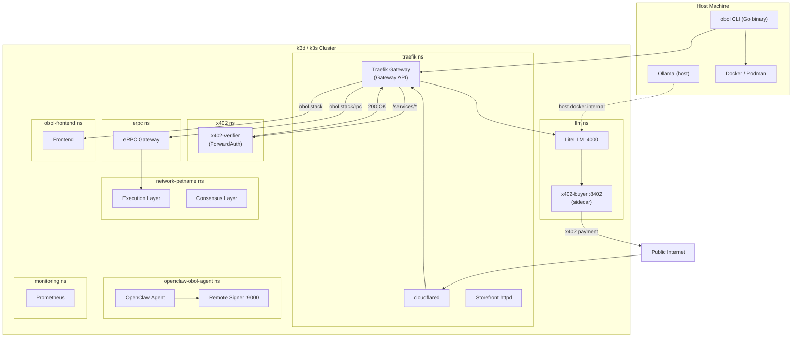
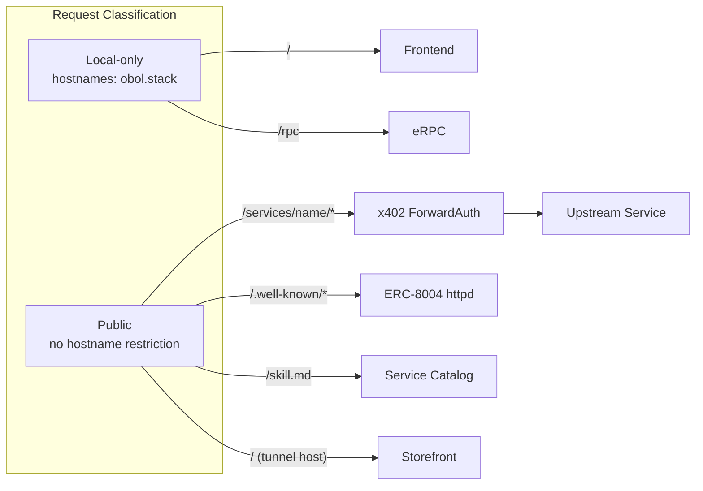
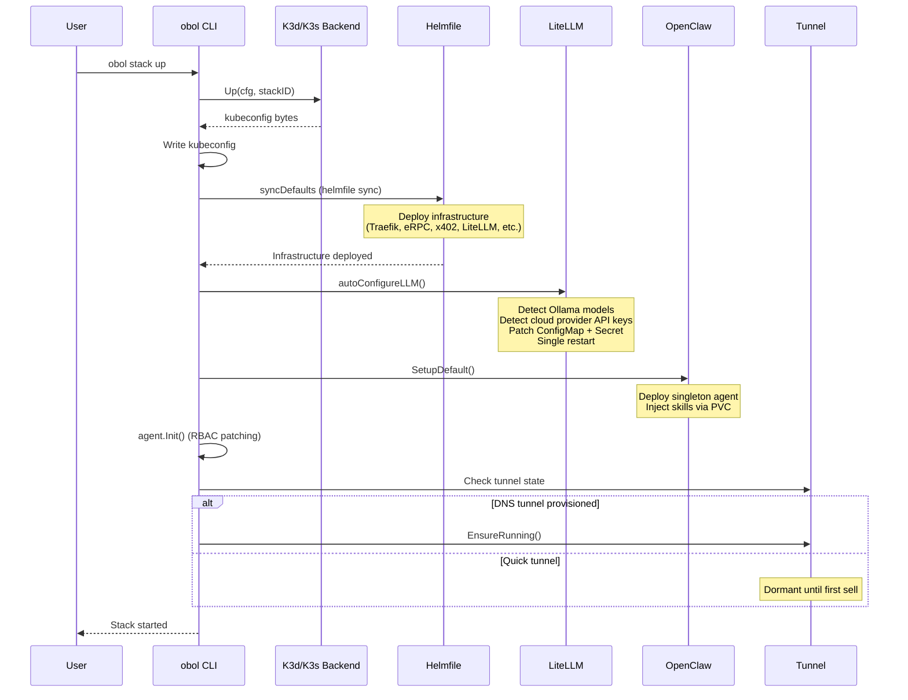
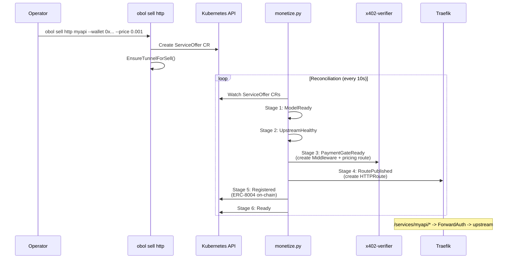
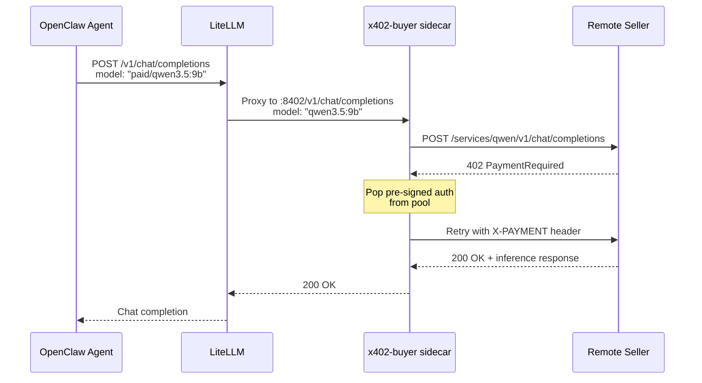
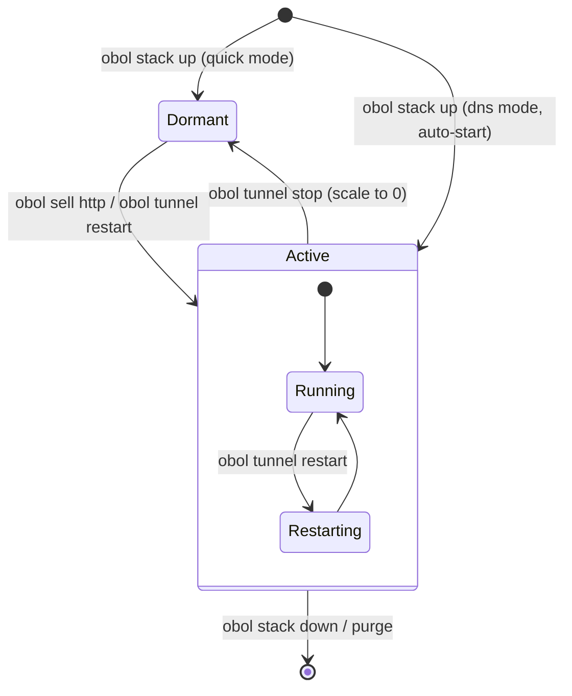
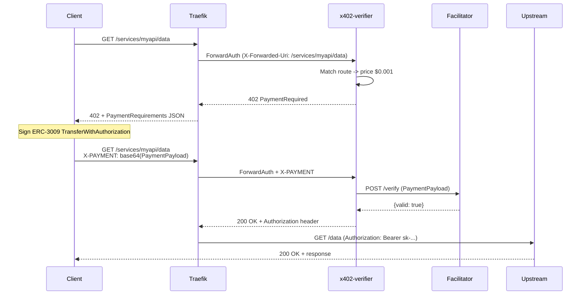
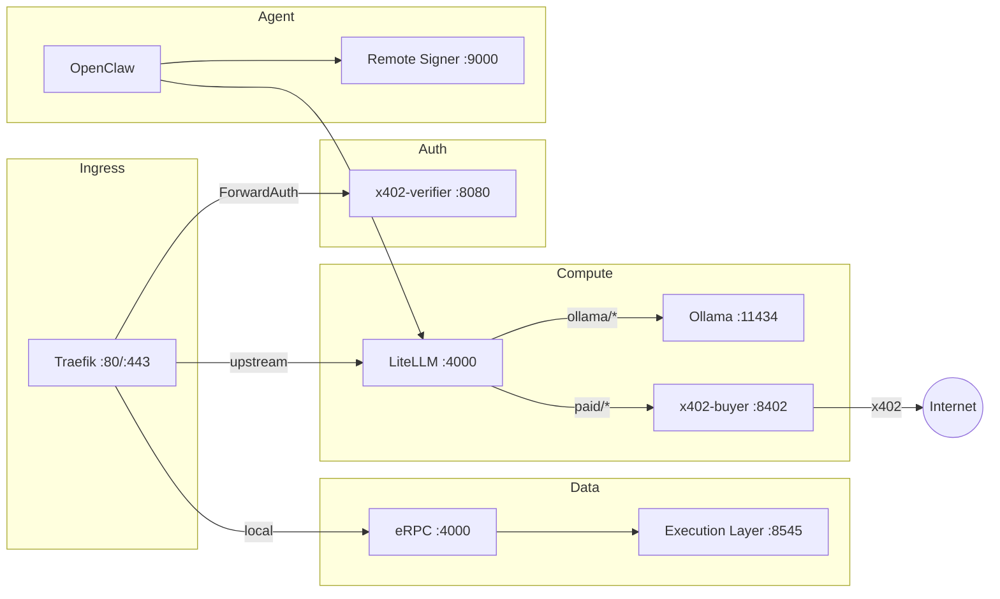

# Obol Stack -- Technical Specification

> **Version:** 1.0.0
> **Date:** 2026-03-27
> **Status:** Living document reflecting the current codebase on the `main` branch.

---

## Table of Contents

1. [Introduction](#1-introduction)
2. [System Architecture](#2-system-architecture)
3. [Core Subsystems](#3-core-subsystems)
4. [API and Protocol Definition](#4-api-and-protocol-definition)
5. [Data Model](#5-data-model)
6. [Integration Points](#6-integration-points)
7. [Security Model](#7-security-model)
8. [Error Handling](#8-error-handling)
9. [Performance](#9-performance)
10. [Testing Strategy](#10-testing-strategy)

---

## 1. Introduction

### 1.1 Purpose

Obol Stack is a framework for AI agents to run decentralized infrastructure locally. It deploys a k3d/k3s Kubernetes cluster containing an OpenClaw AI agent, blockchain networks, payment-gated inference via the x402 protocol, and Cloudflare tunnels for public exposure. All management is done through the `obol` CLI binary, built with Go and `github.com/urfave/cli/v3`.

### 1.2 Terminology

| Term | Definition |
|------|-----------|
| **x402** | HTTP 402 Payment Required protocol for micropayments. Clients attach EIP-712 signed `PaymentPayload` headers; servers verify via a facilitator service. |
| **ERC-8004** | Ethereum standard for on-chain agent identity. Defines an `IdentityRegistryUpgradeable` (ERC-721) with metadata storage. |
| **ServiceOffer** | Custom Kubernetes resource (`obol.org`) declaring a sell-side service with pricing, upstream, and registration metadata. |
| **ForwardAuth** | Traefik middleware pattern where every request is first forwarded to an auth service (`x402-verifier`) before reaching the upstream. |
| **ERC-3009** | `TransferWithAuthorization` -- gasless USDC transfers via pre-signed EIP-712 authorizations. |
| **Facilitator** | Third-party x402 service that verifies payment signatures and optionally settles on-chain. Default: `https://facilitator.x402.rs`. |
| **LiteLLM** | OpenAI-compatible proxy that routes inference requests to Ollama, Anthropic, OpenAI, or paid remote sellers. |
| **eRPC** | Blockchain RPC gateway that multiplexes and caches requests across multiple upstream RPC providers. |
| **OpenClaw** | AI agent runtime deployed as a singleton Kubernetes Deployment with skills injected via host-path PVC. |
| **Petname** | Two-word deterministic identifier (e.g., `fluffy-penguin`) generated via `dustinkirkland/golang-petname` for unique cluster/deployment naming. |
| **CAIP-2** | Chain Agnostic Improvement Proposal for network identifiers (e.g., `eip155:84532` for Base Sepolia). |
| **Storefront** | Static HTML landing page served at the tunnel hostname root via busybox httpd. |
| **Sidecar** | The `x402-buyer` container running alongside LiteLLM in the same Pod, handling buy-side payment attachment. |

### 1.3 System Constraints

| Constraint | Detail |
|-----------|--------|
| **Absolute paths** | Docker volume mounts require absolute paths, resolved at `obol stack init` time. |
| **Two-stage templating** | Stage 1: CLI flags populate Go templates in `values.yaml.gotmpl`. Stage 2: Helmfile renders final Kubernetes manifests. Stages must not be mixed. |
| **Unique namespaces** | Every deployment (network, app) gets a unique namespace: `<type>-<petname>`. |
| **OBOL_DEVELOPMENT=true** | Required for `obol stack up` to auto-build and import local Docker images (x402-verifier, x402-buyer). |
| **Root-owned PVCs** | k3s local-path-provisioner creates root-owned directories. `obol stack purge -f` (sudo) required to remove. |
| **Single cluster** | One k3d/k3s cluster per config directory. Multiple stacks require separate `OBOL_CONFIG_DIR` values. |
| **OpenClaw version pinning** | Version must agree in 3 places: `OPENCLAW_VERSION` file, `openclawImageTag` Go const, `obolup.sh` shell const. `TestOpenClawVersionConsistency` enforces this. |
| **ConfigMap propagation delay** | k3d file watcher takes 60-120 seconds to pick up manifest changes. |

### 1.4 Dependencies

| Dependency | Minimum Version | Purpose |
|-----------|----------------|---------|
| Docker | 20.10.0 | Container runtime for k3d backend |
| Go | 1.25 | Build toolchain |
| kubectl | 1.35.0 | Kubernetes API client |
| Helm | 3.19.4 | Chart management |
| k3d | 5.8.3 | k3d cluster management (default backend) |
| Helmfile | 1.2.3 | Declarative Helm chart orchestration |
| k9s | 0.50.18 | Cluster TUI (optional) |
| k3s | v1.35.1-k3s1 | Kubernetes distribution (via `rancher/k3s` image or binary) |

---

## 2. System Architecture

### 2.1 High-Level Overview

The system is composed of two parts: `obolup.sh` (bootstrap installer with pinned dependency versions) and the `obol` CLI (Go binary managing all lifecycle operations).



### 2.2 Routing Architecture

Traefik serves as the cluster ingress using the Kubernetes Gateway API. A single `GatewayClass` (`traefik`) and `Gateway` (`traefik-gateway`) in the `traefik` namespace handle all HTTP/HTTPS traffic.



**Routing rules:**

- **Local-only routes** are restricted to `hostnames: ["obol.stack"]`. This ensures the frontend, eRPC, LiteLLM admin, and monitoring are never reachable via the Cloudflare tunnel.
- **Public routes** have no hostname restriction and are intentionally exposed via the tunnel. The `/services/*` path is protected by x402 ForwardAuth. Discovery endpoints (`/.well-known/`, `/skill.md`) and the storefront landing page are unauthenticated.

### 2.3 Configuration Hierarchy

```
Config{ConfigDir, BinDir, DataDir, StateDir}

Precedence (each directory type):
  1. Explicit env var (OBOL_CONFIG_DIR, OBOL_BIN_DIR, OBOL_DATA_DIR, OBOL_STATE_DIR)
  2. XDG standard (XDG_CONFIG_HOME/obol, ~/.local/bin, XDG_DATA_HOME/obol, XDG_STATE_HOME/obol)
  3. OBOL_DEVELOPMENT=true -> .workspace/{config,bin,data,state}
```

**Source:** `internal/config/config.go`

### 2.4 Backend Abstraction

The `Backend` interface (`internal/stack/backend.go`) abstracts the Kubernetes runtime:

| Method | Description |
|--------|-----------|
| `Init(cfg, ui, stackID)` | Generate backend-specific cluster configuration |
| `Up(cfg, ui, stackID)` | Create/start cluster, return kubeconfig bytes |
| `Down(cfg, ui, stackID)` | Stop cluster without destroying config/data |
| `Destroy(cfg, ui, stackID)` | Remove cluster entirely |
| `DataDir(cfg)` | Return storage path for local-path-provisioner |
| `Prerequisites(cfg)` | Check required software/permissions |
| `IsRunning(cfg, stackID)` | Check if cluster is currently running |

**Implementations:**

- `K3dBackend` (default): Docker-based via k3d. Ports: 80:80, 8080:80, 443:443, 8443:443.
- `K3sBackend`: Bare-metal k3s binary. Ollama host is `127.0.0.1` (no Docker networking).

Backend choice is persisted in `.stack-backend` file. Switching backends triggers automatic destruction of the old cluster to prevent orphaned resources.

---

## 3. Core Subsystems

### 3.1 Stack Lifecycle

**Source:** `internal/stack/stack.go`, `internal/stack/backend.go`, `internal/stack/backend_k3d.go`, `internal/stack/backend_k3s.go`

#### 3.1.1 Purpose

Manage the full lifecycle of the local Kubernetes cluster: initialization, startup (with infrastructure deployment), shutdown, and purge.

#### 3.1.2 Operations

| Command | Function | Behavior |
|---------|----------|---------|
| `obol stack init` | `Init()` | Generate cluster ID (petname), resolve absolute paths, write backend config, copy embedded infrastructure defaults, resolve Ollama host for backend |
| `obol stack up` | `Up()` | Create cluster, export kubeconfig, `syncDefaults()` (helmfile sync), auto-configure LiteLLM, deploy OpenClaw, apply agent RBAC, start DNS tunnel if persistent |
| `obol stack down` | `Down()` | Stop cluster (preserves config + data), stop DNS resolver |
| `obol stack purge` | `Purge()` | Destroy cluster, remove config dir; `--force` also removes root-owned data dir via sudo |

#### 3.1.3 Startup Sequence



#### 3.1.4 Ollama Host Resolution

The Ollama host varies by backend and OS:

| Backend | OS | Ollama Host | IP Resolution |
|---------|----|-------------|---------------|
| k3d | macOS | `host.docker.internal` | Docker Desktop gateway `192.168.65.254` |
| k3d | Linux | `host.k3d.internal` | `docker0` bridge IP |
| k3s | any | `127.0.0.1` | Loopback (k3s runs on host) |

#### 3.1.5 Configuration

- **Stack ID:** Persisted in `$OBOL_CONFIG_DIR/.stack-id`. Preserved across `--force` reinit.
- **Backend choice:** Persisted in `$OBOL_CONFIG_DIR/.stack-backend`.
- **Embedded defaults:** Copied to `$OBOL_CONFIG_DIR/defaults/` with template substitution (`{{OLLAMA_HOST}}`, `{{OLLAMA_HOST_IP}}`, `{{CLUSTER_ID}}`).

#### 3.1.6 Error States

| Error | Cause | Recovery |
|-------|-------|---------|
| `stack ID not found` | `Init()` not called | Run `obol stack init` |
| `port(s) already in use` | Conflicting service on 80/443/8080/8443 | Stop conflicting service |
| `helmfile sync failed` | Infrastructure deployment error | Cluster auto-stopped via `Down()`, fix and retry |
| `prerequisites check failed` | Missing Docker/k3s binary | Install prerequisites |

---

### 3.2 LLM Routing

**Source:** `internal/model/model.go`

#### 3.2.1 Purpose

Configure and manage the LiteLLM gateway (port 4000) as the central OpenAI-compatible inference proxy, routing requests to local Ollama, cloud providers, or paid remote sellers.

#### 3.2.2 Inputs / Outputs

| Input | Source | Description |
|-------|--------|-------------|
| Ollama models | Host Ollama API (`/api/tags`) | Auto-detected during `obol stack up` |
| Cloud API keys | Environment variables | `ANTHROPIC_API_KEY`, `CLAUDE_CODE_OAUTH_TOKEN`, `OPENAI_API_KEY` |
| OpenClaw config | `~/.openclaw/openclaw.json` | Agent model preference for cloud provider detection |

| Output | Target | Description |
|--------|--------|-------------|
| `litellm-config` ConfigMap | `llm` namespace | YAML `config.yaml` with `model_list` entries |
| `litellm-secrets` Secret | `llm` namespace | Master key + provider API keys |
| LiteLLM Deployment restart | `llm` namespace | Triggered after config patches |

#### 3.2.3 Provider Configuration

Known providers are defined statically:

| Provider | EnvVar | Alt EnvVars | Notes |
|----------|--------|-------------|-------|
| `anthropic` | `ANTHROPIC_API_KEY` | `CLAUDE_CODE_OAUTH_TOKEN` | Claude models |
| `openai` | `OPENAI_API_KEY` | -- | GPT models |
| `ollama` | -- | -- | Local, no API key |

#### 3.2.4 Logic

1. **Auto-configuration** (`autoConfigureLLM`): Detects Ollama models and cloud provider API keys. Patches all providers first, then performs a single LiteLLM restart.
2. **Manual configuration** (`ConfigureLiteLLM`): `obol model setup --provider <name>`. Patches Secret + ConfigMap + restarts.
3. **Paid inference routing**: Static `paid/*` model alias routes through the `x402-buyer` sidecar at `http://127.0.0.1:8402`. The LiteLLM config contains a permanent catch-all entry; the sidecar handles payment attachment.

#### 3.2.5 LiteLLM Config Structure

```yaml
model_list:
  - model_name: "qwen3.5:9b"              # Ollama model
    litellm_params:
      model: "ollama/qwen3.5:9b"
      api_base: "http://ollama.llm.svc:11434"
  - model_name: "anthropic/*"              # Cloud wildcard
    litellm_params:
      model: "anthropic/*"
      api_key: "os.environ/ANTHROPIC_API_KEY"
  - model_name: "paid/*"                   # Buy-side sidecar
    litellm_params:
      model: "openai/*"
      api_base: "http://127.0.0.1:8402/v1"
```

#### 3.2.6 Error States

| Error | Cause | Recovery |
|-------|-------|---------|
| `cluster not running` | Kubeconfig missing | Run `obol stack up` |
| `no models to configure` | Empty model list for provider | Ensure Ollama has models or provide API key |
| Auto-configure failures | Non-fatal | User can run `obol model setup` manually |

---

### 3.3 Network / RPC Gateway

**Source:** `internal/network/erpc.go`, `internal/network/rpc.go`, `internal/network/network.go`, `internal/network/resolve.go`

#### 3.3.1 Purpose

Manage blockchain RPC routing through the eRPC gateway. Add/remove chains with public or custom RPC endpoints, deploy local Ethereum nodes, and register them as priority upstreams.

#### 3.3.2 eRPC ConfigMap Structure

The eRPC configuration is stored in the `erpc-config` ConfigMap in the `erpc` namespace under the key `erpc.yaml`. It defines projects with networks and upstreams:

```yaml
projects:
  - id: main
    networks:
      - architecture: evm
        evm:
          chainId: 1
    upstreams:
      - id: local-ethereum-fluffy-penguin
        endpoint: http://ethereum-execution.ethereum-fluffy-penguin.svc.cluster.local:8545
        evm:
          chainId: 1
      - id: chainlist-ethereum-1
        endpoint: https://eth.llamarpc.com
        evm:
          chainId: 1
```

#### 3.3.3 Two-Stage Templating

Network deployments use two-stage templating:

1. **Stage 1 (CLI flags -> Go templates):** `values.yaml.gotmpl` files in `internal/embed/networks/` use `@enum`, `@default`, `@description` annotations. CLI flags populate these templates to produce `values.yaml`.
2. **Stage 2 (Helmfile -> K8s):** `helmfile sync --state-values-file values.yaml --state-values-set id=<id>` renders final Kubernetes manifests.

#### 3.3.4 Write Method Blocking

By default, eRPC blocks write methods (`eth_sendRawTransaction`) on all upstreams. The `--allow-writes` flag on `obol network add` enables write methods for a specific chain. Local Ethereum nodes registered via `RegisterERPCUpstream()` always have writes blocked -- write requests are routed to remote upstreams instead.

#### 3.3.5 Operations

| Command | Function | Description |
|---------|----------|-------------|
| `obol network add` | `AddPublicRPCs()` / `AddCustomRPC()` | Add chain by ID (ChainList) or custom endpoint |
| `obol network remove` | `RemoveRPC()` | Remove chain from eRPC |
| `obol network list` | `ListRPCNetworks()` | Show configured chains and upstreams |
| `obol network install` | `Install()` | Deploy local Ethereum node (two-stage template) |
| `obol network sync` | `Sync()` | Re-sync helmfile for a deployed network |
| `obol network status` | `Status()` | Show deployment status |

---

### 3.4 Monetize -- Sell Side

**Source:** `cmd/obol/sell.go`, `internal/x402/`, `internal/schemas/`, `internal/embed/skills/monetize/`

#### 3.4.1 Purpose

Enable operators to sell access to cluster services (inference, HTTP endpoints) via x402 micropayments. The sell side creates ServiceOffer CRDs, reconciles them through 6 stages, and publishes payment-gated routes via Traefik.

#### 3.4.2 Sell-Side Flow



#### 3.4.3 ServiceOffer CRD

The `ServiceOffer` CRD (`obol.org`) is the declarative API for sell-side services:

**Spec fields:**

| Field | Type | Description |
|-------|------|-------------|
| `type` | `WorkloadType` | `inference` or `fine-tuning` |
| `model` | `ModelSpec` | `{name, runtime}` -- LLM model metadata |
| `upstream` | `UpstreamSpec` | `{service, namespace, port, healthPath}` -- target K8s Service |
| `payment` | `PaymentTerms` | `{scheme, network, payTo, maxTimeoutSeconds, price}` |
| `path` | `string` | URL path prefix (default: `/services/<name>`) |
| `registration` | `RegistrationSpec` | ERC-8004 metadata `{enabled, name, description, image, services, supportedTrust}` |

**Status fields:**

| Field | Type | Description |
|-------|------|-------------|
| `conditions[]` | `Condition` | 6 condition types tracking reconciliation progress |
| `endpoint` | `string` | Published URL |
| `agentId` | `string` | ERC-8004 token ID |
| `registrationTxHash` | `string` | On-chain registration transaction hash |

#### 3.4.4 x402-verifier (ForwardAuth)

**Source:** `internal/x402/verifier.go`, `internal/x402/config.go`, `internal/x402/matcher.go`, `internal/x402/watcher.go`

The x402-verifier runs in the `x402` namespace as a Deployment. Traefik sends every request matching a ForwardAuth Middleware to `POST /verify`. The verifier:

1. Reads `X-Forwarded-Uri` from the request headers.
2. Matches against `PricingConfig.Routes[]` (first match wins).
3. No match -> `200 OK` (free route).
4. Match + no `X-PAYMENT` header -> `402 Payment Required` with `PaymentRequirements` body.
5. Match + `X-PAYMENT` header -> delegates to `x402-go` middleware for verification/settlement.
6. Verified -> `200 OK` (optionally sets `Authorization` header for upstream auth).

**Configuration hot-reload:** `WatchConfig()` polls the pricing YAML file every 5 seconds for modification time changes, then atomically swaps the `PricingConfig` via `Verifier.Reload()`. This handles ConfigMap volume mount updates (kubelet symlink swaps) without fsnotify.

**Route matching** (`internal/x402/matcher.go`):

| Pattern Type | Example | Behavior |
|-------------|---------|---------|
| Exact | `/health` | Matches only `/health` |
| Prefix | `/rpc/*` | Matches `/rpc/`, `/rpc/a/b/c` |
| Glob | `/inference-*/v1/*` | Segment-level wildcards via `path.Match` |

#### 3.4.5 Pricing

```go
// PricingConfig (YAML: x402-pricing ConfigMap)
type PricingConfig struct {
    Wallet         string      // USDC recipient address
    Chain          string      // e.g., "base-sepolia"
    FacilitatorURL string      // default: "https://facilitator.x402.rs"
    VerifyOnly     bool        // skip settlement (testing)
    Routes         []RouteRule // first-match pricing rules
}

type RouteRule struct {
    Pattern                string // URL path pattern
    Price                  string // USDC per request
    PayTo                  string // per-route wallet override
    Network                string // per-route chain override
    UpstreamAuth           string // Authorization header for upstream
    PriceModel             string // metadata: "perRequest", "perMTok"
    PerMTok                string // original per-million-token price
    ApproxTokensPerRequest int    // fixed estimate (default: 1000)
    OfferNamespace         string // originating ServiceOffer
    OfferName              string // originating ServiceOffer
}
```

**Phase 1 pricing approximation:** When `perMTok` is set, the effective per-request price is `perMTok / 1000` (using `ApproxTokensPerRequest = 1000`). Exact token metering is planned for phase 2.

#### 3.4.6 Supported Chains

| Chain | Name | CAIP-2 |
|-------|------|--------|
| Base Mainnet | `base` | `eip155:8453` |
| Base Sepolia | `base-sepolia` | `eip155:84532` |
| Polygon Mainnet | `polygon` | `eip155:137` |
| Polygon Amoy | `polygon-amoy` | `eip155:80002` |
| Avalanche Mainnet | `avalanche` | `eip155:43114` |
| Avalanche Fuji | `avalanche-fuji` | `eip155:43113` |

#### 3.4.7 CLI Commands

| Command | Description |
|---------|-------------|
| `obol sell http <name>` | Sell access to an HTTP service with x402 gating |
| `obol sell inference <name>` | Sell inference via standalone gateway (bare metal) |
| `obol sell list` | List active ServiceOffers |
| `obol sell status <name>` | Show reconciliation status for a ServiceOffer |
| `obol sell stop <name>` | Scale down a sold service |
| `obol sell delete <name>` | Delete ServiceOffer and all owned resources |
| `obol sell pricing` | Configure global wallet and chain |
| `obol sell register` | Trigger ERC-8004 on-chain registration |

#### 3.4.8 Error States

| Error | Cause | Recovery |
|-------|-------|---------|
| `unsupported chain` | Invalid chain name in `--chain` | Use one of: base, base-sepolia, polygon, polygon-amoy, avalanche, avalanche-fuji |
| `facilitator URL must use HTTPS` | Non-HTTPS facilitator (not localhost) | Use HTTPS URL or loopback for testing |
| Reconciler stuck at stage | Upstream unhealthy, wallet missing, tunnel down | Check `obol sell status <name>` for condition messages |

---

### 3.5 Monetize -- Buy Side

**Source:** `internal/x402/buyer/config.go`, `internal/x402/buyer/signer.go`, `internal/x402/buyer/proxy.go`, `internal/x402/buyer/state.go`

#### 3.5.1 Purpose

Enable agents to purchase inference from remote x402-gated sellers using pre-signed ERC-3009 `TransferWithAuthorization` vouchers. The `x402-buyer` sidecar runs as a second container in the `litellm` Deployment.

#### 3.5.2 Buy-Side Flow



#### 3.5.3 Architecture

The sidecar has zero signer access. Spending is bounded by design: maximum loss = N * price, where N is the number of pre-signed authorizations in the pool.

**Components:**

| Component | Role |
|-----------|------|
| `Proxy` | OpenAI-compatible reverse proxy with model-based routing |
| `PreSignedSigner` | Implements `x402.Signer` by popping from a finite auth pool |
| `StateStore` | Tracks consumed nonces to prevent double-spend across restarts |
| `X402Transport` | HTTP transport that intercepts 402 responses and attaches payments |

#### 3.5.4 Configuration

```json
// x402-buyer-config ConfigMap
{
  "upstreams": {
    "seller-qwen": {
      "url": "https://seller.example.com/services/qwen",
      "remoteModel": "qwen3.5:9b",
      "network": "base-sepolia",
      "payTo": "0x...",
      "asset": "0x...",
      "price": "1000"
    }
  }
}
```

```json
// x402-buyer-auths ConfigMap (pre-signed ERC-3009 authorizations)
{
  "seller-qwen": [
    {
      "signature": "0x...",
      "from": "0x...",
      "to": "0x...",
      "value": "1000",
      "validAfter": "0",
      "validBefore": "115792089237316195423570985008687907853269984665640564039457584007913129639935",
      "nonce": "0x..."
    }
  ]
}
```

#### 3.5.5 Model Resolution

The proxy strips `paid/` and `openai/` prefixes from the requested model name to resolve the upstream:

```
"paid/openai/qwen3.5:9b" -> "qwen3.5:9b" -> lookup in modelRoutes -> upstream handler
```

#### 3.5.6 Endpoints

| Endpoint | Method | Description |
|----------|--------|-------------|
| `/v1/chat/completions` | POST | OpenAI chat completions (model-routed) |
| `/chat/completions` | POST | OpenAI chat completions (no `/v1` prefix) |
| `/v1/responses` | POST | OpenAI responses API |
| `/responses` | POST | OpenAI responses API (no `/v1` prefix) |
| `/upstream/<name>/...` | ANY | Direct upstream access (compatibility) |
| `/status` | GET | JSON with remaining/spent auths per upstream |
| `/healthz` | GET | Liveness probe |
| `/metrics` | GET | Prometheus metrics |

#### 3.5.7 Error States

| Error | Cause | Recovery |
|-------|-------|---------|
| `pre-signed auth pool exhausted` | All vouchers consumed | Agent runs `buy.py` to pre-sign more |
| `no purchased upstream mapped` | Model not in buyer config | Agent runs `buy.py probe` + `buy.py buy` |
| Payment failure from seller | Invalid/expired auth, insufficient balance | Check auth validity, top up USDC |

---

### 3.6 OpenClaw and Skills

**Source:** `internal/openclaw/openclaw.go`, `internal/openclaw/wallet.go`, `internal/openclaw/resolve.go`, `internal/embed/`

#### 3.6.1 Purpose

Deploy and manage the OpenClaw AI agent as a singleton Kubernetes Deployment, inject skills via host-path PVC, and manage agent wallets for on-chain operations.

#### 3.6.2 Agent Deployment

The agent is deployed as a singleton Deployment named `openclaw` in the `openclaw-obol-agent` namespace. Skills are delivered via host-path PVC injection to `$DATA_DIR/openclaw-<id>/openclaw-data/.openclaw/skills/`.

**23 embedded skills** in `internal/embed/skills/`:

| Category | Skills |
|----------|--------|
| Infrastructure | ethereum-networks, ethereum-local-wallet, obol-stack, distributed-validators, monetize, discovery, buy-inference, maintain-inference |
| Ethereum Dev | addresses, building-blocks, concepts, gas, indexing, l2s, orchestration, security, standards, ship, testing, tools, wallets |
| Frontend | frontend-playbook, frontend-ux, qa, why |

#### 3.6.3 Wallet Generation

`GenerateWallet()` in `internal/openclaw/wallet.go`:

1. Generate secp256k1 private key.
2. Derive Ethereum address (Keccak-256 of uncompressed public key, last 20 bytes).
3. Encrypt private key using Web3 V3 keystore format (scrypt KDF, AES-128-CTR cipher).
4. Write keystore JSON to `$DATA_DIR/openclaw-<id>/keystore/`.
5. Deploy remote-signer REST API at port 9000 in the same namespace.

#### 3.6.4 Cloud Provider Detection

During `obol stack up`, `autoDetectCloudProvider()`:

1. Reads `~/.openclaw/openclaw.json` for agent model preference.
2. Extracts provider from model name (e.g., `anthropic/claude-sonnet-4-6` -> `anthropic`).
3. Resolves API key: primary env var -> alt env vars -> `.env` file (dev mode).
4. Patches LiteLLM with the provider + key.

#### 3.6.5 Version Pinning

Three locations must agree:

| Location | File | Format |
|----------|------|--------|
| Source of truth | `internal/openclaw/OPENCLAW_VERSION` | Plain text |
| Go constant | `internal/openclaw/openclaw.go` | `openclawImageTag` const |
| Shell constant | `obolup.sh` | `OPENCLAW_VERSION` variable |

`TestOpenClawVersionConsistency` in `internal/openclaw/version_test.go` enforces consistency.

---

### 3.7 Tunnel Management

**Source:** `internal/tunnel/tunnel.go`, `internal/tunnel/state.go`, `internal/tunnel/provision.go`, `internal/tunnel/cloudflare.go`, `internal/tunnel/agent.go`

#### 3.7.1 Purpose

Manage Cloudflare tunnels that expose the cluster to the public internet, enabling remote access to x402-gated services and agent discovery endpoints.

#### 3.7.2 Tunnel Modes

| Mode | Activation | URL | Persistence |
|------|-----------|-----|-------------|
| `quick` | Dormant by default; activates on first `obol sell` | Random `*.trycloudflare.com` | Ephemeral (changes on restart) |
| `dns` | `obol tunnel login --hostname stack.example.com` | Stable user-controlled hostname | Persistent across restarts |

#### 3.7.3 State

Tunnel state is persisted at `$OBOL_CONFIG_DIR/tunnel/cloudflared.json`:

```go
type tunnelState struct {
    Mode       string    // "quick" or "dns"
    Hostname   string    // e.g., "stack.example.com"
    AccountID  string    // Cloudflare account ID
    ZoneID     string    // Cloudflare zone ID
    TunnelID   string    // Cloudflare tunnel ID
    TunnelName string    // Tunnel name
    UpdatedAt  time.Time // Last state update
}
```

#### 3.7.4 Lifecycle



#### 3.7.5 URL Propagation

When a tunnel becomes active, the URL is propagated to multiple consumers:

1. **obol-agent env:** `AGENT_BASE_URL` on the OpenClaw Deployment (for `monetize.py` registration JSON).
2. **Frontend ConfigMap:** `obol-stack-config` in `obol-frontend` namespace (dashboard URL).
3. **Agent overlay:** Helmfile state values for consistency across syncs.
4. **Storefront:** Busybox httpd landing page at the tunnel hostname root.

#### 3.7.6 Storefront Resources

`CreateStorefront()` deploys 4 Kubernetes resources in the `traefik` namespace:

- `ConfigMap/tunnel-storefront`: HTML content + mime types
- `Deployment/tunnel-storefront`: busybox httpd serving the ConfigMap (5m CPU, 8Mi RAM)
- `Service/tunnel-storefront`: ClusterIP on port 8080
- `HTTPRoute/tunnel-storefront`: Routes tunnel hostname root to the storefront

---

### 3.8 ERC-8004 Identity

**Source:** `internal/erc8004/client.go`, `internal/erc8004/types.go`, `internal/erc8004/abi.go`

#### 3.8.1 Purpose

Register AI agents on-chain using the ERC-8004 Identity Registry, enabling decentralized agent discovery and identity verification.

#### 3.8.2 Contract

| Property | Value |
|----------|-------|
| Standard | ERC-721 (IdentityRegistryUpgradeable) |
| Base Sepolia | `0xEA0fE4FCF9E3017a24d9Db6e0e39B552c8648B9D` |
| Base Mainnet | `0x8004A169...` (abbreviated) |

#### 3.8.3 Client Operations

| Method | Description |
|--------|-------------|
| `Register(ctx, key, agentURI)` | Mint new agent NFT, returns `agentId` (token ID) |
| `SetAgentURI(ctx, key, agentId, uri)` | Update the agent's metadata URI |
| `SetMetadata(ctx, key, agentId, entries)` | Set on-chain metadata key-value pairs |
| `GetMetadata(ctx, agentId, key)` | Read on-chain metadata |
| `TokenURI(ctx, agentId)` | Read the agent's metadata URI |

#### 3.8.4 Agent Registration Document

Served at `/.well-known/agent-registration.json`:

```go
type AgentRegistration struct {
    Type           string       // "https://eips.ethereum.org/EIPS/eip-8004#registration-v1"
    Name           string       // Agent name
    Description    string       // Human-readable description
    Image          string       // Agent icon URL
    Services       []ServiceDef // Endpoints (web, A2A, MCP, OASF)
    X402Support    bool         // Always true for Obol Stack agents
    Active         bool         // Service availability
    Registrations  []OnChainReg // On-chain records [{agentId, agentRegistry}]
    SupportedTrust []string     // ["reputation", "crypto-economic", "tee-attestation"]
}
```

#### 3.8.5 Error States

| Error | Cause | Recovery |
|-------|-------|---------|
| `erc8004: dial` | RPC endpoint unreachable | Check network connectivity, verify RPC URL |
| `erc8004: register tx` | Transaction submission failed | Check wallet balance (gas), verify contract address |
| `erc8004: wait mined` | Transaction not mined | Retry, check network congestion |

---

### 3.9 Standalone Inference Gateway

**Source:** `internal/inference/gateway.go`, `internal/inference/container.go`, `internal/inference/store.go`, `internal/inference/client.go`

#### 3.9.1 Purpose

Provide a standalone, bare-metal OpenAI-compatible HTTP gateway with x402 payment gating and optional hardware-backed encryption (Secure Enclave or TEE).

#### 3.9.2 Configuration

```go
type GatewayConfig struct {
    ListenAddr      string          // default ":8402"
    UpstreamURL     string          // e.g., "http://localhost:11434"
    WalletAddress   string          // USDC recipient
    PricePerRequest string          // default "0.001"
    Chain           x402.ChainConfig // default BaseSepolia
    FacilitatorURL  string          // default "https://facilitator.x402.rs"
    VerifyOnly      bool            // skip settlement
    EnclaveTag      string          // macOS Secure Enclave key tag
    VMMode          bool            // Apple Containerization VM
    VMImage         string          // default "ollama/ollama:latest"
    VMCPUs          int             // default 4
    VMMemoryMB      int             // default 8192
    VMHostPort      int             // default 11435
    VMBinary        string          // default "container"
    TEEType         string          // "tdx", "snp", "nitro", "stub"
    ModelHash       string          // SHA-256 of served model
    NoPaymentGate   bool            // disable x402 (cluster mode)
}
```

#### 3.9.3 Middleware Stack

The gateway composes middleware layers from innermost to outermost:

```
Client -> x402 Payment Gate -> Enclave/TEE Decrypt -> Reverse Proxy -> Upstream (Ollama)
```

| Layer | Condition | Behavior |
|-------|-----------|---------|
| x402 Payment Gate | `!NoPaymentGate` | Returns 402 for unpaid requests |
| Enclave Middleware | `EnclaveTag != ""` or `TEEType != ""` | Decrypts `application/x-obol-encrypted` bodies via SE/TEE key |
| Reverse Proxy | Always | Forwards to upstream inference service |

#### 3.9.4 Endpoints

| Endpoint | Auth | Description |
|----------|------|-------------|
| `GET /health` | None | Liveness probe |
| `GET /v1/enclave/pubkey` | None | SE/TEE public key (enclave mode only) |
| `GET /v1/attestation` | None | TEE attestation report (TEE mode only) |
| `POST /v1/chat/completions` | x402 | Chat completions (payment-gated) |
| `POST /v1/completions` | x402 | Text completions (payment-gated) |
| `POST /v1/embeddings` | x402 | Embeddings (payment-gated) |
| `GET /v1/models` | x402 | Model list (payment-gated) |
| `* /` | None | Passthrough to upstream |

#### 3.9.5 VM Mode

When `--vm` is set, the gateway:

1. Starts an OCI container via Apple Containerization (`container` CLI).
2. Maps the container's Ollama port 11434 to `VMHostPort` on the host.
3. Overrides `UpstreamURL` with `http://localhost:<VMHostPort>`.
4. On `Stop()`, gracefully shuts down the container with a 30-second timeout.

#### 3.9.6 Encryption Scheme (Enclave / TEE)

**Source:** `internal/enclave/enclave.go`

The `Key` interface provides hardware-backed P-256 key management:

| Method | Description |
|--------|-------------|
| `PublicKeyBytes()` | Uncompressed 65-byte SEC1 public key |
| `Sign(digest)` | ECDSA signature via SE/TEE private key |
| `ECDH(peerPubKey)` | Diffie-Hellman shared secret |
| `Decrypt(ciphertext)` | Full ECIES decryption |
| `Persistent()` | Whether key survives process restart |

**Wire format:**

```
[1 byte]   version (0x01)
[65 bytes]  uncompressed ephemeral public key
[12 bytes]  AES-GCM nonce
[n bytes]   ciphertext
[16 bytes]  AES-GCM authentication tag
```

**Implementations:**

| Platform | Backend | Source |
|----------|---------|-------|
| macOS (CGO) | Apple Secure Enclave (Security.framework) | `enclave_darwin.go` |
| Linux TEE | TDX, SNP, Nitro, or stub | `internal/tee/` |
| Other | `ErrNotSupported` | `enclave_stub.go` |

---

## 4. API and Protocol Definition

### 4.1 x402 Payment Protocol

#### 4.1.1 Request Flow



#### 4.1.2 PaymentRequired Response (402)

```json
{
  "x402Version": 1,
  "accepts": [
    {
      "scheme": "exact",
      "network": "eip155:84532",
      "maxAmountRequired": "1000",
      "resource": "https://seller.example.com/services/myapi/data",
      "asset": "0x036CbD53842c5426634e7929541eC2318f3dCF7e",
      "payTo": "0x...",
      "maxTimeoutSeconds": 300
    }
  ]
}
```

#### 4.1.3 PaymentPayload (X-PAYMENT header)

```json
{
  "x402Version": 1,
  "scheme": "exact",
  "network": "eip155:84532",
  "payload": {
    "signature": "0x...",
    "authorization": {
      "from": "0x...",
      "to": "0x...",
      "value": "1000",
      "validAfter": "0",
      "validBefore": "115792089237316195423570985008687907853269984665640564039457584007913129639935",
      "nonce": "0x..."
    }
  }
}
```

### 4.2 CLI Command Tree

```
obol
├── stack
│   ├── init [--force] [--backend k3d|k3s]
│   ├── up
│   ├── down
│   └── purge [--force]
├── agent
│   └── init
├── network
│   ├── list
│   ├── install <type> [--id <name>] [flags]
│   ├── add <chain-id> [--allow-writes] [--endpoint <url>]
│   ├── remove <chain-id>
│   ├── status <type> <id>
│   ├── sync <type> <id>
│   └── delete <type> <id>
├── sell
│   ├── inference <name> --model <model> [--price|--per-mtok] [--vm]
│   ├── http <name> --wallet <addr> --chain <chain> [--price|--per-request|--per-mtok]
│   │         --upstream <svc> --port <port> --namespace <ns> [--health-path <path>]
│   ├── list
│   ├── status <name>
│   ├── stop <name>
│   ├── delete <name>
│   ├── pricing --wallet <addr> --chain <chain>
│   └── register --name <name> --private-key-file <path>
├── openclaw
│   ├── onboard
│   ├── setup
│   ├── sync
│   ├── list
│   ├── delete
│   ├── dashboard
│   ├── cli
│   ├── token
│   └── skills
├── model
│   ├── setup [--provider <name>] [custom --name --endpoint --model]
│   └── status
├── app
│   ├── install <type> [--id <name>]
│   ├── sync <type> <id>
│   ├── list
│   └── delete <type> <id>
├── tunnel
│   ├── status
│   ├── login [--hostname <host>]
│   ├── provision
│   ├── restart
│   └── logs [--follow]
├── kubectl   (passthrough, auto KUBECONFIG)
├── helm      (passthrough, auto KUBECONFIG)
├── helmfile  (passthrough, auto KUBECONFIG)
├── k9s       (passthrough, auto KUBECONFIG)
├── update
├── upgrade
└── version
```

---

## 5. Data Model

### 5.1 Configuration Files

| File | Location | Format | Purpose |
|------|----------|--------|---------|
| `.stack-id` | `$CONFIG_DIR/` | Plain text | Cluster petname identifier |
| `.stack-backend` | `$CONFIG_DIR/` | Plain text | `k3d` or `k3s` |
| `kubeconfig.yaml` | `$CONFIG_DIR/` | YAML | Kubernetes API access |
| `cloudflared.json` | `$CONFIG_DIR/tunnel/` | JSON | Tunnel state (mode, hostname, IDs) |
| `defaults/` | `$CONFIG_DIR/` | Helmfile + YAML | Infrastructure deployment manifests |
| `networks/<type>/<id>/` | `$CONFIG_DIR/` | Helmfile + YAML | Per-network deployment configs |

### 5.2 Kubernetes Resources (by namespace)

| Namespace | Resources |
|-----------|-----------|
| `traefik` | GatewayClass, Gateway, cloudflared Deployment, tunnel-storefront (Deployment, Service, ConfigMap, HTTPRoute) |
| `llm` | LiteLLM Deployment (+ x402-buyer sidecar), `litellm-config` ConfigMap, `litellm-secrets` Secret |
| `x402` | x402-verifier Deployment, `x402-pricing` ConfigMap, `x402-secrets` Secret, ServiceMonitor |
| `openclaw-obol-agent` | OpenClaw Deployment, remote-signer Deployment, wallet Secret, RBAC (ClusterRole, ClusterRoleBinding) |
| `erpc` | eRPC Deployment, `erpc-config` ConfigMap |
| `obol-frontend` | Frontend Deployment, `obol-stack-config` ConfigMap |
| `monitoring` | Prometheus stack |
| `<network>-<id>` | Execution layer, consensus layer, per-network resources |
| (cluster-scoped) | ServiceOffer CRD (`obol.org`), `openclaw-monetize` ClusterRole |

### 5.3 ServiceOffer CRD Schema

```yaml
apiVersion: obol.org/v1alpha1
kind: ServiceOffer
metadata:
  name: my-inference
  namespace: openclaw-obol-agent
spec:
  type: inference                       # WorkloadType: inference | fine-tuning
  model:
    name: qwen3.5:9b
    runtime: ollama
  upstream:
    service: litellm
    namespace: llm
    port: 4000
    healthPath: /health/readiness
  payment:
    scheme: exact                       # x402 payment scheme
    network: base-sepolia               # Human-friendly chain name
    payTo: "0x..."                      # USDC recipient
    maxTimeoutSeconds: 300
    price:
      perRequest: "0.001"              # USDC per request
      perMTok: "1.00"                  # USDC per million tokens (phase 1: /1000)
      perHour: "5.00"                  # USDC per compute-hour (fine-tuning)
  path: /services/my-inference          # URL path prefix
  registration:
    enabled: true
    name: "My Inference Agent"
    description: "Sells qwen3.5:9b inference"
    image: "https://example.com/icon.png"
    services:
      - name: web
        endpoint: ""                    # Auto-filled from tunnel URL
    supportedTrust:
      - reputation
status:
  conditions:
    - type: ModelReady
      status: "True"
    - type: UpstreamHealthy
      status: "True"
    - type: PaymentGateReady
      status: "True"
    - type: RoutePublished
      status: "True"
    - type: Registered
      status: "True"
    - type: Ready
      status: "True"
  endpoint: "https://stack.example.com/services/my-inference"
  agentId: "42"
  registrationTxHash: "0x..."
```

### 5.4 Wallet (Web3 V3 Keystore)

```json
{
  "address": "aabbccdd...",
  "crypto": {
    "cipher": "aes-128-ctr",
    "ciphertext": "...",
    "cipherparams": { "iv": "..." },
    "kdf": "scrypt",
    "kdfparams": { "dklen": 32, "n": 262144, "r": 8, "p": 1, "salt": "..." },
    "mac": "..."
  },
  "id": "uuid",
  "version": 3
}
```

---

## 6. Integration Points

### 6.1 External Services

| Service | Protocol | Purpose | Configuration |
|---------|----------|---------|---------------|
| Cloudflare Tunnel | HTTPS/QUIC | Public internet exposure | `obol tunnel login` / auto-provisioned |
| x402 Facilitator | HTTPS POST | Payment verification + settlement | `facilitatorURL` (default: `https://facilitator.x402.rs`) |
| ChainList API | HTTPS GET | Public RPC endpoint discovery | Used by `obol network add <chain-id>` |
| Ollama API | HTTP | Local LLM inference | `http://localhost:11434` (host) |
| Anthropic API | HTTPS | Cloud LLM inference | `ANTHROPIC_API_KEY` env var |
| OpenAI API | HTTPS | Cloud LLM inference | `OPENAI_API_KEY` env var |
| Base Sepolia RPC | HTTPS | ERC-8004 registration + ERC-3009 settlement | Via eRPC or direct endpoint |

### 6.2 Internal Service Communication



---

## 7. Security Model

### 7.1 Tunnel Exposure

The Cloudflare tunnel is the primary attack surface. The security model ensures only intentionally public endpoints are reachable via the tunnel.

| Route | Exposure | Protection |
|-------|----------|-----------|
| `/services/*` | Public via tunnel | x402 payment gate (ForwardAuth) |
| `/.well-known/agent-registration.json` | Public via tunnel | Read-only, no sensitive data |
| `/skill.md` | Public via tunnel | Read-only service catalog |
| `/` (tunnel hostname) | Public via tunnel | Static HTML storefront |
| `/` (obol.stack) | Local only | `hostnames: ["obol.stack"]` restriction |
| `/rpc` | Local only | `hostnames: ["obol.stack"]` restriction |
| LiteLLM admin | Local only | Not exposed via any HTTPRoute |
| Prometheus | Local only | `hostnames: ["obol.stack"]` restriction |

**Invariants (NEVER violate):**

- Frontend and eRPC HTTPRoutes MUST have `hostnames: ["obol.stack"]`.
- Internal services MUST NOT have HTTPRoutes without hostname restrictions.
- The frontend, RPC gateway, monitoring, and LiteLLM admin MUST NOT be reachable via the tunnel.

### 7.2 Payment Security

| Property | Mechanism |
|----------|-----------|
| Payment integrity | EIP-712 typed signatures verified by facilitator |
| Replay protection | Random 32-byte nonces in ERC-3009 authorizations |
| Bounded spending (buyer) | Finite pool of pre-signed auths; max loss = N * price |
| Zero signer access (buyer) | Sidecar has no private key; only pre-signed vouchers |
| Facilitator HTTPS | `ValidateFacilitatorURL()` enforces HTTPS (loopback exempted) |
| Settlement verification | Facilitator verifies on-chain before confirming |

### 7.3 Wallet Security

| Property | Mechanism |
|----------|-----------|
| Key generation | secp256k1 via `crypto/rand` |
| Key storage | Web3 V3 keystore (scrypt KDF + AES-128-CTR) |
| Key access | Remote-signer REST API (port 9000, in-namespace only) |
| Enclave keys | Apple Secure Enclave (P-256, private key never leaves hardware) |
| TEE keys | Generated inside TEE (TDX/SNP/Nitro), bound to attestation |
| Wallet backup | `PromptBackupBeforePurge()` before destructive operations |

### 7.4 Enclave / TEE Security

| Property | macOS Secure Enclave | Linux TEE |
|----------|---------------------|-----------|
| Key generation | In-hardware (SEP) | In-enclave |
| Private key access | Never exported | Never exported |
| SIP requirement | `CheckSIP()` enforced | N/A |
| Attestation | N/A | Hardware-signed quote binding pubkey + model hash |
| Persistence | Keychain (persistent or ephemeral) | Per-enclave instance |

### 7.5 RBAC

The `openclaw-monetize` ClusterRole grants the OpenClaw agent CRUD access to:

- ServiceOffers (`obol.org`)
- Middlewares (`traefik.io`)
- HTTPRoutes (`gateway.networking.k8s.io`)
- ConfigMaps, Services, Deployments (core)
- Read-only: Pods, Endpoints, logs

Bound to ServiceAccount `openclaw` in `openclaw-obol-agent` namespace via ClusterRoleBinding. Patched by `obol agent init` via `patchMonetizeBinding()`.

---

## 8. Error Handling

### 8.1 Error Handling Strategy

The codebase uses a layered error handling approach:

| Layer | Strategy |
|-------|---------|
| CLI commands | Return `error` to `urfave/cli` which prints and exits non-zero |
| Non-fatal operations | Log warning via `u.Warnf()`, continue execution |
| Infrastructure deployment | Fatal: auto-cleanup via `Down()` on helmfile sync failure |
| Config hot-reload | Log error, keep previous config (verifier, buyer) |
| Network operations | `kubectl.EnsureCluster()` guard at entry points |

### 8.2 Graceful Degradation

| Component | Failure Mode | Behavior |
|-----------|-------------|---------|
| Ollama not running | Auto-configure skipped | LiteLLM starts without local models; user can add later |
| Cloud API key missing | Warning printed | Provider not configured; manual `obol model setup` possible |
| OpenClaw setup fails | Warning printed | User can run `obol openclaw onboard` manually |
| Tunnel not available | Warning printed | Services work locally; sell commands will start tunnel on demand |
| DNS resolver fails | Warning printed | `obol.stack` hostname resolution may not work; IP access still works |
| Pre-signed auths exhausted | 404 for model | Agent must pre-sign more via `buy.py` |

### 8.3 Atomic Operations

| Operation | Atomicity Mechanism |
|-----------|-------------------|
| Config reload (verifier) | `atomic.Pointer` swap |
| Config reload (buyer) | Mutex-guarded `Reload()` rebuilds all handlers |
| Auth consumption | Mutex-guarded pop from pool with `onConsume` callback |
| Tunnel state | File write with `0600` permissions |
| Backend switching | Destroy old backend before initializing new one |

---

## 9. Performance

### 9.1 Resource Allocation

| Component | CPU Request | Memory Request | CPU Limit | Memory Limit |
|-----------|-----------|---------------|----------|-------------|
| Storefront httpd | 5m | 8Mi | 20m | 16Mi |
| x402-verifier | (cluster default) | (cluster default) | -- | -- |
| LiteLLM | (cluster default) | (cluster default) | -- | -- |
| x402-buyer sidecar | (cluster default) | (cluster default) | -- | -- |
| OpenClaw agent | (cluster default) | (cluster default) | -- | -- |

### 9.2 Caching

| Cache | TTL | Purpose |
|-------|-----|---------|
| eRPC `eth_call` | 10s (unfinalized) | Avoid redundant RPC calls |
| x402-verifier chain resolution | Permanent (per-load) | Pre-resolve all chain configs during `load()` |
| LiteLLM model routing | Permanent (until restart) | Static model_list in ConfigMap |

### 9.3 Hot Paths

| Path | Optimization |
|------|-------------|
| x402 ForwardAuth verify | `atomic.Pointer` for lock-free config reads; pre-resolved chain map |
| x402-buyer auth pop | Single mutex lock per Sign() call; O(1) pool pop |
| Route matching | First-match short-circuit; no regex compilation per request |
| Buyer model routing | `sync.RWMutex` for concurrent reads; rebuild only on Reload() |

### 9.4 Known Latencies

| Operation | Typical Latency | Notes |
|-----------|----------------|-------|
| ConfigMap propagation | 60-120s | k3d file watcher interval |
| Quick tunnel URL | 10-20s | Cloudflare registration after pod start |
| x402 facilitator verify | 100-500ms | Network round-trip to facilitator |
| Helmfile sync (initial) | 2-5min | Full infrastructure deployment |
| LiteLLM restart | 10-30s | Pod termination + startup |

---

## 10. Testing Strategy

### 10.1 Test Organization

| Category | Build Tag | Location | Prerequisites |
|----------|----------|----------|---------------|
| Unit tests | (none) | `*_test.go` alongside source | `go test ./...` |
| Integration tests | `integration` | `internal/openclaw/integration_test.go` | Running cluster + Ollama + `OBOL_DEVELOPMENT=true` |
| BDD tests | `integration` | `internal/x402/bdd_integration_test.go` | Running cluster |

### 10.2 Unit Test Coverage

| Package | Key Test Files | Coverage Focus |
|---------|---------------|----------------|
| `internal/x402` | `config_test.go`, `verifier_test.go`, `matcher_test.go`, `validate_test.go`, `watcher_test.go` | Pricing config parsing, route matching, ForwardAuth responses, HTTPS validation |
| `internal/x402/buyer` | `signer_test.go`, `proxy_test.go` | Auth pool exhaustion, model resolution, payment attachment |
| `internal/erc8004` | `abi_test.go`, `client_test.go`, `types_test.go` | ABI encoding, registration document schema |
| `internal/schemas` | `serviceoffer_test.go`, `payment_test.go` | CRD field validation, price approximation |
| `internal/network` | `erpc_test.go`, `chainlist_test.go`, `resolve_test.go` | ConfigMap patching, chain resolution |
| `internal/model` | `model_test.go` | Provider detection, model entry building |
| `internal/stack` | `stack_test.go`, `backend_test.go`, `backend_k3s_test.go` | Backend abstraction, port checking |
| `internal/openclaw` | `wallet_test.go`, `wallet_backup_test.go`, `overlay_test.go`, `version_test.go`, `resolve_test.go` | Keystore generation, version consistency, instance resolution |
| `internal/inference` | `gateway_test.go`, `store_test.go`, `client_test.go`, `enclave_middleware_test.go` | Gateway handler, deployment persistence, encryption middleware |
| `internal/tunnel` | `tunnel_test.go` | URL parsing, state management |
| `internal/embed` | `embed_crd_test.go` | CRD + RBAC validation of embedded manifests |
| `cmd/obol` | `sell_test.go` | CLI flag parsing and validation |

### 10.3 Integration Tests

Integration tests use `//go:build integration` and require:

```bash
export OBOL_DEVELOPMENT=true
export OBOL_CONFIG_DIR=$(pwd)/.workspace/config
export OBOL_BIN_DIR=$(pwd)/.workspace/bin
export OBOL_DATA_DIR=$(pwd)/.workspace/data
go build -o .workspace/bin/obol ./cmd/obol
go test -tags integration -v -timeout 15m ./internal/openclaw/
```

**Key integration test:** `TestIntegration_Tunnel_SellDiscoverBuySidecar_QuotaAndBalance` validates the full paid-inference commerce loop (requires `qwen3.5:9b` model):

1. Sell inference via `obol sell http`
2. Discover service via tunnel
3. Buy inference using pre-signed auths
4. Verify quota consumption and balance

### 10.4 BDD Tests

Gherkin-style BDD tests in `internal/x402/features/` exercise the x402 payment flow end-to-end using `godog`:

- Payment verification happy path
- Payment rejection (insufficient funds, wrong chain)
- Route matching edge cases
- Config hot-reload during operation

### 10.5 Version Consistency Tests

`TestOpenClawVersionConsistency` in `internal/openclaw/version_test.go` reads all 3 version-pinning locations and fails if they disagree. This prevents version drift between the Go binary and the shell installer.

### 10.6 Running Tests

```bash
# All unit tests
go test ./...

# Single test
go test -v -run 'TestMatchRoute' ./internal/x402/

# Integration tests (requires running cluster)
go test -tags integration -v -timeout 15m ./internal/openclaw/

# Full commerce loop (requires qwen3.5:9b)
go test -tags integration -v -run TestIntegration_Tunnel_SellDiscoverBuySidecar_QuotaAndBalance \
    -timeout 30m ./internal/openclaw/

# Check compilation only
go build ./...
```
