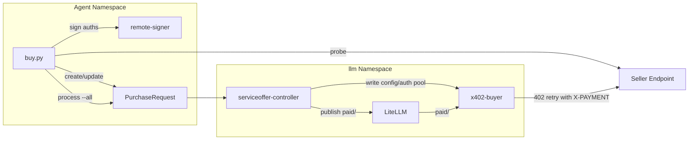

# Buy Inference

Purchase access to remote x402-gated inference endpoints using a risk-isolated sidecar architecture. The agent pre-signs a bounded batch of USDC payment authorizations, embeds them in a `PurchaseRequest` CR in its own namespace, and lets the controller publish buyer config/auth files into `llm`. A lean Go proxy (`x402-buyer`) handles payments at runtime with zero signer access — max loss = N x price.

## When to Use

- Probing an endpoint to check pricing before buying
- Purchasing access to a remote model (pre-signs auths, creates a `PurchaseRequest`, exposes `paid/<remote-model>`)
- Listing purchased providers and remaining auth counts
- Checking USDC balance before buying
- Inspecting the live sidecar status for remaining/spent auths

## When NOT to Use

- Selling your own services — use `monetize`
- Discovering agents without buying — use `discovery`
- Signing transactions directly — use `ethereum-local-wallet`
- Cluster diagnostics — use `obol-stack`

## Quick Start

```bash
# Probe an endpoint to see its pricing
python3 scripts/buy.py probe https://seller.example.com/services/my-model/v1/chat/completions

# Probe with the concrete remote model when the seller validates model IDs
python3 scripts/buy.py probe https://seller.example.com/services/my-model/v1/chat/completions --model qwen3.5:35b

# Buy access (probes, pre-signs auths, creates/updates a PurchaseRequest)
python3 scripts/buy.py buy remote-qwen \
  --endpoint https://seller.example.com/services/my-model \
  --model qwen3.5:35b

# Buy with agent-managed auto-refill intent
python3 scripts/buy.py buy remote-qwen \
  --endpoint https://seller.example.com/services/my-model \
  --model qwen3.5:35b \
  --count 100 \
  --auto-refill \
  --refill-threshold 20 \
  --refill-count 50 \
  --max-total 150

# Buy with custom auth count
python3 scripts/buy.py buy remote-qwen \
  --endpoint https://seller.example.com/services/my-model \
  --model qwen3.5:35b --count 500

# List purchased providers + remaining auths
python3 scripts/buy.py list

# Check sidecar health + remaining auths
python3 scripts/buy.py status remote-qwen

# Reconcile auto-refill policies (heartbeat / cron entrypoint)
python3 scripts/buy.py process --all

# Check your USDC balance
python3 scripts/buy.py balance

# Compatibility alias for the same reconcile loop
python3 scripts/buy.py maintain
```

## Commands

| Command | Description |
|---------|-------------|
| `probe <endpoint-url> [--model <id>]` | Send request without payment, parse 402 response for pricing |
| `buy <name> --endpoint <url> --model <id> [--budget N] [--count N]` | Pre-sign auths, create/update `PurchaseRequest`, expose `paid/<model>` |
| `process <name> | --all` | Reconcile `autoRefill` policies against live `x402-buyer` status |
| `list` | List purchased providers + remaining auth counts |
| `status <name>` | Check sidecar pod status + remaining auths |
| `balance [--chain <network>]` | Check agent's USDC balance via eRPC |

Current controller-mode limitation:
- Automatic refill is driven by `process --all`, which is the intended
  heartbeat / cron entrypoint for Hermes or OpenClaw.
- Manual `refill` and `remove` flows are still not first-class commands.
- `maxSpendPerDay` is reserved in the CRD but not enforced yet.

## How It Works

1. **Probe**: Sends a request without payment. The x402 gate returns `402 Payment Required` with pricing info (`payTo`, `network`, `amount`; legacy sellers may still use `maxAmountRequired`).

2. **Pre-sign**: The agent signs N ERC-3009 `TransferWithAuthorization` vouchers via the remote-signer. Each voucher has a random nonce and is single-use (consumed on-chain when the facilitator settles).

3. **Declare**: `buy.py` creates or updates a `PurchaseRequest` in the agent namespace with the pre-signed authorizations embedded in `spec.preSignedAuths`. When requested, it also stores `spec.autoRefill` intent on the CR.

4. **Reconcile**: The controller validates pricing, writes per-upstream buyer config/auth files into the `x402-buyer-config` and `x402-buyer-auths` ConfigMaps in `llm`, and keeps the paid model route available in LiteLLM.

5. **Runtime mount**: A lean Go sidecar (`x402-buyer`) already runs inside the existing `litellm` pod in the `llm` namespace. It mounts both ConfigMaps and serves as an OpenAI-compatible reverse proxy on `127.0.0.1:8402`.

6. **Wire**: LiteLLM keeps one static wildcard route: `paid/* -> openai/* -> 127.0.0.1:8402`. The controller also adds explicit paid-model entries when required so models with colons resolve reliably. The public model name is always `paid/<remote-model>`.

7. **Runtime**: On each request through the sidecar:
   - Sidecar forwards to upstream seller
   - If 402 → pops one pre-signed auth from pool → builds X-PAYMENT header → retries
   - Seller verifies payment via facilitator → returns 200 + inference result
   - Sidecar confirms local nonce consumption after a successful paid upstream response; if the paid retry still fails, the held auth is released back to the local pool
   - Sidecar has zero signer access — it only uses pre-signed vouchers

8. **Heartbeat**: `buy.py process --all` reads live `x402-buyer` `/status`,
   checks each `PurchaseRequest.spec.autoRefill` policy, signs a fresh batch
   when remaining auths are at or below the configured threshold, trims spent
   history from `spec.preSignedAuths`, and patches the CR. The controller then
   republishes the refreshed pool into `llm`.

## Architecture



## Security Properties

- **Zero signer access**: The sidecar reads pre-signed auths from ConfigMaps — no remote-signer access
- **Bounded spending**: Max loss = N x price (where N = number of pre-signed auths)
- **Risk isolation**: If sidecar crashes, LiteLLM routes to other providers (Ollama, etc.) — inference unaffected
- **Single-use vouchers**: Each auth is consumed on-chain when settled — no replay

## Environment Variables

| Variable | Default | Description |
|----------|---------|-------------|
| `REMOTE_SIGNER_URL` | `http://remote-signer:9000` | Remote-signer REST API |
| `ERPC_URL` | `http://erpc.erpc.svc.cluster.local:4000/rpc` | eRPC gateway base URL |
| `ERPC_NETWORK` | `base` | Default chain for balance queries |

## Constraints

- **Python stdlib only** — no pip install, no external packages
- **Requires remote-signer** — must have agent wallet provisioned via `obol openclaw onboard`
- **Requires x402-buyer image** — `ghcr.io/obolnetwork/x402-buyer:latest` must be available in cluster
- **Static public interface** — purchased models are always addressed as `paid/<remote-model>`
- **Max 1000 auths per batch** — signing takes ~50s at 1000; this cap applies to both `buy` and each refill batch driven by `process --all`
- **Live state comes from the sidecar** — use `x402-buyer` `/status` via `status`, `list`, or `process --all`, not only `PurchaseRequest.status`
- **Auth pool is finite unless auto-refill is configured** — enable `autoRefill` on the CR and run `process --all` from a scheduler to keep it topped up

## Full Buy Flow (Discovery → Probe → Buy → Use)

This is the complete journey from discovering a seller to using purchased inference:

### Step 1: Discover sellers on-chain (use `discovery` skill)

```bash
# Search the ERC-8004 registry for recently registered agents
python3 /data/.openclaw/skills/discovery/scripts/discovery.py search --chain base-sepolia

# Fetch a candidate's registration JSON to check x402Support and services
python3 /data/.openclaw/skills/discovery/scripts/discovery.py uri <agent-id> --chain base-sepolia
```

Look for agents with `"x402Support": true` and a `"web"` service endpoint.

### Step 2: Probe the seller endpoint

```bash
# Send an unauthenticated request to get 402 pricing
python3 scripts/buy.py probe <service-endpoint> --model <model-name>
```

This returns the seller's pricing: `payTo`, `network`, `price`, and `asset` (USDC contract).

### Step 3: Check balance and buy

```bash
# Check USDC balance
python3 scripts/buy.py balance --chain base-sepolia

# Buy access (pre-sign auths, create PurchaseRequest, wait for controller reconciliation)
python3 scripts/buy.py buy <friendly-name> \
  --endpoint <service-endpoint> \
  --model <model-name> \
  --count 20
```

### Step 4: Use the purchased model

After buying, the model is available through LiteLLM as `paid/<model-name>`:

```bash
curl -X POST http://litellm.llm.svc.cluster.local:4000/v1/chat/completions \
  -H "Authorization: Bearer $LITELLM_MASTER_KEY" \
  -H "Content-Type: application/json" \
  -d '{"model": "paid/<model-name>", "messages": [{"role": "user", "content": "hello"}]}'
```

The `paid/` prefix routes through the x402-buyer sidecar, which transparently attaches payment headers.

### Step 5: Monitor purchases

```bash
# Check remaining auths
python3 scripts/buy.py list

# Check one purchased upstream in detail
python3 scripts/buy.py status <friendly-name>

# Reconcile auto-refill intent (what the heartbeat should run)
python3 scripts/buy.py process --all
```

Manual `refill` and `remove` commands are still not available in the current
controller-based path. `maintain` is now only a compatibility alias for
`process --all`.

## References

- `references/purchase-request-spec.md` — Full `PurchaseRequest` CRD field reference
- `references/x402-buyer-api.md` — Wire formats for 402 responses, X-PAYMENT headers, and sidecar config
- See also: `discovery` skill for finding sellers on the ERC-8004 registry
