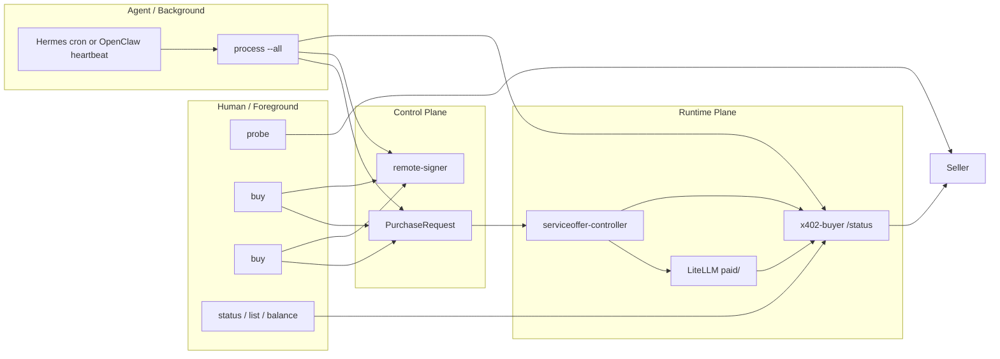
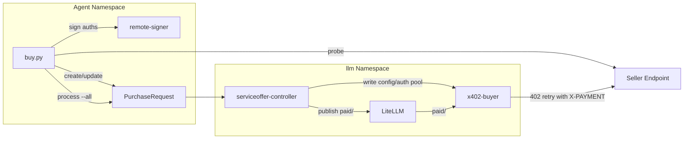

# Buy x402

Purchase access to remote x402-gated services. There are two flows, picked by usage shape:

- **`pay <url>`** — single-shot. Probe the URL, sign **one** payment authorization, attach `X-PAYMENT`, send the request, return the response. Stateless. Use for `type:http` services and any one-off purchase. Max loss = price of one request.
- **`buy <name>`** — pre-payment budget. Pre-sign **N** authorizations, declare them in a `PurchaseRequest` CR, let the `x402-buyer` sidecar spend them transparently as the agent calls the model through LiteLLM at `paid/<remote-model>`. Use for long-running paid inference. Max loss = N × price; runtime path holds zero signer access.

Both flows auto-detect the token + transfer method from the seller's 402 response. Currently supported: **USDC via EIP-3009** (Base Sepolia, Base Mainnet, Ethereum Mainnet) and **OBOL via Permit2** (Ethereum Mainnet).

Chain names follow the eRPC project aliases: `mainnet`, `base`, `base-sepolia`. CAIP-2 strings (`eip155:1`, `eip155:8453`, `eip155:84532`) and the alias `ethereum` are accepted on input and normalized internally. Unknown chains fail loudly with the supported list — buy.py will not silently sign against base-sepolia when the seller is on mainnet.

## Gasless Payments

x402 payments do **NOT** require ETH for gas. The agent signs an EIP-3009
`TransferWithAuthorization` (or Permit2 witness) off-chain. The seller's
**facilitator** submits the on-chain settlement transaction and pays gas.
The agent only needs a balance of the settlement token (USDC or OBOL). Zero
ETH is fine.

## Facilitator (server-side, agents do not call it)

The facilitator is the seller-side service that settles payments on-chain.
The agent does **not** call it directly — there is no facilitator URI flag
in any of these commands. The seller's `x402-verifier` middleware
coordinates with the facilitator after verifying your `X-PAYMENT` header.
The default Obol-operated facilitator at `https://x402.gcp.obol.tech`
covers `eip155:1`, `eip155:8453`, and `eip155:84532`.

## First-Time Permit2 Approval (one-time per token+wallet)

Permit2-based x402 payments (e.g. OBOL, USDC on chains where the seller selects `assetTransferMethod=permit2`) require the agent's wallet to have approved the Permit2 router on the token *before any payment can settle*. Without it, `buy.py pay`/`buy` pre-signs a valid voucher, the seller's facilitator submits the on-chain `transferFrom`, and it reverts with no clear error — usually surfacing as an opaque HTTP 503 from the seller.

`buy.py` now pre-flights this check and aborts with the exact remediation command. If you see the error, run:

```bash
python3 ${OBOL_SKILLS_DIR:-/data/.openclaw/skills}/ethereum-local-wallet/scripts/signer.py send-tx \
    --from <agent-wallet> --to <token-address> \
    --data <approve-calldata-printed-by-buy.py> --network <chain>
```

This is one tx, ~46k gas, valid forever (unless the user later revokes). EIP-3009 flows (USDC `TransferWithAuthorization`) do **not** need this approval. Sellers that advertise `eip2612GasSponsoring` in their 402 extensions also bypass it (per-request signed permits).

## Pitfalls

- **`extra.name` is NOT the EIP-712 signing domain name.** The 402 response
  echoes the token contract's on-chain `name()` getter as `extra.name`. For
  USDC the EIP-712 signing domain depends on the deployment:
    - mainnet / base — EIP-712 `name` is `"USD Coin"` (matches `name()`).
    - base-sepolia   — EIP-712 `name` is `"USDC"` (differs from `name()` →
      `"USD Coin"`).
  `buy.py` resolves the right domain automatically via an in-script
  `USDC_EIP712_DOMAIN` table; sellers can also override per-request via
  `extra.eip712Domain` (Obol convention). Treat `extra.name`/`extra.version`
  as human-readable display only.
- **Endpoint shape differs by service type.** Inference services expect
  `POST /v1/chat/completions`; HTTP services typically expect `GET /` (or
  a service-specific path). Pass `--type http` to `probe` for HTTP services
  so the CLI does not append `/v1/chat/completions` to the URL. `pay`
  defaults to `--type http` and `--method GET`.
- **`pay` is stateless; `buy` is persistent.** Do not use `buy` for a
  `type:http` endpoint — its pipeline is inference-shaped (creates a
  PurchaseRequest, expects a model name, publishes a `paid/<model>`
  route). Use `pay` instead.
- **Prefer `/api/services.json` over parsing markdown.** The seller's
  storefront publishes machine-readable metadata at
  `<base>/api/services.json` with full asset, EIP-712 signing domain,
  transfer method, and atomic-unit price for every offered service.

## When to Use

- Probing an endpoint to check pricing before buying — `probe`
- One-shot paid HTTP request (e.g. `demo-hello`, sponsored API endpoints) — `pay`
- Long-running paid model access (pre-signed batch) — `buy`
- Manually topping up an existing inference purchase by re-running `buy <same-name>`
- Listing purchased providers and remaining auth counts — `list`
- Checking token balance before buying — `balance`
- Inspecting the live sidecar status for remaining/spent auths — `status`

## When NOT to Use

- Selling your own services — use `sell`
- Discovering agents without buying — use `discovery`
- Signing transactions directly — use `ethereum-local-wallet`
- Cluster diagnostics — use `obol-stack`

## Quick Start

```bash
# Probe an inference endpoint to see its pricing (default --type inference)
python3 ${OBOL_SKILLS_DIR:-/data/.openclaw/skills}/buy-x402/scripts/buy.py probe https://seller.example.com/services/my-model/v1/chat/completions

# Probe an HTTP service (no /v1/chat/completions append, GET by default)
python3 ${OBOL_SKILLS_DIR:-/data/.openclaw/skills}/buy-x402/scripts/buy.py probe https://seller.example.com/services/demo-hello --type http

# One-shot paid HTTP request (sign 1 auth, attach X-PAYMENT, send GET, print response)
python3 ${OBOL_SKILLS_DIR:-/data/.openclaw/skills}/buy-x402/scripts/buy.py pay https://seller.example.com/services/demo-hello

# One-shot paid POST with a JSON body
python3 ${OBOL_SKILLS_DIR:-/data/.openclaw/skills}/buy-x402/scripts/buy.py pay https://seller.example.com/services/echo --method POST --data '{"hello":"world"}'

# Probe with the concrete remote model when the seller validates model IDs
python3 ${OBOL_SKILLS_DIR:-/data/.openclaw/skills}/buy-x402/scripts/buy.py probe https://seller.example.com/services/my-model/v1/chat/completions --model qwen3.5:35b

# Buy access (probes, pre-signs auths, creates/updates a PurchaseRequest)
python3 ${OBOL_SKILLS_DIR:-/data/.openclaw/skills}/buy-x402/scripts/buy.py buy remote-qwen \
  --endpoint https://seller.example.com/services/my-model \
  --model qwen3.5:35b

# Buy with agent-managed auto-refill intent
python3 ${OBOL_SKILLS_DIR:-/data/.openclaw/skills}/buy-x402/scripts/buy.py buy remote-qwen \
  --endpoint https://seller.example.com/services/my-model \
  --model qwen3.5:35b \
  --count 100 \
  --auto-refill \
  --refill-threshold 20 \
  --refill-count 50

# Manual top-up on the same purchase name
python3 ${OBOL_SKILLS_DIR:-/data/.openclaw/skills}/buy-x402/scripts/buy.py buy remote-qwen \
  --endpoint https://seller.example.com/services/my-model \
  --model qwen3.5:35b \
  --count 25

# List purchased providers + remaining auths
python3 ${OBOL_SKILLS_DIR:-/data/.openclaw/skills}/buy-x402/scripts/buy.py list

# Check sidecar health + remaining auths
python3 ${OBOL_SKILLS_DIR:-/data/.openclaw/skills}/buy-x402/scripts/buy.py status remote-qwen

# Reconcile auto-refill policies (heartbeat / cron entrypoint)
python3 ${OBOL_SKILLS_DIR:-/data/.openclaw/skills}/buy-x402/scripts/buy.py process --all

# Check your USDC balance
python3 ${OBOL_SKILLS_DIR:-/data/.openclaw/skills}/buy-x402/scripts/buy.py balance

# Compatibility alias for the same reconcile loop
python3 ${OBOL_SKILLS_DIR:-/data/.openclaw/skills}/buy-x402/scripts/buy.py maintain
```

## Commands

| Command | Description |
|---------|-------------|
| `probe <url> [--model <id>] [--type http\|inference] [--method GET\|POST]` | Send request without payment, parse 402 response for pricing |
| `pay <url> [--type http\|inference] [--method GET\|POST] [--data <body>]` | Single-shot paid request: sign 1 auth, attach X-PAYMENT, send |
| `buy <name> --endpoint <url> --model <id> [--budget N] [--count N]` | Pre-sign auths, create/update `PurchaseRequest`, expose `paid/<model>` |
| `process <name> \| --all` | Reconcile `autoRefill` policies against live `x402-buyer` status |
| `list` | List purchased providers + remaining auth counts |
| `status <name>` | Check sidecar pod status + remaining auths |
| `balance [--chain <network>]` | Check agent's USDC balance via eRPC |

## Surfaces

### Human / foreground surface

Use these when a human operator or foreground agent is actively deciding what
to buy:

- `probe` — inspect seller pricing
- `buy <new-name>` — acquire a new purchase
- `buy <same-name>` — manual top-up for that purchase
- `status`, `list`, `balance` — inspect live runtime state

### Agent / automation surface

Use this when Hermes or OpenClaw is maintaining existing purchases in the
background:

- `process --all` — maintenance reconcile loop for `autoRefill`

Current controller-mode limitation:
- `process --all` is the intended heartbeat / cron entrypoint for Hermes or OpenClaw.
- Re-running `buy <same-name>` is the manual top-up path.
- Only one active purchase may own a given `paid/<remote-model>` alias at a time.
- Manual `refill` is still not a first-class command.
- `remove` is still not a first-class command; deleting the `PurchaseRequest`
  directly now enters a drain-first lifecycle instead of tearing the route down
  immediately.

## Automation Recipes

### OpenClaw heartbeat recipe

Use the absolute script path inside the pod. Do not rely on `cd ... && ...`
shell wrapping.

```bash
python3 ${OBOL_SKILLS_DIR:-/data/.openclaw/skills}/buy-x402/scripts/buy.py process --all
```

Tell the agent to schedule that as its maintenance loop only when at least one
`PurchaseRequest.spec.autoRefill.enabled=true` purchase exists.

### Hermes cron recipe

Hermes already has a cron scheduler. The maintenance job should load the
buy-x402 skill and run the same reconcile primitive on a schedule.

CLI example:

```bash
hermes cron create "every 5m" \
  "Reconcile existing x402 PurchaseRequests. Use the buy-x402 skill and run python3 ${OBOL_SKILLS_DIR:-/data/.openclaw/skills}/buy-x402/scripts/buy.py process --all. Report only errors or state changes." \
  --name "x402 buy reconcile" \
  --skill buy-x402
```

Python API example:

```python
from cron.jobs import create_job

create_job(
    prompt="Reconcile existing x402 PurchaseRequests. Use the buy-x402 skill and run python3 ${OBOL_SKILLS_DIR:-/data/.openclaw/skills}/buy-x402/scripts/buy.py process --all. Report only errors or state changes.",
    schedule="every 5m",
    name="x402 buy reconcile",
    skills=["buy-x402"],
)
```

### Surface map



## How It Works

1. **Probe**: Sends a request without payment. The x402 gate returns `402 Payment Required` with pricing info (`payTo`, `network`, `amount`; legacy sellers may still use `maxAmountRequired`).

2. **Pre-sign**: The agent signs N ERC-3009 `TransferWithAuthorization` vouchers via the remote-signer. Each voucher has a random nonce and is single-use (consumed on-chain when the facilitator settles).

3. **Delete / drain behavior**: deleting a `PurchaseRequest` does not
   immediately remove the paid route if there are still auths remaining. The
   controller marks the purchase as draining, keeps `paid/<model>` live, and
   only tears the route down after the remaining auth pool reaches zero. While
   draining:
   - `buy.py list` and `buy.py status <name>` still show the purchase
   - the purchase still owns `paid/<model>`
   - a second `buy <other-name> --model <same-model>` is still rejected

4. **Final cleanup**: once `remaining == 0`, the controller removes the buyer
   config/auth material, removes `paid/<model>` if there is no other owner,
   reloads the buyer sidecar, and clears the finalizer so the CR can disappear.

3. **Declare**: `buy.py` creates or updates a `PurchaseRequest` in the agent namespace with the pre-signed authorizations embedded in `spec.preSignedAuths`. When requested, it also stores `spec.autoRefill` intent on the CR.

4. **Reconcile**: The controller validates pricing, writes per-upstream buyer config/auth files into the `x402-buyer-config` and `x402-buyer-auths` ConfigMaps in `llm`, and keeps the paid model route available in LiteLLM.

5. **Runtime mount**: A lean Go sidecar (`x402-buyer`) already runs inside the existing `litellm` pod in the `llm` namespace. It mounts both ConfigMaps and serves as an OpenAI-compatible reverse proxy on `127.0.0.1:8402`.

6. **Wire**: LiteLLM keeps one static wildcard route: `paid/* -> openai/* -> 127.0.0.1:8402/v1`. The controller also adds explicit paid-model entries when required so models with colons resolve reliably. The public model name is always `paid/<remote-model>`.

7. **Runtime**: On each request through the sidecar:
   - Sidecar forwards to upstream seller
   - If 402 → pops one pre-signed auth from pool → builds X-PAYMENT header → retries
   - Seller verifies payment via facilitator → returns 200 + inference result
   - Sidecar confirms local nonce consumption after a successful paid upstream response; if the paid retry still fails, the held auth is released back to the local pool
   - Sidecar has zero signer access — it only uses pre-signed vouchers

8. **Heartbeat**: `buy.py process --all` reads live `x402-buyer` `/status`,
   checks each `PurchaseRequest.spec.autoRefill` policy, signs a fresh batch
   when remaining auths are at or below the configured threshold, trims spent
   history from `spec.preSignedAuths`, and patches the CR. The controller then
   republishes the refreshed pool into `llm`.

## Architecture



## Security Properties

- **Zero signer access**: The sidecar reads pre-signed auths from ConfigMaps — no remote-signer access
- **Bounded spending**: Max loss = N x price (where N = number of pre-signed auths)
- **Risk isolation**: If sidecar crashes, LiteLLM routes to other providers (Ollama, etc.) — inference unaffected
- **Single-use vouchers**: Each auth is consumed on-chain when settled — no replay

## Environment Variables

| Variable | Default | Description |
|----------|---------|-------------|
| `REMOTE_SIGNER_URL` | `http://remote-signer:9000` | Remote-signer REST API |
| `ERPC_URL` | `http://erpc.erpc.svc.cluster.local/rpc` | eRPC gateway base URL |
| `ERPC_NETWORK` | `base` | Default chain for balance queries |

## Constraints

- **Python stdlib only** — no pip install, no external packages
- **Requires remote-signer** — must have agent wallet provisioned via `obol openclaw onboard`
- **Requires x402-buyer image** — `ghcr.io/obolnetwork/x402-buyer:latest` must be available in cluster
- **Static public interface** — purchased models are always addressed as `paid/<remote-model>`
- **Max 1000 auths per batch** — signing takes ~50s at 1000; this cap applies to both `buy` and each refill batch driven by `process --all`
- **Live state comes from the sidecar** — use `x402-buyer` `/status` via `status`, `list`, or `process --all`, not only `PurchaseRequest.status`
- **Auth pool is finite unless auto-refill is configured** — enable `autoRefill` on the CR and run `process --all` from a scheduler to keep it topped up

## Full Buy Flow (Discovery → Probe → Buy → Use)

This is the complete journey from discovering a seller to using purchased inference:

### Step 1: Discover sellers on-chain (use `discovery` skill)

```bash
# Search the ERC-8004 registry for recently registered agents
python3 ${OBOL_SKILLS_DIR:-/data/.openclaw/skills}/discovery/scripts/discovery.py search --chain base-sepolia

# Fetch a candidate's registration JSON to check x402Support and services
python3 ${OBOL_SKILLS_DIR:-/data/.openclaw/skills}/discovery/scripts/discovery.py uri <agent-id> --chain base-sepolia
```

Look for agents with `"x402Support": true` and a `"web"` service endpoint.

### Step 2: Probe the seller endpoint

```bash
# Send an unauthenticated request to get 402 pricing
python3 ${OBOL_SKILLS_DIR:-/data/.openclaw/skills}/buy-x402/scripts/buy.py probe <service-endpoint> --model <model-name>
```

This returns the seller's pricing: `payTo`, `network`, `price`, and `asset` (USDC contract).

### Step 3: Check balance and buy

```bash
# Check USDC balance
python3 ${OBOL_SKILLS_DIR:-/data/.openclaw/skills}/buy-x402/scripts/buy.py balance --chain base-sepolia

# Buy access (pre-sign auths, create PurchaseRequest, wait for controller reconciliation)
python3 ${OBOL_SKILLS_DIR:-/data/.openclaw/skills}/buy-x402/scripts/buy.py buy <friendly-name> \
  --endpoint <service-endpoint> \
  --model <model-name> \
  --count 20
```

### Step 4: Use the purchased model

After buying, the model is available through LiteLLM as `paid/<model-name>`:

```bash
curl -X POST http://litellm.llm.svc.cluster.local:4000/v1/chat/completions \
  -H "Authorization: Bearer $LITELLM_MASTER_KEY" \
  -H "Content-Type: application/json" \
  -d '{"model": "paid/<model-name>", "messages": [{"role": "user", "content": "hello"}]}'
```

The `paid/` prefix routes through the x402-buyer sidecar, which transparently attaches payment headers.

### Step 5: Monitor purchases

```bash
# Check remaining auths
python3 ${OBOL_SKILLS_DIR:-/data/.openclaw/skills}/buy-x402/scripts/buy.py list

# Check one purchased upstream in detail
python3 ${OBOL_SKILLS_DIR:-/data/.openclaw/skills}/buy-x402/scripts/buy.py status <friendly-name>

# Reconcile auto-refill intent (what the heartbeat should run)
python3 ${OBOL_SKILLS_DIR:-/data/.openclaw/skills}/buy-x402/scripts/buy.py process --all
```

Manual `refill` and `remove` commands are still not available in the current
controller-based path. `maintain` is now only a compatibility alias for
`process --all`.

## References

- `references/purchase-request-spec.md` — Full `PurchaseRequest` CRD field reference
- `references/x402-buyer-api.md` — Wire formats for 402 responses, X-PAYMENT headers, and sidecar config
- See also: `discovery` skill for finding sellers on the ERC-8004 registry
